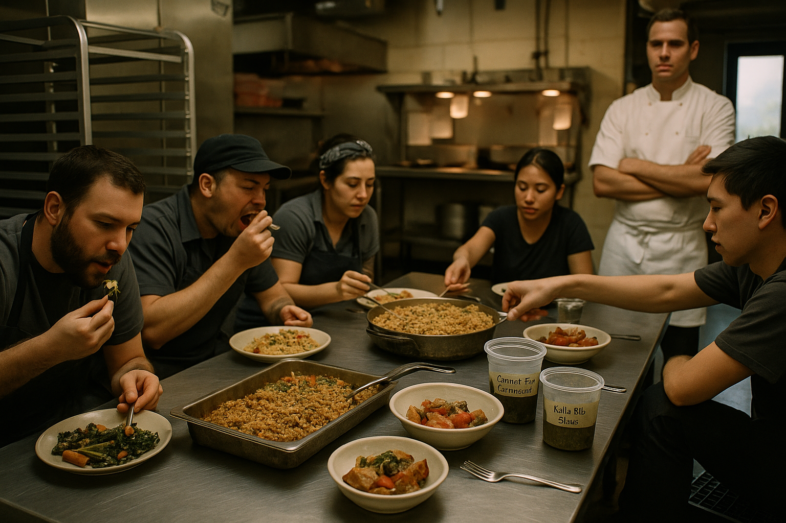

# Chapter 1: A Short History of Drain Cuisine

> *"Flavor is history continuing in the pan."*

## The Prehistory of Plenty

There is a moment in every kitchen, usually around 6:47 p.m. on a Wednesday, when you stand at the cutting board surveying the day's carnage: a palmful of herb stems, three cherry tomato caps, the wilted outer leaves of a cabbage, bread ends too noble for the trash but too humble for the table. This is the moment when most cooks reach for the compost bin or, worse, the garbage disposal. This is also the moment when *Drain Salad* begins.

<!-- img-prompt: Documentary author portrait in a cramped San Francisco studio apartment kitchen, Wednesday in December 2021 at exactly 6:47 p.m. (the phone screen on the counter shows 6:47). 35mm film look, slightly desaturated warm tones, natural dusk light leaking through a small window mixes with a single warm rental-grade ceiling bulb. Three-quarter, eye-level framing: the author stands at a cheap faux-granite laminate counter, facing left, shoulders slightly hunched, caught mid-thought, not posing. Visible in the background through the open doorway: the small bathroom with a white toilet plainly in view, reminding us of the apartment’s reality. Rental-grade electric coil stove with stained drip pans, scuffed off-white fridge with a couple of old magnets, a dish rack, and a scratched cutting board front-and-center. On the board: a palmful of herb stems, three cherry tomato caps, the wilted outer leaves of a cabbage, a few bread ends—humble but noble. A thrifted chef’s knife, a dented stainless bowl nearby for scraps. Include subtle mess: a water ring on the laminate, a chipped mug, a crumpled takeout menu just out of reach. Author details for character consistency: early 30s, olive-toned skin, dark wavy hair tied back, plain gray t-shirt, dark apron, modest forearm spoon tattoo; androgynous, no glam styling. Shallow depth of field (50mm, f/2) focuses on the cutting board; the bathroom/toilet soft but unmistakable. Mood: the decision point—tension between takeout and turning scraps into dinner. Grain, gentle vignetting, natural imperfections. Color palette: warm ambers and soft daylight blues, no glossy highlights. Honest, unglamorous, candid—this is the 6:47 p.m. Wednesday moment where Drain Salad begins. -->

But let us back up several centuries.

In medieval Europe, the center of domestic life was not the stove—those would not arrive for another few hundred years—but the cauldron. Hung over the hearth fire on an iron crane, this vessel rarely went cold and almost never ran empty. Into it went everything: yesterday's roasted bones with their clinging shreds of meat, the tough outer leaves of winter vegetables, stale crusts of dark bread, the water used to rinse bowls, even the whey left from cheesemaking. What emerged was *pottage*, a word that sounds rustic and wholesome to modern ears but which, in its time, simply meant "what's in the pot."

The medieval kitchen operated on a principle that would seem radical to us now: *nothing left the system*. Scraps were not waste—they were dinner tomorrow, or the day after. The pot was what food historians call a "perpetual stew," enriched daily with whatever was available. Meat might appear on Sunday, lending its richness to broths consumed throughout the week. By Friday, the pottage had become an entirely different creature—darker, more complex, haunted by the ghost of that Sunday roast in ways both subtle and profound.

<!-- img-prompt: Authentic 14th-century European kitchen, documentary style, not romanticized. A large blackened cauldron hangs from an iron crane over a hearth fire at the center; embers glow orange beneath, steam and thin scum at the surface of a slow-bubbling pottage. Composition: mid-wide three-quarter view that keeps the cauldron central while including the work zone around it. Hands in action (no modern manicure): one hand drops dark, stale bread crusts; another tips in cabbage outer leaves and leek tops; a third pours pale whey from a rough earthenware pitcher. A few roasted bones (from a previous feast day) rest on a wooden trencher, ready to be added. Period-correct details: soot-blackened beams, rough stone walls, packed earth/flagstone floor strewn with rushes, a narrow leaded window admitting cold blue daylight, oak pegs holding coarse linen towels, a wooden ladle and a two-pronged flesh hook. Clothing: a scullery maid in undyed linen with a simple headwrap, a worn woolen kirtle visible on another figure at the edge of frame. No potatoes, no tomatoes, no anachronistic utensils. Light quality: warm firelight spills amber across the iron pot and hands, while dim winter daylight edges the scene with a cool rim, yielding a chiaroscuro mix that feels lived-in. 35mm film feel with mild grain, slightly desaturated earth tones—soot black, iron gray, barley beige, cabbage green, fire orange. Mood: practical survival, nothing leaves the system—yesterday’s scraps become today’s sustenance, tomorrow’s flavor. Angle approximately waist-to-chest height for an intimate but unheroic perspective. Convey the perpetual stew idea: the pot never empties, only deepens, absorbing the ghost of Sunday’s roast as the week goes on. -->

This was not a matter of philosophy or ethics. It was survival dressed as cuisine.

## Stock Culture: The Invention of Extraction

If medieval pottage was accidental genius—throw everything in and hope for the best—then the French *pot-au-feu* and the Italian *brodo* represented its intellectualization. By the 17th and 18th centuries, European cooks had begun to understand that bones, vegetables, and time could be orchestrated into something greater than the sum of their parts.

Stock making is alchemy's patient cousin. Where alchemy promised to turn lead into gold through heat and hubris, stock making actually delivered: it turned bones into liquid gold through heat and time. The French developed an entire vocabulary around it—*fond* (foundation), *fumet* (essence), *glace* (reduction to the point of near-solid intensity). But the principle remained rooted in the same peasant pragmatism that had kept medieval cauldrons bubbling: use everything, waste nothing, trust the process.

In Auguste Escoffier's legendary kitchens of the late 19th century, stockpots simmered around the clock, fed with the trim and bones from that day's butchery, vegetable peelings from *mise en place*, and the carcasses of roasted birds. The stocks became sauces; the sauces became the foundation of French haute cuisine. Yet at the base of this pyramid of refinement sat the same impulse that drove a medieval scullery maid to toss potato peelings into the pot: nothing should be lost.

This is important to understand: elite cooking and peasant cooking have always been two sides of the same coin. One side simply has better lighting and fancier names.

## From Peasant Intelligence to Cucina Povera

Nowhere is this duality more evident than in the traditions of *cucina povera*—literally, "the cooking of the poor." Emerging from the rural regions of central and southern Italy, particularly Tuscany, Puglia, and Campania, cucina povera developed not as a charming culinary movement but as a series of survival strategies.

Consider *ribollita*, that icon of Tuscan thrift. The name means "reboiled," which undersells both its elegance and its origins. Traditionally made on Friday, ribollita began with the week's leftover vegetable scraps—wilted greens, the woody ends of beans, maybe some carrot tops if you were lucky. These were simmered with stale bread, which transformed from a liability into a necessity, thickening the soup and adding a subtle, yeasty sweetness. Then the pot was left to rest. The next day it was reheated—*ri-bollita*, boiled again—and somehow, mysteriously, it had become something greater. The bread had absorbed and redistributed the flavors; the greens had softened into silky submission. Each subsequent reheating deepened the alchemy. By the third day, ribollita was no longer leftovers. It was memory thickened into food.

Or take *panzanella*, which dates back at least to the 14th century. Its earliest incarnation was even simpler than the tomato-laden summer salad we know today: just stale bread soaked in water, wrung out, then dressed with onions, oil, and vinegar. This was not a recipe born of creativity but of necessity. Tuscan bread, made without salt (a story for another time), grows stale quickly. Rather than throw it away—unthinkable, in a place where bread was practically sacred—cooks soaked it back to life. When tomatoes arrived from the New World in the 16th century, panzanella gained color and acidity, but its soul remained the same: stale bread is not a problem to be solved but an ingredient with potential.

The genius of cucina povera lies in its refusal to see scarcity as a limitation. Instead, it treats limitation as a creative constraint. You don't have meat? Fine. Beans and pasta will become your protein. Your bread is stale? Perfect. It will soak up flavor better than fresh. Your vegetables are wilted? Excellent. They'll collapse into silky sweetness when braised. This is not make-do cooking—it's *make-new* cooking.

My grandmother—Nonna to everyone who knew her—had a fabric bag hanging from a hook in her pantry. Into it went every bread end, every crust, every slice that had gone past its prime. Once a week, that bag came down, and she'd make ribollita or panzanella, depending on the season and her mood. As a kid, I thought this was embarrassing, a visible marker of being poor. I once threw away a bread end when she wasn't looking. She found it in the trash—I still don't know how—and gave me The Look. You know the one. I never did it again.

It took me two decades and a culinary degree to understand what she'd been doing. She wasn't saving bread because she was poor. She was saving it because she *knew*. She knew that stale bread, properly deployed, was better than fresh. She knew that wasting it was not just wasteful—it was *stupid*. When I started keeping my own bread bag in my freezer, it felt less like theft and more like inheritance.

<!-- img-prompt: Circa 1933 Depression-era apartment kitchen, documentary realism, warm neutral palette with a gentle sepia cast. Close, intimate framing on a fabric bread bag hanging from a wall hook near an enamel sink. The bag is utilitarian cotton, hand-mended, bulging with bread heels and ends—dark crusts, irregular slices. A work-worn hand (no nail polish, faint flour dust) reaches in to grasp a heel. Surrounding details ground the period: a chipped white porcelain sink basin, a tin can repurposed as utensil holder, a small cast-iron skillet on an old enamel cookstove, a checkered cotton curtain fluttering near a single-pane window, a hand-crank can opener on the wall, mason jars with saved drippings and coffee grounds, a wooden cutting board scarred with knife marks, a simple calendar page curling on a nail. Light: soft midday sun through the window, dust motes visible, gentle shadows; no harsh studio gloss. Composition favors the bag and hand at center-left, with the sink and stove falling softly out of focus (shallow depth of field, 50mm, f/2.8). Mood: resourcefulness and dignity—nothing performative, no nostalgia gloss. The frame should whisper habits learned from scarcity: save the bread, reboil tomorrow. 35mm film texture with fine grain, slightly desaturated browns, creams, and muted greens. No brand labels, no modern plastics. The image should feel like an archival photograph you might discover in a family shoebox—an artifact of a practice that became inheritance: ends and crusts returning as ribollita, panzanella, or breadcrumbs. -->

## The Long Forgetting: Convenience and Its Discontents

Then, sometime in the mid-20th century, we forgot all of this.

The story of how this happened is complicated, involving world wars, industrial agriculture, refrigeration, supermarkets, and the rise of a middle class with disposable income and less disposable time. But the upshot was simple: food became cheap and scraps became garbage.

The garbage disposal, invented in 1927 by John W. Hammes and popularized after World War II, is perhaps the perfect symbol of this shift. Here was a machine designed specifically to make food waste vanish—not compost it, not feed it to animals, not save it for stock, but to grind it up and flush it down the drain. Out of sight, out of mind, out of the kitchen, out of the food system entirely.

For a few decades, this seemed like progress. Why save vegetable peelings when vegetables were cheap? Why make stock when you could buy bouillon cubes? Why eat stale bread when fresh bread was available every day at the supermarket?

<!-- img-prompt: Pristine late-1950s American kitchen, high-key, ad-bright lighting, a visual ode to convenience and disappearance. Wide, symmetrical composition anchored on a gleaming stainless sink with a polished disposal flange. To the right of the sink, a small chrome toggle switch plate neatly labeled “Disposal.” A manicured hand hovers near the switch, about to flip it. Counters are spotless pastel Formica with a subtle boomerang pattern; cabinets are glossy aqua and butter-yellow with chrome pulls. No visible scraps anywhere—just perfectly packaged foods lined with intention: a generic TV dinner in an aluminum tray, a box labeled “Instant Potatoes,” a jar of dehydrated onion flakes, a box of “Bouillon Cubes,” a loaf of uniformly sliced white bread in plastic, a tower of canned soups with tidy paper labels. Background details: a starburst clock, a sunburst wall decoration, a rounded-edge refrigerator, a tidy roll of paper towels, atomic-pattern curtains. Color palette: saturated mid-century optimism—mint, coral, butter, chrome—no stains, no patina. Mood: out of sight, out of mind—the moment food scraps became trash with the flip of a switch. 35mm color film vibe but crisper and more saturated than the other images to emphasize the era’s glossy promise. Camera at counter height, straight-on, slight wide angle (35mm) to exaggerate the immaculate geometry. Emphasize reflections on chrome and the absence of mess. This is the turning point: why save peelings when the machine will swallow them whole? -->

But something was lost in this exchange, and it wasn't just flavor (though it was that, too). What was lost was a particular kind of kitchen intelligence—the ability to see food not as a linear path from store to plate to garbage, but as a system with cycles and second chances. We stopped asking *what else can this become?* and started asking *where is the trash can?*

## Zero-Waste Moderns: The Return to Sense

The pendulum, of course, has begun to swing back.

In 2015, Dan Barber—chef of Blue Hill at Stone Barns and a kind of philosopher-king of the farm-to-table movement—did something audacious. He closed his acclaimed New York City restaurant and reopened it as a pop-up called *WastED*. For a few weeks, the menu consisted entirely of ingredients that would normally be discarded: damaged apples, rejected carrots made into mustard, kale ribs, fish heads, stale bread. The point was not to shame diners into eating garbage, but to demonstrate that the line between "ingredient" and "waste" is arbitrary, cultural, and changeable.

The project was wildly successful, both as theater and as cuisine. Diners paid premium prices to eat what the food system had deemed worthless, and—here's the kicker—they loved it. The food was inventive, delicious, and often more interesting than conventional fine dining. What Barber proved was that waste is not a culinary problem but a failure of imagination.

Around the same time, Douglas McMaster opened Silo in Brighton, England (later moved to London), widely credited as the world's first zero-waste restaurant. McMaster's approach was systematic: no trash cans, no traditional waste stream. Vegetable scraps became compost, which fed the restaurant's suppliers. Bones became stock, then sauces, then fed into a compost loop. Even non-food waste—napkins, packaging—was meticulously sourced to be compostable or reusable. The result was not a gimmick but a genuine recalibration of what a restaurant could be.

Meanwhile, in Milan, Massimo Bottura—of Osteria Francescana fame, repeatedly named one of the world's best restaurants—turned an abandoned theater into Refettorio Ambrosiano, a soup kitchen staffed by volunteer chefs. The ingredients? Surplus food from Milan's Expo 2015, food that would have otherwise been discarded. Bottura's team transformed 15 tons of would-be waste into dignified meals for the homeless. The project wasn't just about feeding people; it was about demonstrating that good cooking—cooking with care, technique, and respect—can happen with any ingredient, no matter how humble or neglected.

These chefs were not inventing something new. They were *remembering* something very old.

I learned this firsthand during my three years working garde-manger at a mid-tier restaurant in a city I could barely afford to live in. Every day, the staff meal—the one meal we could eat for free—was made entirely from trim. Carrot tops from the line's julienned carrots. Kale ribs from the salad station's delicate leaves. The ends of roasts, the trim from fish butchery, the heels of bread loaves. Our chef, a French-trained hardass who rarely complimented anyone, called it "the most honest food we make all day."

He was right. That staff meal, thrown together in twenty minutes from what the dining room would never see, was often better than the $45 entrees we plated for customers. It tasted like something *real*—unpolished, improvisational, and deeply flavorful. I started taking notes.

<!-- img-prompt: Contemporary mid-tier restaurant kitchen, documentary candid circa 2019, a brief staff meal made entirely from trim and scraps. Eye-level, three-quarter wide shot of 5–7 cooks gathered around a stainless prep table, some perched on milk crates, some standing. The food is family-style and specific: a hotel pan of roasted vegetable ends (carrot nubs, onion ends, kale ribs glistening with oil), a big braiser of day-old-rice fried rice flecked with herb stems, a stockpot of brothy soup set on a trivet with bones visible, a bowl of panzanella built from bread heels and wrinkled tomatoes, deli quarts labeled in Sharpie “Carrot Top Chimichurri” and “Kale Rib Slaw.” Plates are mismatched, utensils are utilitarian. Background: speed rack, stacked Cambros, a line with heat lamps, expo tickets curled in a holder, a back door letting in cool daylight that mixes with warm overhead fluorescents. The chef—crisp whites, arms crossed—stands slightly out of focus at the edge, not smiling, watching. Light is real kitchen light: mixed color temperature, pockets of shadow, no polish. 35mm film feel, slight grain, gently desaturated steel blues and warm skin tones. Composition keeps faces candid—mid-bite, passing a pan, heads down—no staged smiles. Emphasize the textures: crusty bread heels soaking vinaigrette, crisp kale ribs, glossy rice grains, the sheen of reduced stock. Mood: camaraderie and urgency—a 20-minute pause before service, and the most honest food they make all day. No visible brands, no food styling tricks; just resourcefulness turned delicious. -->

When I left that job (burned out, broke, unable to afford rent on a cook's wages), I took those notes with me. They became the foundation of how I cook now—not because I'm virtuous, but because I finally understood what Nonna and that chef both knew: the "best" ingredients are often the ones everyone else has overlooked.

## The Problem We've Cooked Ourselves Into

Here are the numbers, briefly, because they matter: according to the USDA, 30 to 40 percent of food produced in the United States ends up in the trash. Globally, the World Wildlife Fund estimates that 40 percent of all food produced—2.5 billion tons annually—is never eaten. This is not just an environmental catastrophe (all that wasted water, energy, and land) or an economic absurdity (Americans throw away roughly $160 billion worth of food each year). It's a failure of culture.

We have somehow arrived at a place where we can simultaneously worry about food access and food insecurity while also throwing away nearly half of what we grow. This is not because we lack resources. It's because we've lost the cultural knowledge—the kitchen intelligence—that once allowed us to see food as something precious, worth saving, worth transforming.

*Drain Salad* is an attempt to recover some of that knowledge, updated for the 21st century.

## Entropy as Ingredient

Let's be honest: the name *Drain Salad* is absurd. It's provocative, maybe even a little repulsive. That's intentional. The phrase forces a confrontation with what we've chosen to ignore—all those scraps circling toward the drain, headed for oblivion.

But here's the thing about entropy: it's not always destructive. In cooking, controlled entropy—decay, fermentation, aging, wilting, staling—often creates the most interesting flavors. Cheese is controlled rot. Wine is controlled fermentation. Aged beef is controlled decomposition. Stale bread makes better panzanella precisely because it's lost moisture and gained structural integrity. Wilted herbs have a softer, sweeter character than fresh ones. Day-old rice makes superior fried rice because it's dried out enough to fry rather than steam.

What we call "scraps" are simply ingredients at a different stage of their lifecycle—sometimes a *better* stage, if we know what to do with them.

The philosophy of *Drain Salad* is this: there is a moment—brief but very real—between "perfectly fresh" and "compost" where ingredients are not only edible but often more interesting than they were at their peak. This is the moment we aim to capture.

## The Clean-Catch Principle: A Note on Safety and Sense

Before we go further, let's establish something clearly: this book does not advocate eating anything that has actually touched a drain, sink basin, or drain filter. Despite the provocative title, we're not insane, and we're not interested in making anyone sick.

Domestic drains and sinks are, to put it mildly, hostile environments. They harbor biofilms (sticky colonies of bacteria), can contain pathogens from previous use, and are explicitly flagged by the CDC and USDA as contamination risks. You should not rinse raw chicken for this reason—the splashing spreads bacteria everywhere, including into your sink, where it can linger even after cleaning. Food that has touched a drain or drain filter should not be eaten, full stop.

What we *do* advocate is something we call the **Clean-Catch Method**: capturing edible scraps *before* they reach the sink, in a sanitized, food-only container. This upstream interception keeps scraps in the food system rather than the waste system, preserving both their safety and their potential. Think of it as mise en place for your offcuts—intentional, organized, and uncompromising about hygiene.

The specifics of the Clean-Catch Method will be detailed in Chapter 3, but the principle is simple: we're not salvaging from the drain. We're preventing waste before it reaches the drain. This is not gross hippie frugality; it's professional kitchen discipline applied at home.

## A Treatise in Motion

This book is part cookbook, part manifesto, part meditation on value and flavor. It takes scraps seriously—not despite their humble origins, but because of them. Each shred of onion, each herb stem, each bread crust represents energy, water, labor, and land. They also represent flavor that would otherwise be lost.

In the chapters that follow, you'll learn to see your kitchen differently. That cutting board scattered with vegetable trim? That's not mess—it's *mise en place* for tomorrow's vinaigrette. Those bread ends? Not too stale to use—too flavorful to waste. Those herb stems you've been discarding your whole cooking life? They're the base of your next pesto, and they taste more intensely of themselves than the leaves you've been fussing over.

We'll explore the anatomy of a Drain Salad—how texture, acid, fat, and crunch combine to make scraps sing. We'll set up your Clean-Catch system. We'll learn techniques: roasting fines to intensify flavor, using bread crumbs to emulsify dressings, fermenting vegetable trim into condiments with more personality than anything you can buy. We'll cook through a catalog of recipes, from the playfully named (Sludge Caesar, Compost Cobb) to the quietly profound (ribollita made with intention, panzanella treated as architecture).

But more than anything, we'll practice a different way of seeing. Not food as a straight line from store to plate to trash, but food as a loop, where endings are really beginnings, where waste is just potential waiting for technique, and where the things we've been throwing away are exactly what we've been looking for.

In other words, we'll learn to see like a cook again.

Because here's the secret the medieval peasants knew, that the Italian nonnas knew, that chefs like Barber and McMaster and Bottura are remembering: *there is no such thing as food waste, only food we haven't figured out how to use yet.*

Everything is an ingredient. You just have to know where to look—and be willing to look in places most people have stopped seeing.

---

**Photography note:** *This chapter might open with a diptych: on the left, a gleaming stockpot from a 19th-century professional kitchen; on the right, a medieval cauldron. The similarity should be striking. Include archival-style vignettes throughout: a hand grating stale bread, panzanella at various stages of assembly, the interior of a contemporary zero-waste restaurant kitchen, perhaps a shot of Dan Barber's WastED menu. These images should feel like artifacts—important, worth preserving, teaching us something we've forgotten.*
