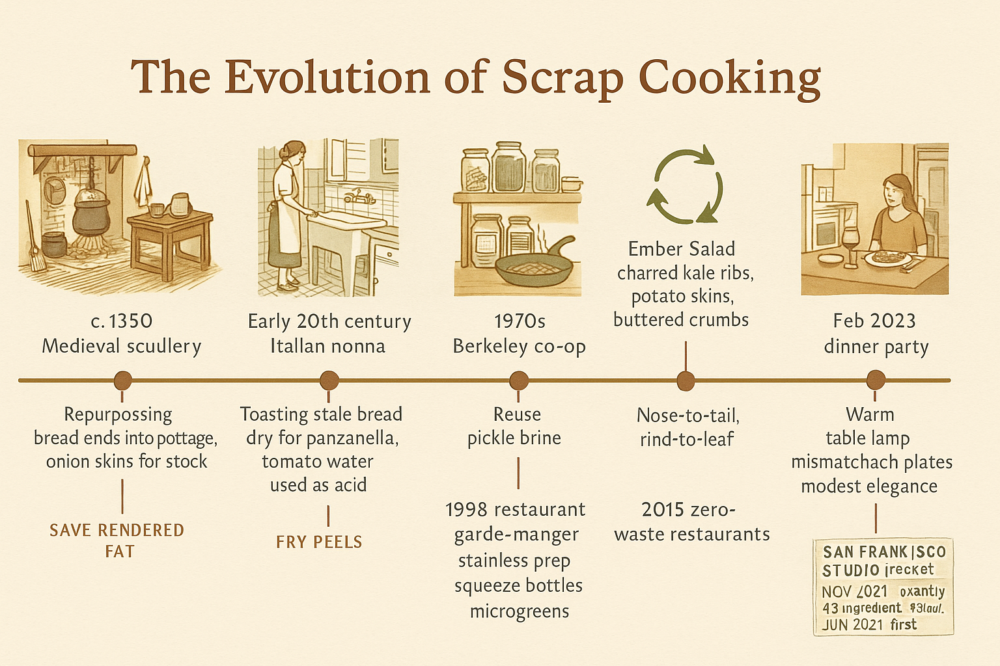
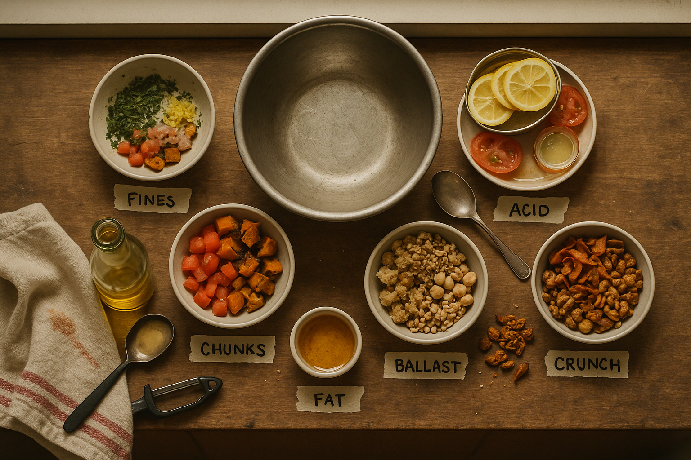
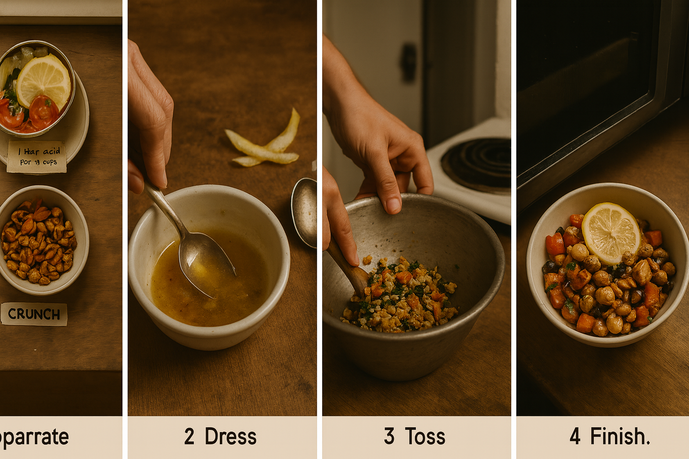

# Chapter 2: The Anatomy of a Drain Salad

> *"Balance is a verb."*

<!-- img-prompt: Create a horizontal timeline infographic on a warm cream paper background (field guide aesthetic) that traces the evolution of scrap cooking from medieval kitchens to a modern San Francisco studio apartment. Use a warm neutral palette: cream (#F5F0E6), sepia brown (#7A5F4C), muted olive (#7C8C4A), and rust accents (#A5613F). Layout: a clean left-to-right bar with dated nodes and small, historically accurate line illustrations at each stop. Typography: title in a friendly bookish serif; labels and captions in a clear humanist sans; legible, minimal, not slick. Nodes to include, with authentic period details: 1) c. 1350 Medieval scullery: rough-hewn table, iron cauldron over open hearth, rushes on the floor, linen apron, wooden trenchers; caption repurposing bread ends into pottage, onion skins for stock. 2) Early 20th century Italian nonna: terrazzo floor, enamel sink, moka pot, stale bread soaking for panzanella, tomato water used as acid. 3) 1933 Depression kitchen: ration book, flour sack apron, cast-iron pan, potato peel pie; callout save bacon drippings. 4) 1970s Berkeley co-op: bulk bins, mason jars, home ferments, sprouting jars; reuse pickle brine. 5) 1998 restaurant garde-manger: stainless prep table, squeeze bottles, microgreens; Ember Salad with charred kale ribs, potato skins, buttered crumbs. 6) 2015 zero-waste restaurants: closed-loop arrows, nose-to-tail, rind-to-leaf. 7) Nov 2021–Mar 2022 San Francisco studio: cheap laminate counter, coil burner, visible bathroom doorway; callouts November 2021 pantry 5 ingredients, 43 dollars; June 2021 first fermentation; December 2021 mold failure; recurring 6:47 pm Wednesday decision point. 8) February 2023 dinner party: warm table lamp, mismatched plates, modest elegance. Add small technique tags beneath nodes (save rendered fat, toast stale bread dry, brine as acid, fry peels). Mood: documentary, instructive, unromantic. Maintain generous margins and crisp linework; ensure all text is readable at cookbook size. -->

## What Is a Salad, Really?

Before we can understand what makes a *Drain Salad*, we need to interrogate the concept of "salad" itself—a word that has become so elastic as to be almost meaningless.

Caesar salad is a salad. So is potato salad, fruit salad, taco salad, and the thing your aunt brings to Thanksgiving that involves lime Jell-O and miniature marshmallows. The category has expanded to the point of absurdity. What do these dishes have in common? Often, very little beyond being served cold-ish and involving more than one ingredient.

In my garde-manger days, we served a $22 salad that was basically three types of scraps arranged on a plate: charred kale ribs, crispy potato skins, and bread crumbs toasted in aged butter. We called it "Ember Salad." People raved about it. Someone once left a Yelp review saying it "transcended the concept of salad." It was literally the compost bin, plated.

For our purposes, let's define a salad more narrowly: **a composed dish where multiple elements—raw, cooked, or in-between—are brought into balance through texture, flavor, and a unifying dressing or binder.**

A salad is architecture made of disparate parts. It is a study in contrasts: soft against crisp, rich against bright, savory against acidic. A good salad has *integrity*—it holds together conceptually and texturally. A great salad also has *tension*—there's an edge to it, a sharpness that keeps your palate engaged.

A *Drain Salad* takes this framework and applies it to ingredients that most people would consider exhausted, spent, or past their prime. It asks: can we build something compelling from the scraps? Not despite their humble origins, but *using* their particular qualities—dryness, wilt, irregularity—as assets?

The answer, it turns out, is yes. But you have to understand the system.

## The Six Elements of a Drain Salad

Think of a Drain Salad as a six-legged stool. Each leg serves a purpose, and while you can occasionally get away with five, you really want all six working together.

<!-- img-prompt: Photograph an overhead, editorial-style spread that visualizes the Six Elements of a Drain Salad on a weathered wood surface placed atop a cheap laminate counter edge peeking at the frame’s top, hinting at a small San Francisco studio kitchen. Natural window light from the left, late afternoon glow, slightly desaturated warm tones, soft shadows. Arrange six small bowls in a loose hexagon around an empty, scuffed metal mixing bowl. Each bowl is clearly distinct: 1) Fines: minced parsley stems, micro-diced shallot, lemon zest curls, grated ginger nub; flecks clinging to the sides. 2) Chunks: diced tomato caps, roasted squash trimmings with caramelized edges, crisped potato skin cubes. 3) Ballast: toasted sourdough bread crumbs browned in butter, a spoonful of day-old farro, a few chickpeas. 4) Acidity: thinly sliced spent lemon rinds, a jar lid filled with pickle brine, two tomato ends oozing seeds. 5) Fat: the last glug of olive oil in a bottle, a small ramekin of brown butter just set, a spoonful of saved bacon fat. 6) Crunch: fried carrot and potato peel ribbons, toasted squash seed cluster, revived nuts. Add subtle, hand-torn masking tape labels near each bowl, handwritten: Fines, Chunks, Ballast, Acid, Fat, Crunch. Include a tarnished spoon, a kitchen towel with a stain, a cheap plastic peeler, a few crumb trails for honesty. Camera angle 90 degrees top-down, editorial cookbook style, not glossy or overly styled. Mood: practical abundance and quiet resourcefulness. Keep the palette warm browns, olive greens, muted reds. No perfection: slightly irregular cuts, a drip of brine, and a scuff on the mixing bowl tell the story. -->

### 1. Fines (≤5 mm): The Aromatic Matrix

These are your tiny pieces—herb stems minced to near-dust, garlic shavings, micro-diced shallot ends, grated carrot nubs, citrus zest. They're too small to provide structure, but they create an *aromatic matrix*, a background hum of flavor that suffuses the entire dish.

In a conventional salad, you might achieve this with a vinaigrette. In a Drain Salad, the fines *are* part of the vinaigrette—they cling to everything else, distributing their oils and essences. Think of them as the mortar between bricks.

**Examples:**
- Parsley stem mince
- Scallion root ends, cleaned and sliced paper-thin
- The inner, tender ribs of kale, shaved on a mandoline
- Lemon zest (from fruit you've already juiced)
- The stub of a ginger knob, grated fine

**Why they work:** Fines take dressing beautifully because they have high surface area relative to mass. They also often have *more intense flavor* than their larger counterparts—herb stems, for instance, can be more pungently herbal than the leaves. You've been throwing away the best part.

### 2. Chunks (5–20 mm): The Structure

These are the pieces you can see and feel—the elements that give the salad physical presence. Tomato ends diced small, the firm tips of cucumbers, roasted vegetable trimmings, cubes of stale bread toasted until crunchy, cooked potato skins crisped in a pan.

Chunks provide *chew* and *bite*. They're what makes a salad feel like food rather than a garnish.

**Examples:**
- Tomato caps (the stem end), seeded and diced
- Radish tops, quartered
- Roasted squash trimmings (the bits you cut off to make neat cubes)
- Bread ends, torn and toasted
- Blanched broccoli stems, sliced into coins

**Why they work:** These pieces have already been handled—peeled, chopped, roasted, whatever—so they're primed to take on new roles. A roasted carrot trim, for example, has caramelized edges that add a sweet, umami depth that raw carrot never could. Stale bread, toasted, becomes structurally superior to fresh bread—it has integrity, crunch, and a nutty flavor that fresh bread lacks.

### 3. Ballast: The Foundation

This is your weight—the thing that turns a pile of scraps into a *meal*. Ballast is usually starch-based: bread crumbs, cooked grains, a handful of beans, diced roasted potatoes, even small pasta shapes (orecchiette, orzo, broken spaghetti).

Ballast does three jobs:
1. **Absorbs and redistributes dressing**, preventing the salad from becoming a soup
2. **Provides satiety**—you can't live on herb stems alone
3. **Mellows intensity**—if your scraps skew bitter or sharp, ballast smooths them out

**Examples:**
- Bread crumbs, toasted in brown butter
- Day-old rice or farro
- A spoonful of white beans or chickpeas
- Roasted potato ends
- Polenta cubes, crisped

**Why it works:** Ballast is your safety net. If you've gone too far with acid or bitterness, ballast brings you back. It's also the most flexible element—nearly any starch will work, and they all bring their own subtle character.

### 4. Acidity: The Backbone

Acid is what makes food taste like *food* rather than a collection of nutrients. It wakes up your palate, cuts through richness, and makes everything else sharper and clearer.

In a Drain Salad, acidity often comes from unusual sources: pickle brine (left over from a jar of cornichons), the liquid from a can of tomatoes, lemon rinds that have already been juiced (zest them first, then throw the spent halves into the salad), whey from draining yogurt, or even a splash of the vinegary water used to clean your cutting board.

**Sources:**
- Lemon/lime rinds, zested or sliced thin
- Pickle brine (dill, bread-and-butter, jalapeño)
- Vinegar (sherry, red wine, cider, rice)
- Tomato ends (they're mostly acid and seeds)
- Yogurt or sour cream that's getting close to its date

**Why it works:** Acid brings everything into focus. Without it, a Drain Salad is just a pile of brown, sad things. With it, those same ingredients suddenly have *shape*—you can taste each element distinctly.

**Ratio tip:** You want acid to be noticeable but not aggressive. Start with about 1 tablespoon per 4 cups of salad, then adjust. Trust your tongue.

### 5. Fat: The Amplifier

Fat is flavor's delivery system. It coats your palate, carries aromatic compounds, and rounds out sharp edges. In a Drain Salad, fat often comes from saved sources: the oil from a can of anchovies, bacon fat from last weekend's breakfast, the last glug of a very good olive oil bottle, brown butter used to toast crumbs, or even the crispy bits of schmaltz left over from roasting a chicken.

**Sources:**
- Olive oil (especially the dregs from a nice bottle)
- Toasted nut oils (walnut, hazelnut)
- Bacon fat or schmaltz, saved and stored
- Brown butter
- Tahini or nut butters thinned with water
- The oil from a jar of sun-dried tomatoes or marinated artichokes

**Why it works:** Fat makes scraps taste *luxurious*. A piece of stale bread, toasted dry, is

 okay. That same piece, tossed in brown butter? Transcendent. Fat also helps acid and salt integrate into the dish, so everything tastes cohesive rather than separate.

**Note:** You don't need much. Two tablespoons of fat can dress a salad for four if you toss thoroughly.

### 6. Crunch: The Exclamation Point

Crunch provides *contrast* and *excitement*. It's the textural surprise that keeps your mouth interested. In a Drain Salad, crunch often comes from repurposing something that was already on its way out: vegetable peelings fried crisp, seed clusters from tomatoes or squash toasted until they shatter, stale nuts or seeds revived in a hot pan.

**Sources:**
- Bread crumbs, toasted until deeply golden
- Vegetable peelings (carrot, potato, parsnip) fried or roasted until crisp
- Seed clusters (from tomatoes, peppers, squash) toasted
- Nuts or seeds, even if they've gone slightly soft—toast them back to life
- Crispy alliums (garlic or onion chips)

**Why it works:** Crunch is neurologically rewarding—it literally makes food more interesting to eat. It also signals *freshness* and *care*, even when the underlying ingredients are anything but fresh.

---

## The Proportions: The 40/30/20/10 Rule

Here's a framework for building a Drain Salad that actually works:

**40% – Structure (chunks + greens)**: This is your volume—the bulk of the salad. If you're using greens (lettuce ends, kale ribs, etc.), they go here. So do your larger vegetable chunks.

**30% – Ballast (grains, beans, crumbs)**: Enough to make it filling, but not so much that it becomes grain salad with vegetable garnish.

**20% – Fat + Acid (dressing components)**: This is your binder. You want enough to coat everything lightly, not drown it.

**10% – Crunch + Fines (finishing elements)**: These are your accents—just enough to be noticed without overwhelming.

This is not a rigid formula. Some salads want more ballast, others want to be lighter. But it's a useful starting point, especially when you're staring at a bowl of random scraps and trying to figure out what else you need.

---

## Flavor Axes: The Matrix of Deliciousness

Beyond texture, a Drain Salad needs to balance along several *flavor axes*:

### Brightness ↔ Depth

**Brightness** comes from acid, fresh herbs, citrus, raw alliums.
**Depth** comes from roasted elements, aged cheeses, browned butter, miso, anchovy.

You want both. All-bright is shrill and one-dimensional. All-deep is heavy and dull. The magic happens in the tension between the two.

### Soft ↔ Crisp

This is textural, but it's also flavor-adjacent. Crispy things tend to read as *fresher* even if they're not. Soft things read as *comforting*. A good Drain Salad oscillates between the two.

### Bitter ↔ Sweet

Many scraps—kale ribs, radicchio cores, burnt edges, over-steeped greens—skew bitter. This is not a flaw. Bitterness is grown-up and interesting. But it needs to be balanced with some sweetness: a pinch of sugar in the dressing, some caramelized onion ends, roasted roots with their natural sugars concentrated, or even a drizzle of honey or maple syrup.

### Savory ↔ Funky

Savory is straightforward umami—parmesan, soy sauce, tomato paste, mushrooms.
Funky is fermented or aged—miso, fish sauce, aged cheese, pickle brine, kimchi liquid.

You want *some* funk—it adds complexity and a subtle sense of "what *is* that?" But too much and your salad tastes like a fermentation experiment gone wrong. Start with small amounts and build.

---

## Common Mistakes (and How to Avoid Them)

### Mistake #1: Wetness

Scraps often have high water content, especially if they've been sitting for a day. Limp vegetables weep. Thawed bread gets soggy. If you don't account for this, your salad will become a puddle.

**Fixes:**
- Salt your vegetables lightly and let them sit for 15 minutes. The salt draws out water, which you can then squeeze or drain away.
- Toast your bread aggressively—you want it bone-dry before it goes into the salad.
- Dress the salad *just before serving*, or keep the dressing separate until the last second.

### Mistake #2: Sameness

If everything in your Drain Salad is the same color, texture, and temperature, it's going to be boring no matter how well-seasoned it is.

**Fixes:**
- Make sure you have at least three distinct textures: soft, firm, and crunchy.
- Vary temperature: something room-temp, something cold, something still-warm from the pan.
- Think about color: a salad doesn't need to be a rainbow, but it should have *some* visual variety.

### Mistake #3: Under-Seasoning

Scraps often have muted flavors—they're past their peak, or they're from parts of the plant that were never intensely flavorful to begin with. This means you have to season more aggressively than you would with fresh ingredients.

**Fixes:**
- Salt in layers: salt the scraps, salt the dressing, then taste and adjust.
- Don't be shy with acid. You should be able to *taste* the brightness.
- Use a finishing salt—something flaky and crunchy—right before serving. It adds both flavor and texture.

### Mistake #4: Bitterness Without Relief

Many scraps—especially from brassicas and bitter greens—are *bitter*. This is fine, even desirable, but only if you give your palate some relief.

**Fixes:**
- Add fat (it coats the tongue and softens bitterness).
- Add sweetness (even a pinch of sugar helps).
- Balance with salt and acid—both make bitterness less aggressive.

---

## A Note on Intuition

The rules above are useful, but they're not gospel. The best cooks I've known—grandmothers in Tuscan kitchens, seasoned garde-manger in restaurant basements, home cooks who've been at it for forty years—rarely measure anything. They taste, adjust, taste again. They trust their instincts.

Building that intuition takes time, but it also requires a willingness to *fail*.

December 2021. I'm making what I think is a brilliant Drain Salad: kale ribs, stale sourdough, pickle brine, brown butter crumbs. I'm so proud of myself. I plate it. Take a bite.

It's a bowl of wet, bitter sadness.

The kale ribs are fibrous and aggressive. The bread has turned to mush. The pickle brine is making everything taste like a failed science experiment. I'm standing in my kitchen—the one where the toilet is visible from the stove—trying to figure out where I went wrong.

Three mistakes in one dish: I didn't blanch the ribs, didn't toast the bread dry enough, used too much brine. I know this now because I had to eat that salad anyway (it was dinner, and I had $73 until payday). Every bitter, soggy bite taught me something.

You will make salads that are too bitter, too wet, too dull. This is fine. This is how you learn. You learn that kale ribs need aggressive massaging or quick blanching to be palatable. You learn that roasted fines are almost always better than raw ones. You learn that crunch matters more than you thought. You learn by eating your mistakes, because wasting food is worse than enduring a mediocre dinner.

The framework in this chapter is training wheels. Use it until you don't need it anymore.

---

## The Swap Library: A Quick Reference

One of the joys of Drain Salad is its flexibility. Don't have kale ribs? Use cabbage core shavings. No bread crumbs? Toasted grain crumbs work just as well. Here's a quick swap guide:

| **If you have:** | **You can substitute:** |
|---|---|
| Herb stems | Tender celery leaves, radish greens |
| Kale ribs | Cabbage core (shaved thin), broccoli stems |
| Bread crumbs | Toasted cooked grains (farro, rice, quinoa), crushed crackers |
| Lemon juice | Any citrus juice, pickle brine, vinegar |
| Olive oil | Any neutral oil, brown butter, bacon fat, schmaltz |
| Parmesan rind | Any aged cheese rind, nutritional yeast, miso |
| Roasted vegetable scraps | Blanched or raw vegetables (though roasted is better) |

The principle is always the same: *what role is this ingredient playing?* If you understand the job it's doing, you can find a substitute.

---

## Epilogue: Seeing with New Eyes

The anatomy of a Drain Salad is not complicated. It's just a matter of balance—texture, flavor, proportion. But it requires a shift in how you see your kitchen.

That pile of scraps on your cutting board is not a mess to be cleaned up. It's *mise en place* for the next dish. Those wilted greens? They're soft and sweet, ready to be braised or folded into eggs. That stale bread? It's structurally superior to fresh, just waiting to soak up a great dressing.

The hardest part is not the technique. It's unlearning the reflex to throw things away.

Once you see it, though—once you understand that scraps are just ingredients at a different stage, waiting for a second chance—you can't unsee it. Every meal becomes two meals. Every cutting board yields not just dinner, but tomorrow's lunch.

This is not about scarcity or deprivation. It's about *abundance*—recognizing how much flavor and potential we've been letting slip down the drain.

---

<!-- img-ref: images/chapter-02/008_six-element-overhead.png -->
<!-- img-prompt: Create a four-panel, left-to-right assembly sequence that progresses from separated elements to a finished Drain Salad, maintaining visual continuity with the six-element overhead: same weathered wood over a glimpse of cheap laminate, same natural window light from the left, warm slightly desaturated tones. Panel 1 (Stage: Mise en place): overhead view of the six small bowls from image 008 plus a small colander with lightly salted, drained vegetable scraps; a masking tape note reads 1 tbsp acid per 4 cups. Panel 2 (Stage: Dressing): closer 3/4 top angle; brown butter and a last glug of olive oil whisked with pickle brine in a chipped ramekin; lemon rind slivers ready; a teaspoon poised; faint steam-free sheen. Panel 3 (Stage: Tossing): medium 3/4 angle of a scuffed metal mixing bowl; hands or a wooden spoon folding ballast and chunks through fines; crumbs stay crisp, not soggy; flecks of zest and flaky salt visible; motion blur conveys vigor; background reveals the small SF studio reality: a cheap coil burner and, softly out of focus, the bathroom doorway. Panel 4 (Stage: Finished): hero overhead of the assembled salad in a simple bowl; contrasts evident—soft beans, crisp peels, glossy crumbs, bright citrus; a final sprinkle of flaky salt and a few toasted seeds. Include a barely-in-frame digital clock or microwave display reading 6:47 pm Wednesday, signaling the decision moment. Keep the mood honest and instructive rather than glamorous; textures realistic and appetizing but unpretentious. Ensure clear visual progression with small, unobtrusive stage labels in clean sans: 1 Separate, 2 Dress, 3 Toss, 4 Finish. -->

