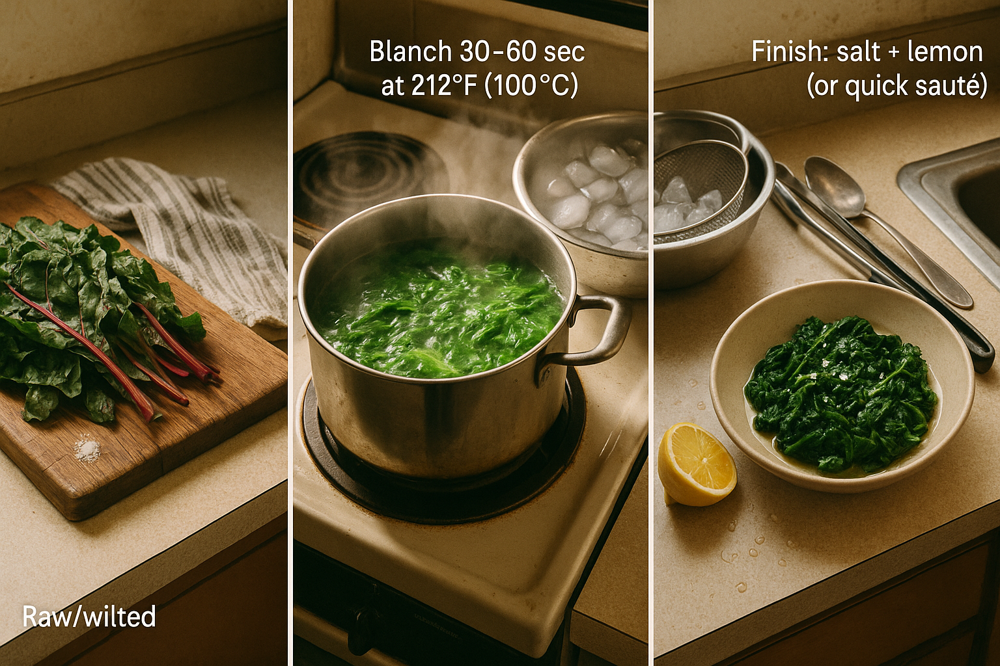

# Chapter 5: Techniques

> *"Technique turns 'almost' into 'absolutely.'"*

## On Applying Restaurant Techniques to Garbage

Let's be clear about what we're doing here: taking techniques that French-trained chefs use in Michelin-starred restaurants—the Maillard reaction, lacto-fermentation, starch emulsification—and applying them to the stuff that most people throw away. Kale ribs. Stale bread. Onion ends. Vegetable peelings.

This is either profound or completely absurd. Possibly both.

But here's the uncomfortable truth about scraps: without technique, they're usually worse than their fresh counterparts. Wilted greens are limper than fresh ones. Stale bread is drier. Vegetable trim is irregularly sized and often includes parts that are woody or tough. You cannot just eat this stuff and expect it to be good. It needs help.

The revelation—the thing that made me take this seriously enough to write an entire book about it—is that technique doesn't care about freshness. A stale piece of bread, properly toasted, becomes *better* than fresh bread—it's crunchier, nuttier, more structurally sound. A wilted green, massaged with salt and acid, becomes silky and complex. Vegetable trim, roasted hard until the edges char, develops sweetness and umami that fresh vegetables can't match.

Technique is the great equalizer. It's how you transform scraps from "technically edible" into "legitimately delicious." And once you understand the techniques, you'll find yourself getting weirdly evangelical about kale ribs. (I'm sorry in advance. It happens to all of us.)

I learned this the hard way in my first week of culinary school. We were learning to make brown butter—simple, right? Melt butter, wait for it to turn golden and nutty, done. Except I got distracted (probably by the fact that everyone else seemed to know what they were doing and I felt like an imposter), and my butter went from golden to burnt in about eight seconds. The smell was unmistakable: bitter, acrid, like someone had set a tire fire in a Parisian bakery.

Our chef—a French-trained woman who scared the absolute hell out of me—walked over, looked into my pan, and said flatly: "Start over." That was it. No lecture, no explanation, just the quiet acknowledgment that I had failed and needed to try again. I burned it twice more that week before I got it right. The fourth time, when it worked, I almost cried from relief.

That was the moment I understood: technique is not about getting it right the first time. It's about understanding *why* things work so that when they don't, you know how to fix them. And scraps are the perfect training ground because the stakes are low and the lessons are immediate—either it's delicious, or you try again.

<!-- img-prompt: Create an editorial cookbook process image: an overhead, three-panel triptych with thin white dividers, showing the precise stages of butter transforming into brown butter (beurre noisette) in a cramped San Francisco studio kitchen. Time and mood: early evening, around 6:47 p.m., winter light filtering in from a small window; slightly desaturated, warm tones with a subtle 35mm film grain. Each panel features the same battered stainless-steel saucepan on a rental-grade gas burner (blackened grate, baked-on stains), cropped by cheap laminate countertop edges. Panel 1 (left): Stage 1 — Melted. Butter is pale lemon-yellow, fully melted with translucent sheen; a few pale milk solids swirl; faint steam wisps. Include a small digital probe thermometer reading ~250°F and a tiny white sans-serif caption: "Stage 1: melted." Panel 2 (center): Stage 2 — Foamy. Butter vigorously foaming, opaque white bubbles rolling across the surface; color deepens slightly; a few larger bubbles expose the liquid beneath. Thermometer shows 280–300°F. Caption: "Stage 2: foamy." Panel 3 (right): Stage 3 — Nutty brown. Foam has subsided; liquid is a clear, amber-hazelnut brown with chestnut-colored milk solids speckled across the bottom; a nicked wooden spoon rests nearby as if just swirled; two delicate steam ribbons suggest aroma. Thermometer reads 310–320°F with a subtle callout: "Maillard browning of milk solids." Caption: "Stage 3: nutty brown — pull now (before black)." A small piece of masking tape near the stove reads, handwritten: "Technique turns 'almost' into 'absolutely.'" Keep the scene honest, a little scuffed, not glossy: modest props, real texture on the pan, soft shadows, no Instagram styling. Emphasize the visible differences between pale, foamy, and nutty brown; no burnt black butter. -->

This chapter covers the core techniques that make scrap cooking work. Some are basic (roasting, sautéing), but applied with rigor and understanding. Others are less common (lacto-fermentation, starch-emulsified dressings) but transformative. Master these, and you'll never look at scraps the same way again. And yes, you'll probably burn some stuff along the way. We all do.

---

## Technique 1: High-Heat Roasting (The Maillard Effect)

### The Science

When you apply high heat (above 300°F / 150°C) to foods containing both proteins and sugars, a chemical reaction called the **Maillard reaction** occurs. Amino acids and reducing sugars combine to create hundreds of new flavor compounds—nutty, toasty, savory, complex. This is the reaction responsible for the crust on bread, the sear on a steak, the golden edges of roasted vegetables.

A related but distinct process, **caramelization**, occurs when sugars break down under heat (around 320°F / 160°C for most sugars). This creates sweet, slightly bitter, deeply flavorful compounds. Root vegetables like carrots and parsnips, which are high in carbohydrates, both caramelize *and* undergo Maillard browning when roasted.

**Why this matters for scraps:** Many scraps—carrot tops, kale ribs, onion ends—are bland or even unpleasant when raw. But roasted hard, they develop concentrated sweetness, umami, and a satisfying textural contrast between crispy edges and tender interiors.

### The Technique

**Temperature:** 400–450°F (200–230°C). You want high heat to drive browning. Lower temps will steam the scraps rather than roast them.

**Preparation:**
1. Cut scraps into relatively uniform sizes (so they cook evenly).
2. Toss with enough oil to coat—1–2 tablespoons per 2 cups of scraps. Don't skimp. Oil conducts heat and encourages browning.
3. Season with salt. Be generous. Salt draws out moisture (which promotes browning) and seasons as it cooks.

**Pan setup:**
- Use a heavy sheet pan (not a flimsy one that warps).
- Line with parchment if you want easy cleanup, but bare metal conducts heat better.
- Spread scraps in a single layer. **Do not crowd the pan.** Crowding traps steam, and steam prevents browning. If you have a lot of scraps, use two pans.

**Timing:**
- 15–25 minutes, depending on the density of the scraps and your oven.
- Flip or stir halfway through to ensure even browning.
- You're done when the edges are deeply golden and starting to char in places. Don't be timid—char = flavor.

**What to roast:**
- Vegetable trim: carrot ends, parsnip peelings, squash scraps, broccoli stems (sliced), cauliflower cores, onion ends (quartered), fennel trim
- Greens with structure: kale ribs (cut into 2-inch pieces), chard stems, cabbage cores (sliced thin)
- Alliums: garlic cloves (unpeeled—they'll become sweet and jammy), scallion ends, leek greens (sliced)

**Pro tip:** If your scraps are particularly wet (e.g., tomato caps, zucchini ends), salt them first and let them sit for 15 minutes to draw out moisture. Pat dry, then roast.

### Common Mistakes

**Mistake:** Roasting at too low a temperature (350°F or below).
**Result:** Scraps steam instead of brown. They're soft but not flavorful.
**Fix:** Crank the heat to 425°F.

**Mistake:** Crowding the pan.
**Result:** Scraps steam in their own moisture and never crisp up.
**Fix:** Use two pans, or roast in batches.

**Mistake:** Pulling them out too early because you're worried about burning.
**Result:** Pale, boring scraps.
**Fix:** Let them go until the edges char. Char is flavor. Embrace it.

<!-- img-prompt: Produce a clear, overhead instructional triptych (thin white dividers) documenting high-heat roasting of mixed vegetable scraps in a small San Francisco studio kitchen. A single heavy, well-used sheet pan (scratched, dark patina) anchors all three panels; background hints of cheap laminate counter and an old oven knob set to 425°F (218°C). Light: natural daylight from the right, warm and slightly desaturated; editorial cookbook style, not glossy. Panel 1 (left): Raw. A single uncrowded layer of scraps: carrot ends, parsnip peelings, broccoli stem coins, cauliflower core slivers, kale ribs cut into 2-inch pieces, quartered onion ends, unpeeled garlic cloves, and thin leek green ribbons. Lightly coated in oil with visible coarse salt crystals. Add a minimal white sans-serif label: "Stage 1: raw — 425°F (218°C). Do not crowd." A tiny note references: "Maillard ≥300°F." Panel 2 (center): Halfway (about 12 minutes). Edges are turning golden; a thin metal spatula is sliding under vegetables mid-flip; wisps of steam; some scraps showing early blistering. Label: "Stage 2: flip/stir — promote even browning." Panel 3 (right): Finished. Deep golden-brown with scattered charred edges; kale ribs and leek greens are crackly, onion ends mahogany, garlic clove tips caramelized; a few nearly black flecks signal bold flavor. A piece of masking tape on the pan’s rim reads, handwritten: "Char = flavor." Minimal label: "Stage 3: deeply browned — pull when edges char." Subtle callout arrow: "High heat drives Maillard + caramelization." Keep the image honest and approachable: oil sheen, salt grains, stray crumbs, and the pan’s real wear. No food-porn gloss, just appetizing, concentrated color and texture. -->

---

## Technique 2: Pan-Crisping (Fast, High-Heat Frying)

### The Concept

This is roasting's faster, stove-top cousin. You're using a hot pan and a thin layer of fat to quickly brown small, thin scraps until they're crispy.

### The Technique

**Setup:**
1. Heat a large skillet (cast iron or stainless steel, not nonstick) over medium-high heat until very hot.
2. Add enough neutral oil or fat to coat the bottom of the pan (1–2 tablespoons).
3. Add scraps in a single layer. Do not stir immediately—let them sit for 1–2 minutes to develop a crust.
4. Flip or toss, then cook another 1–2 minutes until crispy.
5. Remove to a paper towel, season with salt while hot.

**What to pan-crisp:**
- Vegetable peelings: potato, carrot, parsnip, sweet potato (patted dry first)
- Allium chips: thinly sliced garlic, shallots, or onion ends
- Bread crumbs: toss with butter or oil and cook, stirring frequently, until golden
- Herb stems: minced fine and fried until fragrant (30 seconds max—they burn fast)
- Seed clusters: tomato or squash seeds, rinsed and dried, then fried until they pop and crisp

**Pro tip:** After crisping, you can toss the scraps with spices (smoked paprika, cumin, chili flakes) or grated cheese while they're still hot. They'll absorb the flavors.

---

## Technique 3: Rehydration & Revival (Bringing Stale Things Back to Life)

### The Concept

Stale bread, wilted greens, and dried-out scraps have lost moisture. The trick is to reintroduce liquid *intentionally*, rather than just adding water (which makes things soggy).

### The Technique (Stale Bread)

**For salads (panzanella-style):**
1. Tear or cube stale bread.
2. Toss with a warm vinaigrette (3 parts oil, 1 part vinegar, pinch of salt, warmed in a pan for 30 seconds).
3. Let sit for 5 minutes. The bread will absorb the vinaigrette and soften slightly while retaining some structure.

**For croutons:**
1. Cube stale bread.
2. Toss with olive oil, salt, and optionally garlic or herbs.
3. Toast in a 350°F oven for 10–15 minutes until crunchy on the outside but still slightly tender inside.

### The Technique (Wilted Greens)

**Massage method:**
1. Tear or chop wilted greens (kale, chard, collards).
2. Sprinkle with salt and a squeeze of lemon.
3. Massage aggressively with your hands for 1–2 minutes. The cell walls break down, releasing liquid, and the greens become silky and tender.

**Quick sauté:**
1. Heat olive oil or butter in a pan.
2. Add garlic or alliums (optional).
3. Add wilted greens and cook quickly over high heat until just warmed through and slightly crispy at the edges.
4. Finish with acid (lemon, vinegar) and salt.

<!-- img-prompt: Create a hero-style, overhead composition showing the blanch-and-shock revival of wilted greens as a clear three-stage sequence across one frame, set in a cramped San Francisco studio kitchen. Natural late-afternoon window light (around 6:47 p.m.), warm neutral palette, slightly desaturated with gentle 35mm film grain; honest textures, not glossy. Left zone: a weathered wood cutting board piled with slightly wilted kale and chard (visible ribs and stems), a small pinch of salt spilled nearby, a threadbare striped dish towel. Minimal white sans-serif label: "Raw/wilted." Center zone: a rental-grade pot at a lively rolling boil on a scuffed stovetop burner; vibrant greens swirl mid-blanch, steam rising in gentle ribbons. To the side, a metal mixing bowl packed with ice cubes and water holds a battered colander ready to receive. Add subtle callouts: "Blanch 30–60 sec at 212°F (100°C)." and "Shock 1–2 min ~32°F (0°C)." Right zone: a wide, shallow bowl with the finished greens squeezed and glistening from a light drizzle of olive oil, sprinkled with flaky salt; a lemon half just squeezed (pulp visible), a few droplets on the counter. Label: "Finish: salt + lemon (or quick sauté)." Include tactile details—the sheen on the final greens, condensation on the ice bowl, and the slightly sad matte look of the raw leaves—to convey transformation. Keep props modest: thrift-store tongs, a scratched spoon, cheap laminate counter edges in frame. The overall mood is practical and reviving: constraint turned into technique, the beauty in making something better, not photogenic perfection. -->

---

## Technique 4: Emulsions by Starch (The Crumb-Vinaigrette Method)

### The Science

Emulsions—blends of oil and water-based liquids that normally don't mix—are typically stabilized with an emulsifier like mustard, egg yolk, or honey. But there's another, less common emulsifier: **starch**.

Bread crumbs, toasted and finely ground, contain enough starch to bind oil and vinegar into a creamy, stable dressing. The result is a vinaigrette with body and a subtle, nutty flavor.

### The Technique

**Ingredients:**
- 2 tablespoons finely ground, toasted bread crumbs (blitz in a spice grinder or mortar)
- 2 tablespoons vinegar (sherry, red wine, or apple cider)
- 6 tablespoons olive oil
- Pinch of salt
- Optional: 1 teaspoon Dijon mustard, honey, or miso for extra flavor

**Method:**
1. In a jar or bowl, combine crumbs and vinegar. Let sit for 1 minute (the crumbs will absorb the vinegar and swell slightly).
2. Add oil in a slow, steady stream while whisking or shaking vigorously.
3. The dressing will thicken and become creamy.
4. Taste and adjust: more salt, more vinegar if it's too rich, more oil if it's too sharp.
5. Use immediately, or store in the fridge for up to 3 days (shake before using).

**Why it's magic:** This dressing has *texture*. It's not just slippery oil—it clings to scraps, coating them evenly. And because it uses bread crumbs (which you made from stale bread), it's a closed-loop system: scraps dressing scraps.

---

## Technique 5: Lacto-Fermentation (Controlled Acidity)

### The Science

Lacto-fermentation is a preservation and flavor-development technique where naturally occurring lactic acid bacteria (lactobacillus) convert sugars in vegetables into lactic acid. This acid lowers the pH, making the environment inhospitable to spoilage bacteria, while developing complex, tangy flavors.

The key is **salt**. Salt creates a brine that favors lactobacillus over undesirable bacteria. Too little salt, and you risk contamination. Too much, and fermentation stalls.

**The magic ratio:** 2% salt by weight for firm, low-moisture vegetables (carrots, radishes, cabbage cores). 3–5% for soft, high-moisture vegetables (cucumbers, peppers, zucchini).

### The Technique

**Equipment:**
- A clean glass jar (quart-sized is good for beginners)
- A weight to keep vegetables submerged (a smaller jar filled with water, or a fermentation weight)
- A lid (loose-fitting, or use a fermentation lid with an airlock)

**Ingredients:**
- 2 cups vegetable scraps (sliced cabbage cores, carrot tops, radish greens, kale ribs, etc.)
- 10 grams (about 2 teaspoons) fine sea salt (for 2% brine)
- Optional: spices (peppercorns, garlic cloves, chili flakes)

**Method:**
1. **Prepare scraps:** Chop vegetables into relatively uniform pieces. Rinse and drain.
2. **Mix with salt:** Place vegetables in a bowl, sprinkle with salt, and massage for 2–3 minutes. The salt will draw out liquid.
3. **Pack into jar:** Transfer vegetables and any liquid into the jar. Press down firmly to pack tightly.
4. **Add brine if needed:** If the vegetables aren't fully submerged in their own liquid, make a 2% brine (10 grams salt per 500 ml water) and add enough to cover.
5. **Weight down:** Place a weight on top to keep vegetables submerged. Exposure to air = mold.
6. **Cover loosely:** Put the lid on, but don't tighten it completely (gas needs to escape).
7. **Ferment:** Leave at room temperature (65–75°F / 18–24°C) for 3–7 days. "Burp" the jar daily to release gas.
8. **Taste and refrigerate:** After 3 days, start tasting. When it's pleasantly tangy, refrigerate. It'll keep for months.

**A note on first ferments:** My first attempt at fermentation was a disaster. I used 1% salt instead of 2% (misread the recipe), didn't pack the vegetables tightly enough, and forgot to burp the jar. Day 5, I opened it. The smell hit me like a biological weapon. Not tangy-fermented. Not even funky-fermented. Just... wrong. Slimy vegetables floating in cloudy liquid. I threw out the entire jar, scrubbed it with bleach, and didn't try again for three months.

When I finally did try again—following the ratios correctly, keeping everything submerged, actually checking on it daily—it worked. The vegetables were crunchy, tangy, and tasted intentional. That's when I learned: fermentation isn't magic, it's chemistry. Follow the ratios, keep things submerged, trust the process. If you do those three things, it works. If you don't, you're making compost in a jar.

<!-- img-prompt: Design a documentary hero triptych (three jars, left to right with thin white dividers) showing lacto-fermentation over time on a cheap laminate countertop by a small window in a San Francisco studio kitchen. Light is wintery late afternoon (about 6:47 p.m.), warm but slightly desaturated, with a subtle 35mm film grain; the scene is honest and compact, not styled. Jar 1 (left): Day 1. A quart Mason jar tightly packed with chopped cabbage cores, 1-inch kale ribs, carrot tops, radish greens, and a few onion/scallion ends; peppercorns and chili flakes scattered. Brine just covers the vegetables; a clear glass weight holds everything submerged. The lid sits loosely. Minimal white sans-serif labels: "Day 1" and a small callout: "2% salt by weight (follow ratio)." A sticky note behind the jar reads: "Keep submerged. Burp daily." with a faint, crossed-out "1%" as a nod to past failure. Jar 2 (center): Day 3. Visible tiny CO2 bubbles clinging to vegetable edges; brine slightly cloudy; the lid is ajar to vent. A small ambient thermometer nearby reads 68–72°F. Label: "Day 3: bubbling." Jar 3 (right): Day 7. Brine clearer, color bright; all vegetables neatly below the brine line under the weight; condensation beads on glass. Label: "Day 7: tangy — refrigerate." Background details remain subtle: a scratched wood cutting board, a thrift-store kitchen scale, the corner of a rental-grade stove and, softly out of focus, the edge of a bathroom doorway to convey the cramped reality. Keep it instructional and approachable: clean jars, no mold, visible weights, restrained typography, and the science-forward feel of a warm, hands-on field guide. -->

**Food safety notes:**
- Use clean equipment. This isn't sterile canning—some bacteria are good—but you don't want mold spores or dirt.
- Keep vegetables submerged. Exposed vegetables can develop mold (white, fuzzy patches). If you see mold, scrape it off and check the smell. If it smells right (tangy, not rotten), it's probably fine. If it smells bad, discard.
- Trust your senses. If it smells putrid, slimy, or off, don't eat it.

**What to ferment:**
- Cabbage cores and outer leaves (basically sauerkraut)
- Carrot tops and radish greens (chop fine)
- Kale ribs (cut into 1-inch pieces)
- Onion or scallion ends (add to a mixed ferment for flavor)
- Cucumber ends or cores

**Do NOT ferment:**
- Anything that touched raw meat
- Tomato scraps (too acidic, unpredictable)
- Very soft, overripe vegetables

---

## Technique 6: Infusions (Extracting Flavor into Fat or Liquid)

### The Concept

Many scraps have flavor locked inside—garlic, herb stems, citrus zest. Infusing these into oil, butter, or water extracts and concentrates their essence.

### Garlic Confit (Covered in Chapter 4, But Worth Repeating)

Slow-cook peeled garlic cloves in olive oil at low heat (250°F / 120°C) for 45–60 minutes. The garlic becomes soft, sweet, and mellow. The oil becomes garlic-infused. Both are useful.

### Scallion / Allium Oil

Finely chop scallion greens or leek tops. Gently cook in neutral oil over low heat for 5–7 minutes. Strain (or leave the bits in). Use as a finishing oil.

### Herb Stem Oil

Blanch herb stems (parsley, cilantro) in boiling water for 30 seconds, shock in ice water, then squeeze dry. Blend with neutral oil (1 cup stems to ½ cup oil) until smooth. Strain through cheesecloth. You get a vibrant green oil that tastes intensely herbal.

### Parmesan-Rind Broth

Simmer parmesan rinds with onion ends, herb stems, and water for 30–45 minutes. Strain. You get a deeply savory broth that's excellent for risotto, soups, or as a braising liquid.

---

## Technique 7: Umami Extractions (Building Depth from Scraps)

### Roasted Vegetable Glaze

Take your roasted scraps (especially onions, tomatoes, or mushroom stems) and deglaze the pan with a splash of stock or wine. Scrape up the browned bits, then reduce over medium heat until syrupy. This glaze is pure umami—use it to finish dishes or stir into dressings.

### Dregs Reductions

Take the last inch of brewed coffee (or tea, or mushroom soaking liquid) and reduce it with a spoonful of sugar or honey over medium-high heat until thick and syrupy. Drizzle over roasted roots or mushrooms for a bittersweet, complex finish.

### Miso-Tahini Slurry

Whisk together miso paste, tahini, a squeeze of lemon, and warm water until smooth and pourable. This is an instant sauce for grain bowls, roasted scraps, or anything that needs richness and depth.

---

## Technique 8: Bind & Fry (Turning Scraps into Cohesive Patties)

### The Concept

Many scraps are too irregular or small to eat on their own. But if you bind them with starch and egg, you can turn them into fritters, pancakes, or okonomiyaki-style cakes.

### The Formula

**2 cups finely chopped scraps + 1 egg + ½ cup flour + ½ cup liquid + salt**

### The Technique

1. **Prep scraps:** Chop finely and evenly. If very wet, salt them and let sit for 15 minutes, then squeeze out moisture.
2. **Mix batter:** Whisk egg, flour, liquid (water, stock, or milk), and salt in a bowl. Fold in scraps.
3. **Rest:** Let batter sit for 10 minutes (the flour hydrates, making for a better texture).
4. **Pan-fry:** Heat oil in a skillet over medium-high heat. Drop spoonfuls of batter into the pan, flattening slightly. Fry 3–4 minutes per side until golden and cooked through (internal temp should hit 165°F / 74°C if egg is involved).
5. **Drain and season:** Transfer to paper towels, season with salt, serve hot.

**Variations:**
- Add grated cheese, scallions, or herbs to the batter
- Serve with soy sauce, hot sauce, or yogurt-based dips
- Make them larger (4–5 inches) for a main, smaller (2 inches) for appetizers

**What scraps work:**
- Shredded cabbage cores, carrot tops, zucchini ends, grated potato peelings, corn kernels scraped from cobs, wilted greens (squeezed dry)

---

## Technique 9: Dehydration & Dusting (Making Shelf-Stable Flavor Bombs)

### The Concept

If you have more scraps than you can use fresh, dehydrate them and grind into powders. These "dusts" last for months and add concentrated flavor to everything.

### The Technique

**Oven method:**
1. Spread scraps (herb stems, vegetable peelings, citrus zest) on a parchment-lined sheet pan.
2. Bake at 200°F / 95°C for 2–4 hours, stirring occasionally, until completely dry and brittle.
3. Let cool, then grind in a spice grinder or mortar into a fine powder.
4. Store in an airtight jar. Label with date.

**Dehydrator method:**
- Follow manufacturer instructions (usually 125–135°F / 50–60°C for 6–8 hours).

**What to dehydrate:**
- Herb stems → herb dust (sprinkle on popcorn, eggs, roasted vegetables)
- Citrus zest → citrus salt (mix with coarse salt)
- Mushroom stems → mushroom powder (add to broths, gravies, risotto)
- Tomato skins → tomato powder (stir into pasta sauces, soups)

---

## Technique 10: Heat as Insurance (When in Doubt, Cook It Through)

### The Concept

If you're ever uncertain about the safety or quality of scraps—they've been sitting a bit too long, they smell borderline, you're not sure if they were contaminated—**cook them through**.

Heat is the great sanitizer. Cooking scraps to 165°F (74°C) will kill most pathogens. This doesn't fix rotten or moldy food (if it's bad, throw it out), but it does provide a safety margin for borderline items.

### Applications

- **Frittatas:** Eggs + scraps, cooked through in a skillet or oven.
- **Soups:** Boil scraps in stock for 20+ minutes.
- **Stir-fries:** High heat + constant motion = thorough cooking.
- **Baked dishes:** Gratins, casseroles, savory bread puddings.

---

## The Technique Mindset: Trust the Process

The techniques in this chapter aren't exotic. Roasting, sautéing, fermenting, emulsifying—these are foundational cooking skills. But applied *rigorously* to scraps, they become transformative.

The key is trusting the process. When you roast vegetable trim, don't pull it out early because it looks dark. Let it char. When you ferment cabbage cores, don't panic if it bubbles—that's what it's supposed to do. When you blend stale bread into a vinaigrette, don't worry that it sounds weird—taste it, and you'll understand.

Technique is not magic. It's applied knowledge. And once you internalize these methods, scraps stop being a problem to solve and become an opportunity to create.

---

**Photography note:** *This chapter should be highly instructional with step-by-step process shots. Include: (1) a visual breakdown of roasting (raw scraps → halfway through → finished with charred edges); (2) the stages of lacto-fermentation (packing jar → day 3 with bubbles → finished product); (3) crumb-vinaigrette being whisked together; (4) before-and-after shots of wilted greens (sad and limp → massaged and glossy); (5) bind-and-fry pancakes being flipped in a pan. Use overhead shots for clarity. Include thermometer callouts (300°F for Maillard, 165°F for food safety, 2% salt for fermenting). The aesthetic should be instructional but beautiful—like a technical manual for flavor.*
