# Chapter 6: Foundations

> *"Make once, use everywhere."*

## On Building a Flavor Library

If the Drain Pantry is your toolbox, these Foundations are your power tools—the preparations you make once and deploy across dozens of dishes. They're the building blocks that turn a random collection of scraps into something coherent, intentional, and frankly, better than most people's "real" cooking.

The recipes in this chapter are not glamorous. There are no Instagram moments here. But they are *essential*. Master these seven foundations, keep them in rotation, and you'll always be thirty seconds away from making something delicious out of whatever's lurking in your scrap bin.

A note on precision: Unlike the rest of this book, which encourages improvisation and vibes-based cooking, these recipes benefit from *some* measure and structure. Not because I'm a tyrant, but because emulsions have opinions about ratios, and brown butter has a very narrow window between "perfect" and "you just made burnt butter and now your kitchen smells like regret."

That said, once you've made each of these a few times, you'll internalize the technique and can riff freely. Until then, measure. Your scraps deserve it.

<!-- img-prompt: Create a side-by-side comparison grid (two columns, four rows) titled subtly in small, clean sans-serif type: left column labeled “Correct,” right column labeled “Incorrect.” Field-guide aesthetic, warm neutral palette, slightly desaturated, natural daylight from a window. Shot in a cramped San Francisco studio apartment kitchen—cheap laminate counter with a nicked edge, scuffed rental stove barely in frame, faintly blurred bathroom door visible in the far background to ground the reality. Overhead camera angle (90° top-down), 35mm film look, shallow depth of field, no glossy food styling, real crumbs and smudges acceptable. Row 1 (Brown Butter): Correct shows a light-colored skillet with butter at a perfect hazelnut-amber hue, tiny medium-brown specks of toasted milk solids visible; Incorrect shows butter too dark with black flecks, slightly smoky appearance. Row 2 (Bread Crumbs): Correct shows irregular, coarse crumbs toasted to a deep golden, dry and crisp; Incorrect shows either pale, soggy crumbs with visible moisture sheen or over-charred near-black crumbs. Row 3 (Crumb Vinaigrette): Correct shows a creamy, cohesive emulsion clinging to the sides of a small glass jar; Incorrect shows a broken dressing with oil floating on top and watery vinegar below. Row 4 (Garlic Confit): Correct shows cloves just barely shimmering in oil, pale gold and intact; Incorrect shows aggressively bubbling oil with cloves browning rapidly, edges fraying. Keep labels minimal at the top of each panel; no arrows or heavy graphics. Mood: instructional, honest, unglamorous—“the difference between success and regret.” -->
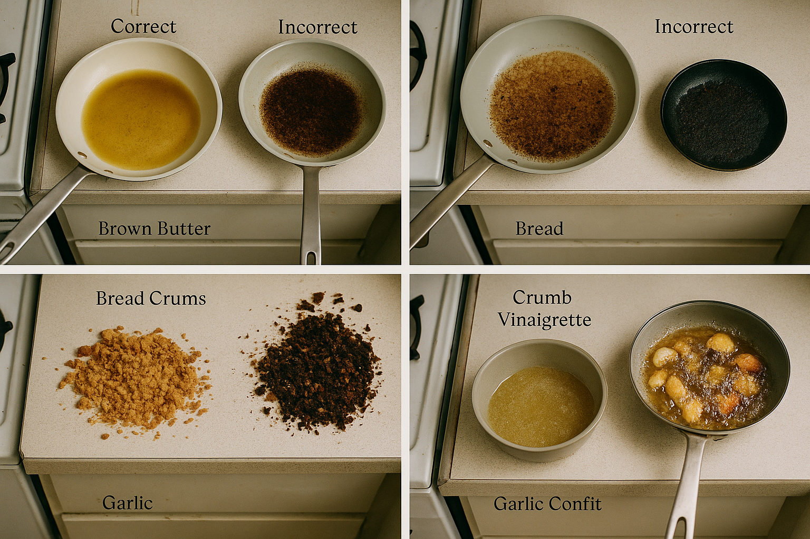

---

## Foundation 1: Brown-Butter Bread Crumbs

### The Why

Bread crumbs are the unsung heroes of scrap cooking. They absorb liquid, add texture, bind dressings, and—when toasted in brown butter—become so good that you'll eat them straight from the pan with a spoon, standing over the stove like a raccoon who's discovered gourmet trash.

Brown butter (beurre noisette in fancy French) is what happens when you stop cooking butter *before* it becomes burnt butter. The milk solids caramelize, developing a nutty, toffee-like flavor through the Maillard reaction. It's alchemy, but the science-backed kind.

### The Recipe

<!-- img-prompt: Design a three-panel process triptych (left-to-right) that clearly shows the progression for Brown-Butter Bread Crumbs. Natural daylight from a single window, warm tones, slightly desaturated, unpretentious editorial cookbook style. Shoot overhead (90° top-down) on a weathered wooden surface set on a cheap laminate counter edge peeking at the bottom—hint of a cramped San Francisco studio kitchen (rental stove knob visible at far edge). Panel 1 (Prep): A bowl of irregular, coarse, pea-sized stale bread crumbs sits beside torn crust pieces and a small digital scale; a note card reads “2 cups (120g)” in neat handwriting; a light-colored skillet is empty nearby. Panel 2 (Brown the butter): The skillet now contains butter in mid-brown stage—foam just subsiding, amber milk-solid specks collecting on the pale skillet surface; a hand tilts the pan slightly, swirl motion visible, steam faintly drifting. The color is a nutty medium amber, not dark. Panel 3 (Toast the crumbs): The crumbs are added and are toasting—spatula mid-stir with obvious motion blur; crumbs visibly transitioning to deep golden with a dry, crisp look; a pinch bowl of sea salt and a tiny dish of optional spice (za’atar/chili flakes) sit to the side. Include tiny cues of real life: a single crumb on the burner, a faint coffee ring on the wood. Camera: 50mm lens equivalent, f/3.5 for clarity across each panel. Mood: fast and focused—“have everything ready; this moves fast.” -->
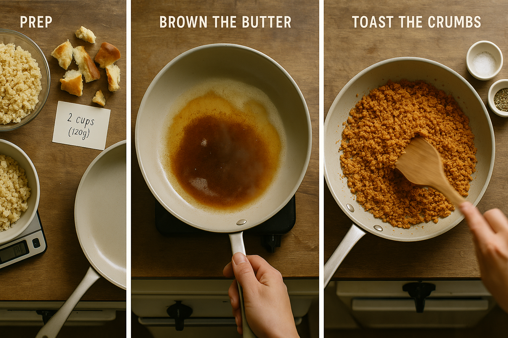

**Yield:** About 2 cups toasted crumbs
**Active time:** 8 minutes
**Keeps:** 2 weeks in an airtight container at room temp; 2 months frozen

**Ingredients:**
- 4 tablespoons (½ stick / 56g) unsalted butter
- 2 cups (120g) coarse bread crumbs, made from stale bread*
- ¾ teaspoon fine sea salt
- Optional: 1 teaspoon za'atar, smoked paprika, or nutritional yeast

*To make crumbs: Tear or pulse stale bread into rough, pea-sized pieces. They should be irregular—this is Drain Salad, not a Michelin kitchen.

**Method:**

1. **Set up:** Have your crumbs measured and ready in a bowl next to the stove. This moves fast.

2. **Brown the butter:** Place butter in a light-colored skillet (so you can see the color change) over medium heat. As it melts, it will foam enthusiastically. This is the water evaporating—let it. Swirl the pan occasionally. After 3–4 minutes, the foam will subside and you'll see amber-brown specks forming on the bottom of the pan. These are the toasted milk solids. They smell like hazelnut and happiness.

3. **The moment of truth:** When the butter smells nutty and the solids are medium-brown (not dark brown—that's burnt), immediately add the bread crumbs. They'll sizzle dramatically. Stir constantly.

4. **Toast:** Cook, stirring constantly, for 3–4 minutes until the crumbs are deeply golden and crispy. They should be a shade darker than "tan" but lighter than "chocolate." Taste one (blow on it first, they're lava-hot). It should crunch and taste nutty, buttery, and faintly sweet.

5. **Finish:** Remove from heat. Add salt and any optional spices. Toss. Transfer immediately to a plate or bowl to stop the cooking—if you leave them in the hot pan, they'll keep cooking and may burn.

6. **Cool completely** before storing. Warm crumbs = condensation in your container = soggy crumbs tomorrow.

**Variations:**

- **Garlic Brown-Butter Crumbs:** Add 3 smashed garlic cloves to the butter as it browns. Fish them out before adding crumbs (or leave them in and mince them—your call).
- **Parmesan Crumbs:** Toss warm crumbs with 3 tablespoons finely grated Parmesan.
- **Spicy Crumbs:** Add ½ teaspoon red chili flakes with the salt.
- **Everything Crumbs:** Toss with 1 tablespoon everything bagel seasoning.

**Uses:**
- Sprinkle over any salad for instant crunch and richness
- Toss with roasted scraps as a finishing texture
- Stir into pasta with olive oil and garlic for emergency dinner
- Top soups, grain bowls, or roasted vegetables
- Eat directly from the pan (no judgment)

**Troubleshooting:**

- **Burnt butter smell:** You went too far. Start over. There's no saving burnt butter—it's bitter and acrid.
- **Crumbs won't crisp:** Your bread wasn't stale enough, or your heat was too low. Try toasting them longer, or start with drier bread.
- **Soggy the next day:** You stored them while they were still warm. Moisture is the enemy. Always cool completely.

<!-- img-prompt: Create a hero shot of Brown-Butter Bread Crumbs in a simple, matte ceramic bowl, mounded and overflowing slightly. The crumbs are irregular, deeply golden with a matte, dry crunch—speckles of toasted milk solids clinging subtly, no oily gloss. A well-loved metal spoon rests in the bowl, a few crumbs spilled onto a weathered wood surface. Natural window light from the left, warm and soft, with gentle falloff and a shallow depth of field that keeps the crumbs crisp and the background pleasantly blurred. Slightly desaturated editorial palette; no artificial shine. In the soft blur, hint at the reality of the setting: the edge of a cheap laminate counter and a scuffed rental stove knob. No props that suggest luxury—just a tiny pinch bowl of salt and a folded dish towel. Camera angle: three-quarter overhead (about 45°) with a 50mm or short macro lens at f/2.8 to emphasize texture. Mood: quietly triumphant, the scent of hazelnut and toasted bread implied—“so good you eat them with a spoon over the stove.” Avoid perfect symmetry; let the scene feel lived-in. This is honest, not Instagram-polished. Keep tones warm, slightly desaturated, and appetizing-but-real. -->
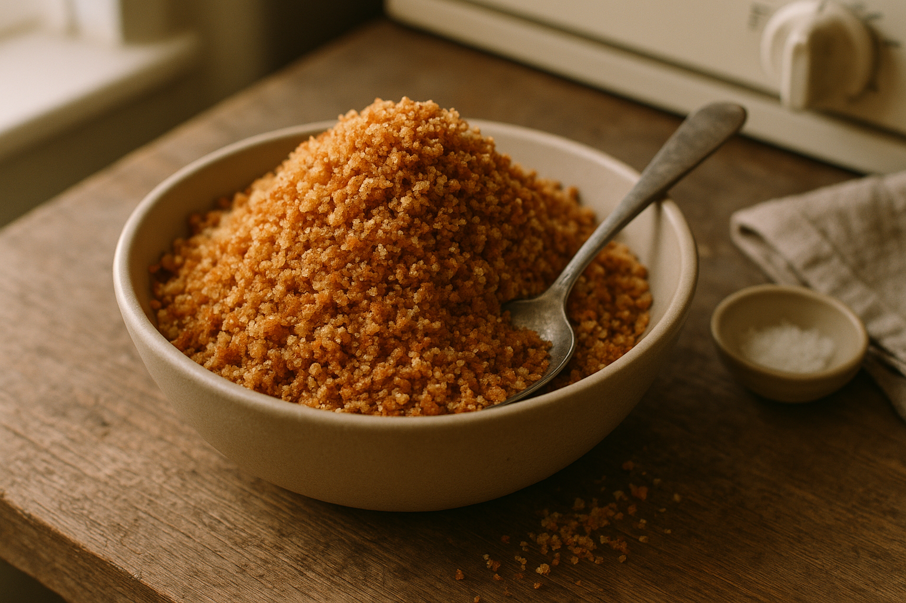

---

## Foundation 2: House Crumb-Vinaigrette (Three Ways)

### The Why

This is the signature move of Drain Salad cooking: a vinaigrette emulsified with bread crumbs instead of mustard or egg. The crumbs add body, a subtle nutty sweetness, and a creamy texture that clings to scraps instead of pooling at the bottom of the bowl. It's also a closed-loop system—you're using stale bread to dress food scraps. Poetic, no?

The science: Bread crumbs contain starch, which acts as a stabilizer, helping oil and vinegar bind into a creamy emulsion. This is the same principle that makes pasta water or potato starch useful in sauces—starch likes both fat and water, so it plays diplomat between them.

### The Formula

**Classic 3:1 Ratio:** 3 parts oil to 1 part acid, plus crumbs for body.

For a **more stable emulsion** (if you're making this ahead or want it extra creamy), use **1 part emulsifier (crumbs) : 3 parts vinegar : 6–9 parts oil**. We'll split the difference and go with a middle-ground ratio that works for most applications.

---

### Recipe A: Classic Sherry-Crumb Vinaigrette

<!-- img-prompt: Render a clear four-step process sequence for House Crumb-Vinaigrette, arranged left-to-right in a single strip or a 2x2 grid. Natural daylight, warm neutral palette, slightly desaturated. Shot overhead (90° top-down) on a weathered wood board resting atop a cheap laminate counter—subtle nod to a cramped San Francisco studio kitchen. Minimal props, instructional clarity. Step 1 (Bloom crumbs): A small glass bowl with finely ground, toasted bread crumb powder (from a spice grinder nearby) mixed with sherry vinegar; the crumbs have visibly swelled, forming a paste. Label discreetly in small, clean sans-serif type at the top-left: “1. Bloom crumbs in vinegar (1 min).” Step 2 (Add flavor): Dijon, honey, salt, and black pepper added to the paste; a small whisk partially submerged; mustard jar and honey spoon just at the edge. Label: “2. Whisk in mustard, honey, salt, pepper.” Step 3 (Emulsify): Olive oil being poured in a thin, steady stream from a measuring cup while whisking vigorously; the mixture thickening, glossy-sticky, clinging to the bowl sides. Label: “3. Stream in oil while whisking.” Step 4 (Finish): A creamy, cohesive dressing in a small jar, with a tiny spoonful lifting to show viscosity—no separation. Label: “4. Adjust: water if too thick, vinegar/salt to balance.” Include a few stray crumb flecks on the board, no heavy graphics, and tiny shadows. Lens: 50mm equivalent, f/3.2. Mood: smart, practical, unglamorous science—“emulsions have opinions about ratios.” -->
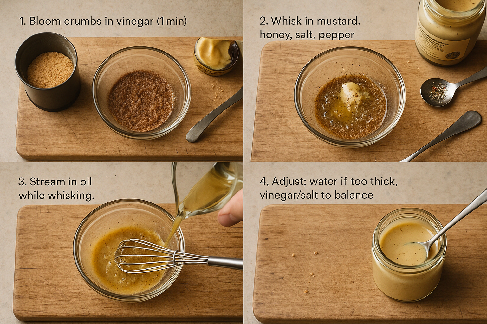

**Yield:** About ¾ cup (enough for 6–8 salads)
**Active time:** 3 minutes
**Keeps:** 3 days refrigerated (shake before using)

**Ingredients:**
- 2 tablespoons finely ground toasted bread crumbs*
- 2 tablespoons sherry vinegar
- 1 teaspoon Dijon mustard (optional, for extra emulsifying power)
- 1 teaspoon honey or maple syrup
- ½ teaspoon fine sea salt
- Freshly ground black pepper
- 6 tablespoons (90ml) extra-virgin olive oil

*Grind your toasted bread crumbs in a spice grinder or mortar until powdery. If you skip this step, the dressing will be gritty.

**Method:**

1. **Bloom the crumbs:** In a jar or bowl, combine crumbs and vinegar. Let sit for 1 minute. The crumbs will swell and absorb the vinegar, forming a paste. This is good—it's the foundation of your emulsion.

2. **Add the rest:** Whisk (or shake) in the mustard, honey, salt, and a few grinds of pepper.

3. **Emulsify:** Add the olive oil in a slow, steady stream while whisking vigorously. If using a jar, add all the oil, seal tightly, and shake hard for 30 seconds. The dressing should thicken and become creamy, almost like a thin mayo. If it's too thick, whisk in a teaspoon of water. Too thin? Let it sit for 2 minutes—the crumbs will continue absorbing liquid.

4. **Taste:** It should be bright (acidic), rich (fatty), and balanced. Adjust: more salt if flat, more vinegar if too oily, more honey if too sharp.

**Uses:**
- Roasted vegetable scraps
- Grain bowls
- Wilted greens
- Tomato-bread salads (panzanella-style)

---

### Recipe B: Lemon-Herb Crumb Vinaigrette

Brighter and more delicate. Great for spring/summer scraps.

**Ingredients:**
- 2 tablespoons finely ground toasted bread crumbs
- 2 tablespoons fresh lemon juice (about 1 lemon)
- 1 teaspoon finely grated lemon zest
- 1 small garlic clove, grated or minced to a paste
- ½ teaspoon fine sea salt
- 6 tablespoons (90ml) olive oil or a mix of olive + neutral oil
- 2 tablespoons finely minced tender herbs (parsley, basil, chives, or a mix)

**Method:** Same as above, but stir in the herbs at the very end.

---

### Recipe C: Miso-Sesame Crumb Vinaigrette

Umami-forward. Excellent for heartier scraps (kale ribs, roasted roots, grain bowls).

**Ingredients:**
- 2 tablespoons finely ground toasted bread crumbs
- 2 tablespoons rice vinegar
- 1 tablespoon white or yellow miso paste
- 1 teaspoon honey
- 1 teaspoon toasted sesame oil
- 5 tablespoons (75ml) neutral oil (grapeseed or canola)
- Optional: 1 teaspoon toasted sesame seeds

**Method:** Whisk miso into the vinegar-crumb mixture until smooth, then proceed as above. Finish with sesame seeds if using.

<!-- img-prompt: Create a hero image of the House Crumb-Vinaigrette in a small, clear glass jar, filled almost to the rim. The dressing is creamy and cohesive with a gentle sheen, visible micro-flecks from finely ground toasted crumbs, no pools of oil. A spoon dipped into the jar trails a thick ribbon back into the surface to show viscosity. Subtle supporting elements (soft focus): a small bowl of crumb powder, a bottle of sherry vinegar, a pepper mill—kept minimal. Set on a weathered wooden surface with the edge of a cheap laminate counter faintly visible, hinting at the real San Francisco studio kitchen context. Natural window light from the right, warm and diffuse; slightly desaturated editorial palette. Camera angle: 45° three-quarter view, shallow depth of field (f/2.8 on a 50mm or short macro lens) to make the jar the star, with background gently blurred. Mood: quietly confident, utilitarian elegance—no garnish, no frills. Include gentle condensation or smear marks on the jar rim to emphasize honest use. Avoid bright, glossy “food porn” highlights; keep it appetizing but real, matte-ish, with subtle texture on the dressing’s surface. This is the signature move—closed-loop cooking that feels smart and satisfying. -->
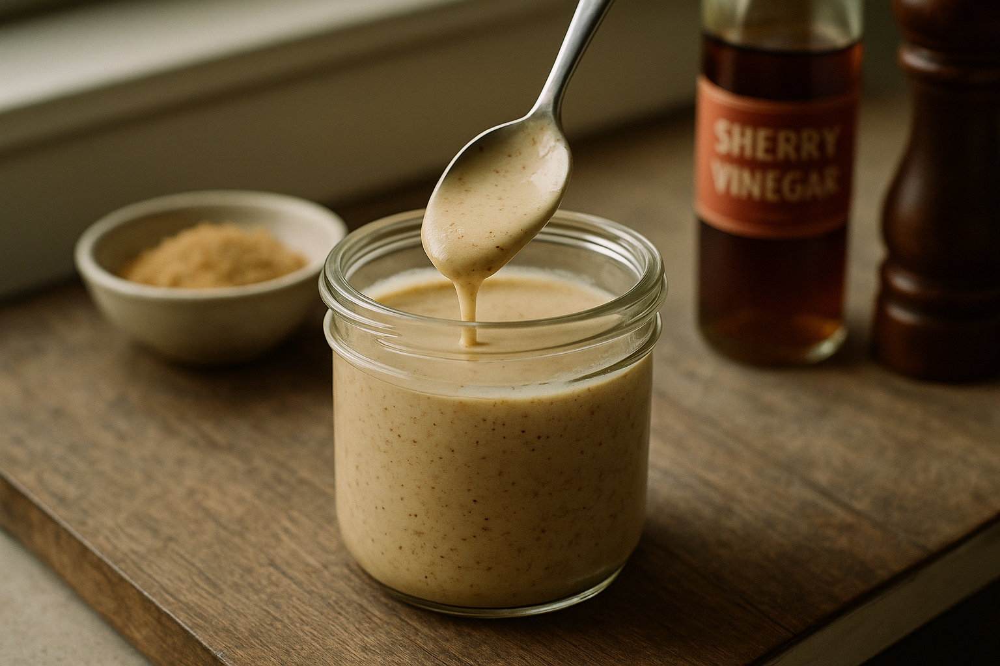

---

## Foundation 3: Parmesan-Rind Broth (Brodo)

### The Why

Parmesan rinds are too tough to eat, but they're packed with umami. Simmered in water with aromatics, they release savory, nutty, slightly sweet flavors—think of it as a vegetable stock with a PhD in deliciousness. This is *brodo*, and it's what Italian grandmothers have been making forever because they understood that "garbage" is just "dinner" that hasn't been cooked yet.

Use this as a base for soups, risotto, braising liquid, or just sip it from a mug like bouillon when you're feeling fancy and/or unwell.

### The Recipe

<!-- img-prompt: Build a three-stage vertical process sequence for Parmesan-Rind Broth (Brodo). Natural daylight, warm neutrals, slightly desaturated. Shot in a cramped San Francisco studio kitchen—cheap laminate counters, a coil-burner rental stove, and a well-used enamel pot. Overhead or slightly elevated (60°) for clarity, editorial cookbook style. Panel 1 (Optional sauté): Onion quarters (unpeeled) and a halved head of garlic cut-side down in a slick of olive oil, browning in the enamel pot; bay leaves, peppercorns, and herb stems (parsley/thyme) staged nearby; a tomato end or dab of tomato paste in a tiny dish. Label in small sans-serif at the top-left: “Sear aromatics (optional).” Panel 2 (Simmer): Water added with several Parmesan rinds (stickers/wax scrubbed clean), bay leaves, peppercorns, and herb stems bobbing. Gentle steam and a barely-there simmer; rinds softening at the edges. Label: “Simmer 1–2 hours, partially covered.” Panel 3 (Strain): A fine-mesh strainer over a large bowl catching a rich golden broth; a wooden spoon presses solids in the strainer to extract every drop; the softened rinds and spent aromatics visible in the sieve. Label: “Strain and season lightly.” Include real-life details: a slightly stained pot rim, stray peppercorn, a folded dish towel. Lens: 50mm, f/3.5 for clarity. Mood: old-world wisdom meets broke-kitchen pragmatism—“garbage becomes dinner.” -->
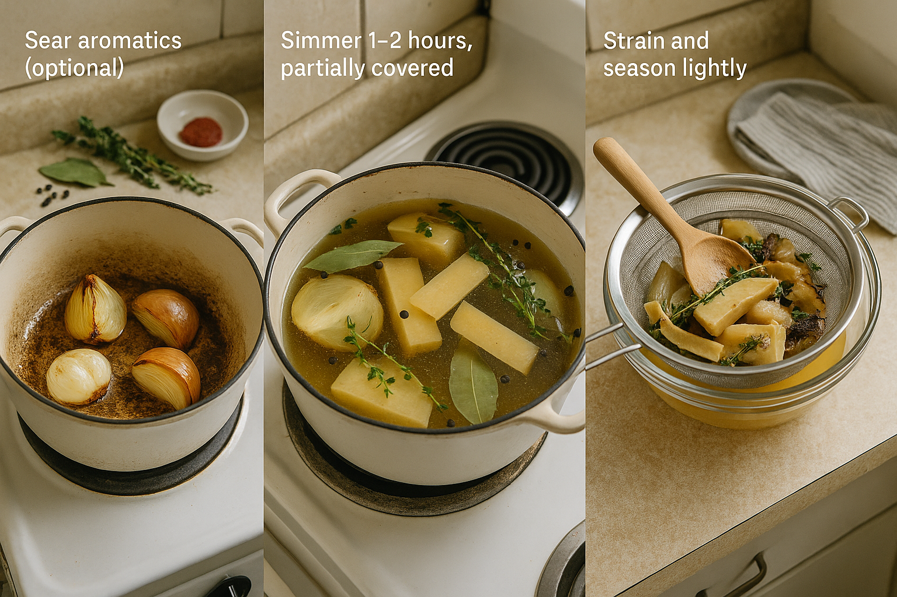

**Yield:** About 6 cups
**Active time:** 10 minutes
**Total time:** 1–2 hours
**Keeps:** 1 week refrigerated, 3 months frozen

**Ingredients:**
- 1 cup (about 4–6 pieces) Parmesan rinds, rinsed*
- 8 cups (2L) cold water
- 1 medium onion, quartered (no need to peel)
- 1 whole head garlic, halved crosswise
- 2 bay leaves
- 1 teaspoon black peppercorns
- Small handful of herb stems (parsley, thyme, or basil stems—whatever you have)
- Optional: 1 tomato end or a splash of tomato paste for color and acidity

*If your rinds have wax or stickers, scrub them off first. Also, yes, you can and should save rinds in the freezer until you have enough to make broth.

**Method:**

1. **Sauté aromatics (optional but good):** In a large pot, heat a glug of olive oil over medium heat. Add the onion and garlic, cut-side down, and cook for 5 minutes until lightly browned. This adds depth. Skip this if you're lazy or in a hurry—the broth will still be good.

2. **Add everything:** Toss in the Parmesan rinds, water, bay leaves, peppercorns, herb stems, and tomato (if using). Bring to a boil.

3. **Simmer:** Reduce heat to low and simmer, partially covered, for 1–2 hours. The longer it goes, the richer it gets. You'll know it's ready when the rinds have softened slightly and the broth tastes deeply savory. It should smell like a good Italian restaurant.

4. **Strain:** Pour through a fine-mesh strainer. Press on the solids to extract every drop of liquid. Discard the solids (the rinds have given all they have).

5. **Season:** Taste. It should be flavorful but not salty (the rinds aren't super salty). Add a pinch of salt if needed, but be conservative—you'll be seasoning whatever dish you use this in.

6. **Store:** Let cool, then refrigerate in jars or freeze in portions.

**Pressure Cooker Method:** Combine everything in a pressure cooker. Cook on high pressure for 30 minutes, then natural release. Done. This is absurdly fast and yields a richer broth.

**Uses:**
- Base for ribollita, minestrone, or any Italian soup
- Risotto liquid (mix 1:1 with vegetable or chicken stock)
- Braising liquid for greens or beans
- Deglaze roasting pans
- Sip it with a little black pepper and a drizzle of olive oil

<!-- img-prompt: Produce a serene hero shot of Parmesan-Rind Broth served simply in a small, matte off-white bowl. The broth is a clear, rich golden color with a faint sheen; a few tiny droplets of olive oil shimmer on the surface, and a twist of freshly cracked black pepper floats at center. Whisper of steam rises, catching the natural window light from the left. Set on a weathered wood board, with the subtle edge of a cheap laminate counter peeking in the lower frame—an honest nod to the San Francisco studio apartment. Background out of focus: an enamel pot lid and a stray Parmesan rind, both soft and unobtrusive. Camera angle: 45° three-quarter, shallow depth of field (f/2.8 on a 50mm lens) to keep the surface detail and steam crisp while the world falls away. Color palette: warm neutrals, slightly desaturated; no stylized garnishes. Mood: comforting, minimal, quietly luxurious in a humble way—“sip it like bouillon when you’re feeling fancy and/or unwell.” Texture should be realistic, not overly glossy; keep reflections soft. This image should feel like a pause—the essence of flavor extracted from scraps, distilled into something restorative and precise. -->
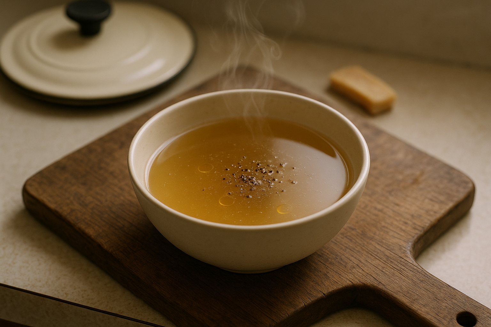

---

## Foundation 4: Garlic Confit & Infused Oil

### The Why

Raw garlic is aggressive. Roasted garlic is sweet. Garlic confit—garlic slowly poached in oil—is *both*: mellow, jammy, spreadable, and utterly versatile. Plus, you get two products for the price of one: silky garlic cloves and garlic-infused oil. Both keep for weeks. Both make everything better.

### The Recipe

<!-- img-prompt: Create a three-step process sequence for Garlic Confit & Infused Oil, arranged left-to-right. Natural daylight, warm tones, slightly desaturated, honest editorial style. Shot overhead (90°) on a weathered board set on a cheap laminate counter—hinting at the cramped San Francisco studio kitchen. Step 1 (Peel & submerge): A small saucepan (or oven-safe dish) filled with peeled garlic cloves (about 30), completely covered in olive oil. Optional aromatics—two thyme sprigs, a bay leaf, and a few peppercorns—are nestled among the cloves. Label in subtle small sans-serif: “1. Peel. Submerge in oil.” Step 2 (Poach low & slow): The same vessel on a rental stove coil burner with the tiniest shimmer of bubbles—barely perceptible movement—cloves turning pale gold but not browning. Include a visible dial set to the lowest heat. Label: “2. Gentle bubbles, 45–60 min.” Step 3 (Cool & store): The finished confit cooled in the oil and transferred to a clean glass jar; cloves look soft, jammy, golden, fully submerged. Label: “3. Cool in oil. Store refrigerated.” Honest details: a few papery skins off to the side, a dribble of oil on the counter, a folded towel. Lens: 50mm, f/3.5 for clarity. Mood: calm, meditative, two-for-one magic—silky cloves and infused oil. -->
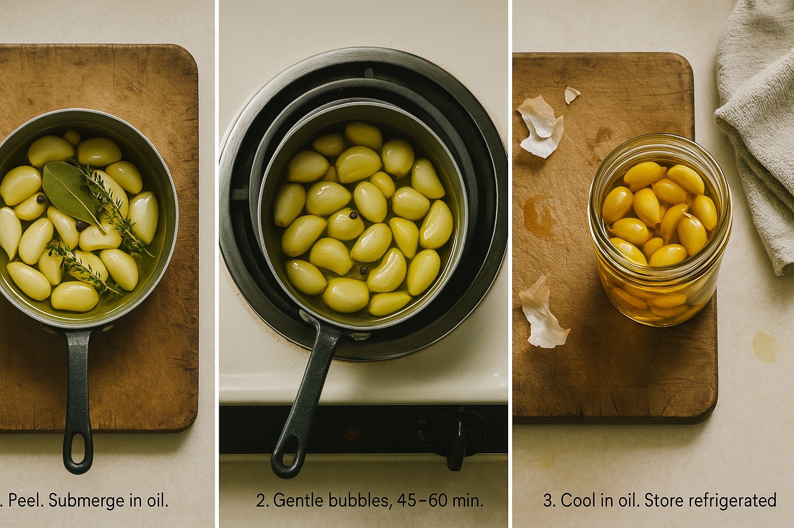

**Yield:** About 30 cloves confit + 1 cup infused oil
**Active time:** 10 minutes
**Total time:** 1 hour
**Keeps:** 2 weeks refrigerated (submerged in oil)

**Ingredients:**
- 3 heads of garlic (about 30 cloves), peeled
- 1–1½ cups (250–375ml) olive oil (enough to cover the garlic completely)
- Optional: 2 sprigs fresh thyme, 1 bay leaf, ½ teaspoon black peppercorns

**Method:**

1. **Peel:** Yes, you have to peel all the cloves. Put on a podcast. This is meditative.

2. **Submerge:** Place garlic in a small saucepan or oven-safe dish. Add oil until cloves are fully covered. Add optional aromatics if using.

3. **Cook low and slow:**
   - **Stovetop:** Set heat to the lowest possible setting. You want gentle bubbles, not a vigorous simmer. Cook for 45–60 minutes, stirring occasionally, until the cloves are soft, golden, and spreadable.
   - **Oven:** Bake at 250°F (120°C) for 1 hour. Check at 45 minutes.

4. **Cool:** Let cool completely in the oil. The garlic will continue softening as it cools.

5. **Store:** Transfer everything (garlic and oil) to a clean jar. Make sure cloves stay submerged—exposed garlic = mold risk. Refrigerate.

**Uses:**

**Garlic:**
- Mash into dressings, mayo, or aioli
- Spread on toast
- Stir into mashed potatoes, soups, or sauces
- Toss with roasted scraps

**Oil:**
- Finishing oil for soups and salads
- Sauté base for vegetables
- Drizzle over pizza or pasta
- Use anywhere you'd use olive oil, but want a subtle garlic flavor

**Safety note:** Garlic in oil can theoretically harbor *Clostridium botulinum* (botulism) if stored improperly. The key is **refrigeration** and **using it within 2 weeks**. Don't leave it at room temp. If it smells off or looks cloudy, discard it.

<!-- img-prompt: Compose a hero image of Garlic Confit: a small glass jar packed with jammy, golden garlic cloves fully submerged in olive oil. The surface glows warmly in soft window light, with tiny thyme leaves and a bay leaf pressed against the glass, peppercorns settled at the bottom. A tarnished spoon rests alongside, holding a single smashed clove to show its spreadable texture. Set on a weathered wooden surface; the blurred edge of a cheap laminate counter and a faint glimpse of a rental stove knob sit at the periphery to ground the reality of a cramped San Francisco studio kitchen. Camera angle: 45° three-quarter, shallow depth of field (f/2.8, 50mm or short macro) emphasizing the luscious, soft structure of cloves without high-gloss shine. Slightly desaturated, warm neutral palette. Honest imperfections allowed: a little oil smear on the jar rim, a speck of garlic skin nearby. Mood: quietly opulent, practical luxury—two products in one. Avoid styling that looks staged or aspirational; keep it candid, appetizing, and real. Optional subtle hand-written label on the jar reading “Garlic Confit — refrigerate, 2 weeks.” -->
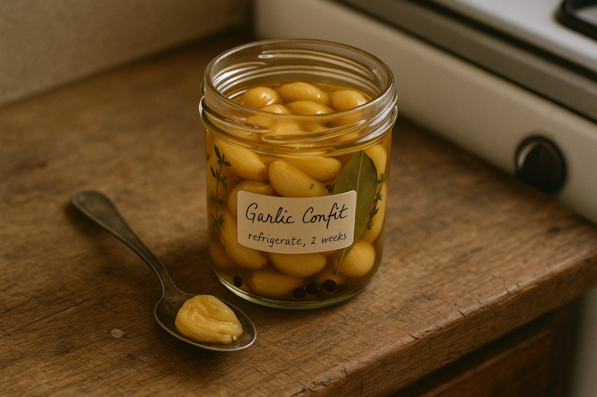

---

## Foundation 5: Quick-Pickled Fines

### The Why

Pickles are controlled chaos—acid, salt, and sugar taming raw scraps into something bright, crunchy, and longer-lasting. These aren't shelf-stable fermented pickles (that's Chapter 9); these are refrigerator pickles, ready in hours and perfect for adding zing to any Drain Salad.

### The Recipe

**Yield:** 1 pint jar
**Active time:** 10 minutes
**Ready in:** 2 hours (better after 24 hours)
**Keeps:** 2 weeks refrigerated

**Ingredients:**
- 2 cups mixed vegetable fines and scraps, thinly sliced or chopped*
- 1 cup (250ml) vinegar (white, rice, or apple cider)
- 1 cup (250ml) water
- 2 tablespoons sugar
- 2 teaspoons fine sea salt
- Optional: 1 teaspoon mustard seeds, peppercorns, coriander seeds, red chili flakes, or a bay leaf

*Good candidates: radish tops, carrot ribbons, cucumber ends, red onion slivers, jalapeño stems (if you like spice), cabbage cores, cauliflower trim.

**Method:**

1. **Prep scraps:** Pack them into a clean pint jar. Pack tightly but don't crush.

2. **Make brine:** In a small saucepan, combine vinegar, water, sugar, salt, and any spices. Bring to a boil, stirring to dissolve sugar and salt.

3. **Pour:** Immediately pour the hot brine over the scraps, covering them completely. Let any air bubbles escape by gently tapping the jar on the counter.

4. **Cool & refrigerate:** Let cool to room temp, then seal and refrigerate. They're technically edible after 2 hours, but they're much better after a day.

**Variations:**
- **Spicy:** Add sliced jalapeño or Fresno chili and red chili flakes.
- **Sweet:** Up the sugar to 3 tablespoons and add a cinnamon stick (good for carrots and beets).
- **Dill:** Add a big handful of fresh dill and extra garlic.

**Uses:**
- Chop and toss into salads
- Serve alongside grain bowls
- Top tacos, sandwiches, or burgers
- Eat straight from the jar while standing in front of the fridge

<!-- img-prompt: Design a hero shot of Quick-Pickled Fines: a clear pint jar tightly packed with mixed vegetable scraps in jewel-toned brine. Include thin carrot ribbons, cucumber ends, red onion slivers, jalapeño stems, radish tops, cabbage core shavings, and cauliflower trim. Brine is bright and clear with visible mustard seeds, peppercorns, and a bay leaf suspended. The colors should pop yet remain slightly desaturated for an honest editorial look—crimson onion, orange carrot, green stems, pale cabbage. Natural daylight from a side window, warm and soft. The jar sits on a weathered wood surface with subtle water rings; the edge of a cheap laminate counter just peeks in frame to anchor the San Francisco studio kitchen vibe. Background blur might include a small saucepan and a measuring cup (soft focus). Camera angle: 45° three-quarter, shallow depth of field (f/2.8, 50mm), highlighting the translucent brine and crisp textures pressed against the glass. A few stray seeds and a drip of brine on the board underscore real use. Mood: bright, zippy, controlled chaos tamed by acid. No artificial gloss; keep reflections soft, not flashy. This should look like something you’d grab from the fridge and eat standing there, fork in jar. -->
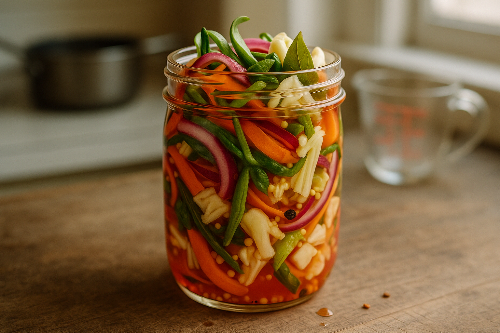

---

## Foundation 6: Green-Stem Pesto

### The Why

Herb stems (parsley, cilantro, basil) are often more intensely flavored than the leaves, but they're too fibrous to eat raw. Blended into pesto, they become a vibrant, punchy sauce that lasts for weeks and transforms boring scraps into something that tastes like effort.

This is not traditional Genovese pesto. This is *stem pesto*—rougher, greener, more assertive. It's what pesto would be if it grew up on a punk farm instead of in Liguria.

### The Recipe

**Yield:** About 1 cup
**Active time:** 10 minutes
**Keeps:** 1 week refrigerated, 3 months frozen

**Ingredients:**
- 2 cups packed herb stems (parsley, cilantro, basil, or a mix), tough bottom ends trimmed
- 1 garlic clove (or 2 if you're brave)
- ⅓ cup (50g) nuts or seeds (pine nuts, walnuts, almonds, sunflower seeds—whatever you have)
- ½ cup (120ml) olive oil, plus more as needed
- ¼ cup (25g) grated Parmesan, Pecorino, or nutritional yeast (for vegan)
- Juice of ½ lemon
- ½ teaspoon fine sea salt, plus more to taste

**Method:**

1. **Toast the nuts (optional but recommended):** In a dry skillet over medium heat, toast nuts for 3–4 minutes until fragrant. Let cool.

2. **Blend:** In a food processor or blender, combine herb stems, garlic, nuts, cheese, lemon juice, and salt. Pulse until roughly chopped.

3. **Add oil:** With the motor running, drizzle in olive oil until the mixture becomes a thick, spreadable paste. You want it chunky, not smooth—this isn't baby food.

4. **Taste:** It should be bright, garlicky, and herbaceous. Adjust: more salt if flat, more lemon if it tastes heavy, more oil if it's too thick to spread.

5. **Store:** Transfer to a jar and cover the surface with a thin layer of olive oil (this prevents oxidation). Refrigerate.

**Uses:**
- Toss with pasta and roasted scraps
- Spread on toast or sandwiches
- Stir into soups or grain bowls
- Mix with mayo for a bright aioli
- Use as a marinade for vegetables before roasting

<!-- img-prompt: Create a hero image of Green-Stem Pesto in a low, wide ceramic bowl. The pesto is chunky and vibrant—flecks of herb stems, crushed nuts or seeds, grated cheese (or nutritional yeast), and a sheen of olive oil pooling lightly in crevices. Texture is intentionally rough and assertive, not silky; visible strands of minced stems signal “punk farm” energy. Natural daylight from the left, warm and slightly desaturated to maintain an honest editorial look. Set on a weathered wooden surface with a lemon half, a small pile of trimmed herb stems, and a few toasted nuts in soft background blur. The edge of a cheap laminate counter or a scuffed rental stove knob should be barely perceptible to root the image in the San Francisco studio kitchen. Camera angle: 45° three-quarter with a short macro lens (60–100mm equivalent), shallow depth of field (f/2.8) to emphasize texture. A spoon smear on the board reveals thickness and chunkiness. Mood: bold, practical, and green in the best way—resourcefulness turned into flavor. Avoid pristine styling; allow a few escaped pesto flecks and an oil drop or two. No overly glossy highlights; keep the color true and appetizing. -->
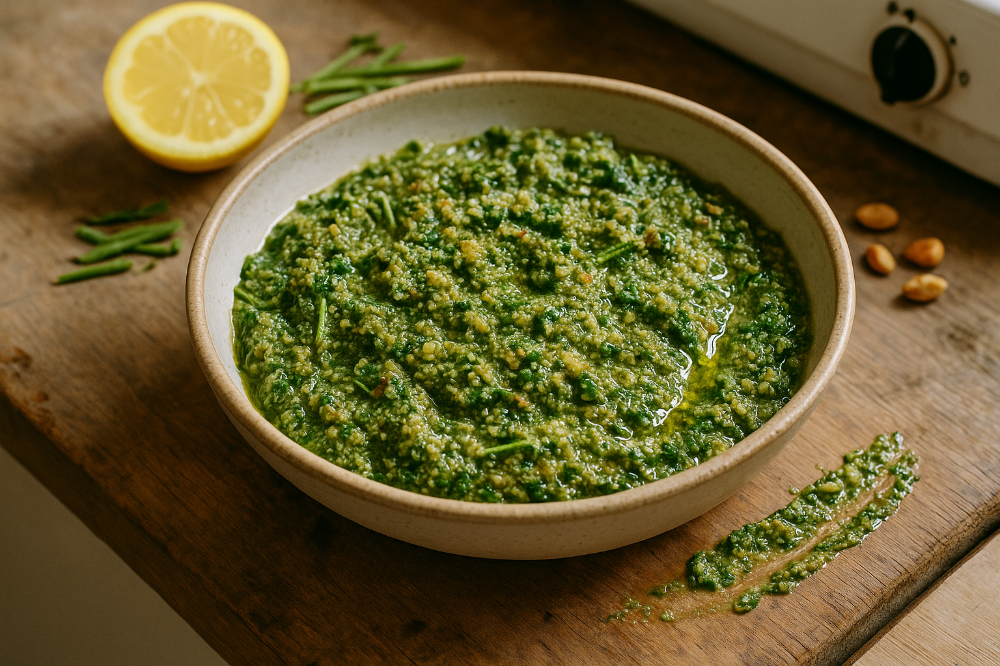

---

## Foundation 7: Brewed-Coffee Molasses (Dregs Reduction)

### The Why

This one's weird, but trust me. If you have leftover coffee (or tea, or mushroom soaking liquid), you can reduce it with sugar into a glossy, bittersweet glaze that adds complexity to roasted scraps, grains, or even desserts. It's umami-adjacent, slightly bitter, deeply savory, and it makes people say "what *is* that?" in the best way.

### The Recipe

**Yield:** About ¼ cup
**Active time:** 10 minutes
**Keeps:** 2 weeks refrigerated

**Ingredients:**
- 1 cup (250ml) brewed coffee (day-old is fine), strong tea, or mushroom soaking liquid
- 2 tablespoons brown sugar, honey, or maple syrup
- Pinch of salt

**Method:**

1. **Combine:** In a small saucepan, combine liquid, sweetener, and salt. Bring to a boil over medium-high heat.

2. **Reduce:** Lower heat to medium and simmer, stirring occasionally, until reduced to about ¼ cup and thick enough to coat the back of a spoon. This takes 8–12 minutes. It should look glossy and syrupy, not watery.

3. **Cool:** Remove from heat. It will thicken further as it cools.

4. **Store:** Transfer to a jar and refrigerate.

**Uses:**
- Drizzle over roasted root vegetable scraps
- Stir into grain bowls for depth
- Glaze roasted mushroom stems or onion ends
- Add a spoonful to savory sauces or stews for complexity
- Drizzle over vanilla ice cream if you're feeling adventurous

<!-- img-prompt: Produce a moody hero shot of Brewed-Coffee Molasses (Dregs Reduction): a small glass or ceramic pouring vessel filled with a dark, glossy, bittersweet syrup. Capture a slow ribbon of the reduction falling from a spoon back into the vessel, showing thick, lacquered viscosity that coats the back of the spoon. Natural window light, warm and soft, slightly desaturated palette. Set on a weathered wood board with a few scattered coffee grounds and a stained mug in blurred background, plus the edge of a cheap laminate counter—anchoring the San Francisco studio apartment setting. Keep the background objects out of focus: a small saucepan with caramelized residue, a crumpled sugar packet. Camera angle: 45° three-quarter, shallow depth of field (f/2.8, 85mm or short macro) to emphasize the glossy surface without turning it into flashy food porn—reflections should be controlled, soft, and realistic. Mood: intriguing, a little strange, quietly elegant—“what is that?” in the best way. Color should read deep mahogany with amber highlights at the edges. Honest imperfections welcome: a small drip on the rim, a streak on the spoon. Keep it minimal, functional, and inviting for both savory and sweet applications. -->
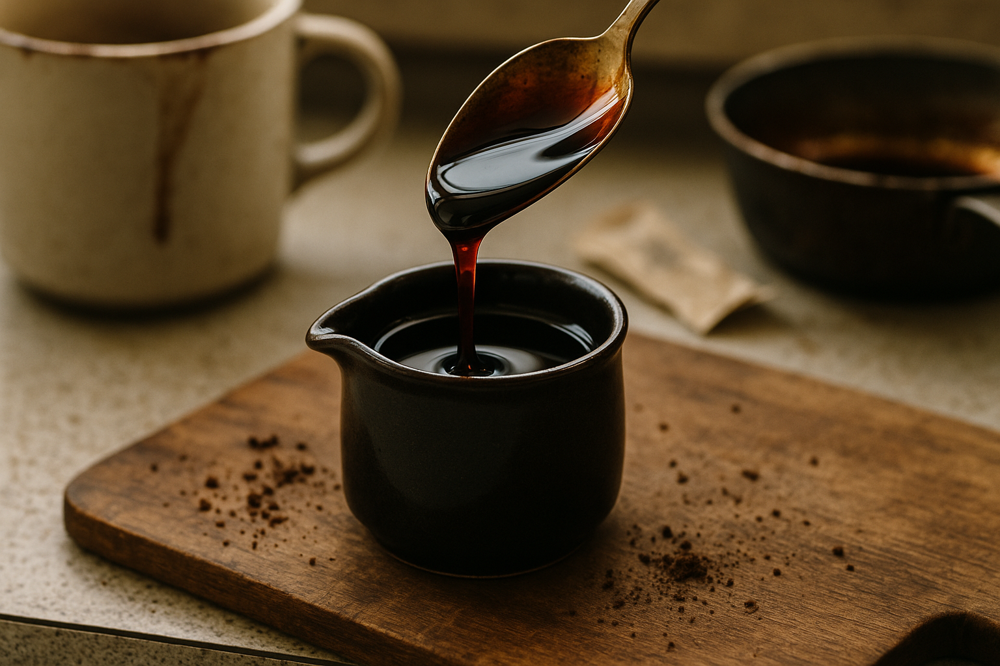

---

## The Foundation Mindset: Make Ahead, Use Freely

These seven recipes aren't meant to be made on demand. They're infrastructure—things you batch-make on a Sunday afternoon (or whenever) and keep in your fridge, ready to deploy. With these on hand, Drain Salad cooking becomes almost embarrassingly easy.

You don't need all seven at once. Start with two or three that sound most useful to your cooking style, and expand from there. But I will say this: the day you have brown-butter crumbs, crumb-vinaigrette, and garlic confit all sitting in your fridge at the same time is the day you realize you've become a more competent cook than most people who've never heard of Drain Salad.

Welcome to the infrastructure layer. It only gets more delicious from here.

---
