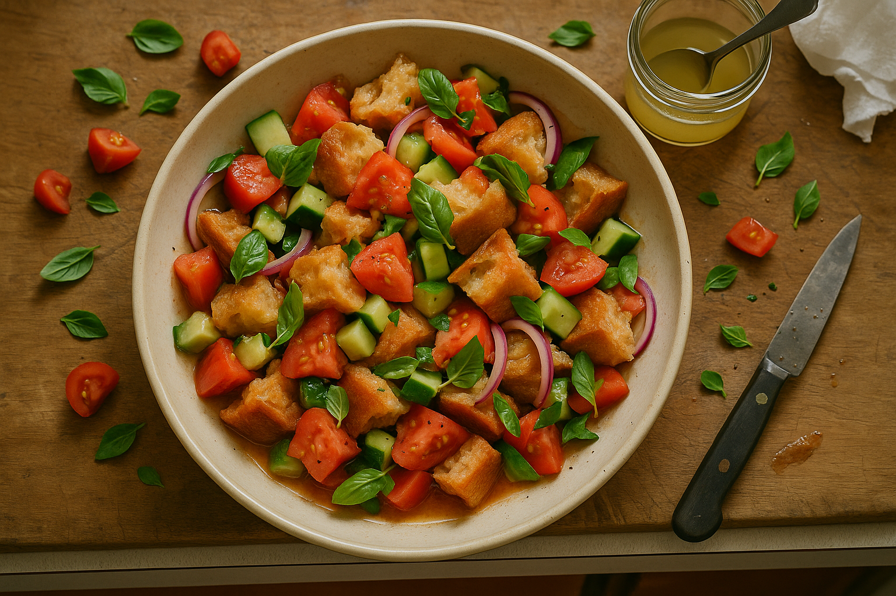

# Chapter 7: Salads & Small Plates

> *"Start small. Start honest."*

## On the First Bite

This is where theory becomes food.

The previous chapters gave you systems, techniques, and foundations. Now you're going to cook actual dishes—the kind you'd serve to friends, to yourself on a Tuesday night, to skeptical family members who think "drain salad" sounds like a punchline. These are not experiments. These are meals.

The salads and small plates in this chapter are designed to be entry points: straightforward, forgiving, fast. They're also modular—you can swap scraps, adjust ratios, and riff freely once you understand the structure. But the first time you make them, follow the recipe. Trust the proportions. Learn the rhythm. Then break the rules.

A note on yields: Most of these serve 2–4 people as a side, or 1–2 as a main if you're hungry or eating alone standing over the sink. Scale up as needed.

<!-- img-ref: images/chapter-06/026_brown-butter-crumbs-hero.png -->
<!-- img-ref: images/chapter-06/028_crumb-vinaigrette-hero.png -->
<!-- img-ref: images/chapter-06/030_parmesan-rind-broth-hero.png -->
<!-- img-ref: images/chapter-06/032_garlic-confit-hero.png -->
<!-- img-ref: images/chapter-06/033_quick-pickled-fines-hero.png -->
<!-- img-ref: images/chapter-06/034_green-stem-pesto-hero.png -->
<!-- img-ref: images/chapter-06/035_coffee-molasses-hero.png -->
<!-- img-prompt: Create a documentary-style, editorial cookbook image that shows all seven foundations together as the honest building blocks for Drain Salad. Composition: a slightly oblique overhead (about 35–45° three-quarter top view) on a weathered wood cutting board set on a cheap, speckled laminate rental counter in a cramped San Francisco studio kitchen. Natural late-afternoon window light from the left, soft shadows, warm, slightly desaturated palette, shallow depth of field with all seven items in sharp focus and the edges falling softly. Include: (1) brown-butter crumbs—golden, sandy pile in a small chipped ceramic pinch bowl; (2) crumb vinaigrette—cloudy tan dressing in a small mason jar with oil bead on top; (3) parmesan-rind broth—amber liquid in a glass measuring cup with a couple of gnawed parmesan rinds nearby; (4) garlic confit—soft golden cloves submerged in oil in a squat jar; (5) quick-pickled fines—tangled green herb stems in clear brine in a slender jar; (6) green-stem pesto—vivid, textured green paste in a white ramekin with a slick of oil; (7) coffee-molasses—inky, glossy syrup in a tiny glass bottle, a viscous drip on the board. Scatter honest scraps: a few stale bread crumbs, a microplane with garlic smears, lemon zest curls, pepper grinder out of focus. In the deep background, softly blurred, hint at reality: rental-grade stove coil and the open bathroom doorway just peeking in frame (toilet barely implied, not featured). No text or branding. Camera: 35mm lens, f/5.6, ISO 400. Mood: practical, inviting, not precious—“Start small. Start honest.” Show subtle fingerprints, water rings, and a dish towel corner for human presence. -->

---

## Recipe 1: Sludge Caesar (Kale Ribs, Stale Bread, Parmesan Rinds)

### The Story

March 2022. Six friends coming over. I have: wilted kale ribs I was going to compost, half a baguette from three days ago that's hard as a brick, and a bag of parmesan rinds in the freezer. Also $11 in my checking account until Friday, so going to the store isn't happening.

I make this.

Someone asks for the recipe. Someone else says it's "the kind of thing you'd pay $18 for at [restaurant name redacted]." I don't tell them it cost $3.47 to make, or that I invented it twenty minutes before they arrived because I had no other options. That's when I learned: desperation and technique look identical on a plate.

### The Why

This is a riff on Caesar salad, but built from scraps. The kale ribs—fibrous, bitter when raw—are blanched until tender, then tossed in a dressing made from parmesan-rind broth (umami bomb), stale bread (body and emulsification), and anchovy (funk and salt). It's rich, creamy, crunchy, and tastes like you meant to make it this way.

### The Recipe

<!-- img-prompt: Produce a clean, three-panel process sequence (triptych) for Sludge Caesar that clearly shows progression: blanching kale ribs → making croutons → emulsifying dressing. Consistent natural window light from the left, warm, slightly desaturated tones, editorial cookbook style, no text or logos. Set in a cramped San Francisco studio kitchen, March 2022, early evening (friends due any minute, $11 in the checking account—resourceful urgency). Panel 1 (left): Overhead top-down shot of a battered stockpot at a gentle rolling boil on an electric coil stove; a handful of 1/2-inch sliced kale ribs tumbling into salted water, tongues of steam rising, a metal spider strainer resting across the pot rim, a nearby metal bowl packed with ice water ready for shocking. Cheap laminate counter, stray kale rib ends, a clean towel. Panel 2 (center): Three-quarter overhead shot of torn stale baguette chunks on a scuffed baking sheet lined with wrinkled parchment, glistening lightly with olive oil, coarse salt sprinkled; a small bowl with olive oil and a tablespoon, half of the rock-hard baguette in frame, crumbs scattered. Oven door ajar in background (no visible temperature readouts). Panel 3 (right): Close three-quarter shot of a small glass jar mid-emulsification: parmesan-rind broth, fine toasted bread crumbs, lemon juice, Dijon, minced anchovy, grated garlic, and olive oil being whisked with a tiny whisk; dressing looks creamy and thick. Props: anchovy tin (label obscured), microplane with garlic residue, measuring cup of amber parmesan broth, pepper grinder. Camera: 35mm lens, f/5.6 for clarity across each panel. Mood: instructional, calm, and honest—technique over glamour. -->

**Serves:** 2–4 as a side, 1–2 as a main
**Active time:** 20 minutes
**Keeps:** Dressing: 3 days. Assembled salad: eat immediately (wilts fast).

#### Ingredients

**For the salad:**
- 2 cups (200g) kale ribs, sliced into ½-inch strips (about 2 bunches' worth)
- 2 cups (120g) stale bread, torn into 1-inch pieces
- 2 tablespoons olive oil
- ¼ teaspoon salt
- ¼ cup (25g) shaved Parmesan (or more, I won't judge)
- Flaky salt and black pepper for finishing

**For the dressing:**
- ½ cup (125ml) parmesan-rind broth (from Chapter 6, or use vegetable stock + 1 tablespoon grated Parmesan)
- 2 tablespoons finely ground toasted bread crumbs
- 1 tablespoon lemon juice
- 1 teaspoon Dijon mustard
- 2 anchovy fillets, minced (or 1 teaspoon anchovy paste)
- 1 garlic clove, grated
- ¼ cup (60ml) olive oil
- Freshly ground black pepper

#### Method

1. **Blanch the kale ribs:** Bring a pot of salted water to a boil. Add kale ribs and cook for 2–3 minutes until just tender (they should still have some bite). Drain and immediately plunge into ice water to stop cooking. Drain again and pat very dry with a towel. Set aside.

2. **Make croutons:** Preheat oven to 375°F (190°C). Toss bread pieces with 2 tablespoons olive oil and ¼ teaspoon salt. Spread on a baking sheet and bake for 10–12 minutes, stirring once halfway through, until deeply golden and crunchy. Let cool.

3. **Make dressing:** In a jar or bowl, combine parmesan broth, bread crumbs, lemon juice, mustard, anchovies, and garlic. Let sit for 1 minute (the crumbs will swell). Add olive oil and shake or whisk vigorously until emulsified and creamy. Taste. It should be salty, funky, rich, and bright. Adjust: more lemon if too heavy, more oil if too sharp, more black pepper always.

4. **Assemble:** In a large bowl, toss blanched kale ribs with half the dressing. Let sit for 2 minutes (this helps the dressing penetrate). Add croutons and toss again. The croutons should be coated but not soggy—if it looks dry, add more dressing.

5. **Finish:** Transfer to a serving plate. Top with shaved Parmesan, flaky salt, and several grinds of black pepper. Serve immediately.

#### Variations

- **With egg:** Top with a soft-boiled egg (6-minute egg, peeled, halved). Now it's a meal.
- **Spicy:** Add a pinch of red chili flakes to the dressing.
- **Citrus:** Toss in some lemon zest with the Parmesan at the end.

#### Notes

- **Why blanch the ribs?** Raw kale ribs are too fibrous and bitter. Blanching tenderizes them and mellows the bitterness while retaining their structure.
- **Can I use other greens?** Yes. Chard stems work. So do broccoli stems (slice thin). Cabbage cores (shaved on a mandoline) work great.
- **What if I don't have parmesan broth?** Use vegetable stock and stir in 1 tablespoon grated Parmesan when making the dressing.

<!-- img-prompt: Create a hero shot of Sludge Caesar that reads as elevated yet clearly made from scraps. Show blanched kale ribs glistening with a creamy, peppery dressing, generously studded with deeply golden, jagged croutons, and finished with snowy, irregular shavings of Parmesan, flaky salt, and freshly cracked black pepper. Composition: 45° angle close-up on a small, slightly chipped ceramic plate set on a weathered wood board atop a cheap laminate counter in a San Francisco studio kitchen (March 2022 dinner for six). Natural early-evening window light from the left, warm and soft, with gentle shadows; slightly desaturated tones. In the soft background, out of focus: a zip-top bag with parmesan rinds, a spent lemon half, and a few raw kale rib trimmings to hint at the transformation. No text or branding. Include a fork with a little dressing sheen and a few crumbs on the board; a smear of dressing on the plate rim is okay—real, not messy. The dressing should look thick and emulsified (bread crumbs giving body). The kale ribs should be visibly tender yet structured, not raw. Steam is not necessary; focus on texture and gloss. Camera: 50mm lens, f/4 to emphasize dimensionality of croutons and rib contours. Mood: quiet triumph—desperation and technique looking identical on a plate. Color palette: emerald greens, toasty browns, ivory Parmesan, olive oil gold, pepper black. -->

---

## Recipe 2: Bread-and-Tomato Salad with Pickle Brine (Panzanella Remix)

### The Why

Panzanella is a Tuscan bread salad built on one brilliant insight: stale bread soaked in tomato juice and vinegar becomes *better* than fresh bread. It's a dish designed to use up scraps (old bread, overripe tomatoes) and somehow ends up tasting like summer in a bowl.

This version uses tomato ends (the tough stem caps you'd normally discard), pickle brine (from a jar of cornichons or dill pickles), and whatever herbs you have lingering. It's tangy, juicy, and absurdly satisfying.

### The Recipe

**Serves:** 4 as a side, 2 as a main
**Active time:** 15 minutes
**Resting time:** 15–30 minutes (crucial—don't skip)
**Keeps:** Best eaten day-of. Next-day leftovers are mushier but still good.

#### Ingredients

- 4 cups (240g) stale bread, torn into 1½-inch chunks (rustic bread, sourdough, baguette—anything sturdy)
- 2 cups (300g) tomato ends and scraps, seeds removed, diced*
- ¼ cup (60ml) pickle brine (dill, bread-and-butter, or jalapeño all work)
- ¼ cup (60ml) olive oil
- 1 tablespoon red wine vinegar
- 1 garlic clove, grated
- ½ teaspoon fine sea salt
- ¼ teaspoon black pepper
- 1 cup (150g) cucumber ends or scraps, diced
- ½ small red onion, thinly sliced (or onion ends, minced)
- ¼ cup (10g) fresh basil leaves, torn (or parsley, or a mix)
- Optional: ¼ cup (30g) crumbled feta or ricotta salata

*Tomato ends are the tough, stem-end caps. Cut away the hard core, seed them, and dice the rest.

#### Method

1. **Toast the bread (optional but recommended):** If your bread is only slightly stale, toast the chunks in a 350°F (175°C) oven for 5–7 minutes until dry but not browned. Let cool. If your bread is very stale (rock-hard), skip this—it's already perfect.

2. **Make the dressing:** In a large bowl, whisk together pickle brine, olive oil, red wine vinegar, garlic, salt, and pepper.

3. **Soak the bread:** Add the bread chunks to the bowl and toss to coat. Let sit for 10 minutes. The bread will soften and absorb the dressing. It should be moist but not falling apart—if it's too dry, add a splash more olive oil. If it's too wet, let it sit longer (some moisture will evaporate).

4. **Add the rest:** Toss in tomatoes, cucumbers, red onion, and herbs. Toss gently but thoroughly.

5. **Rest:** Let the salad sit at room temperature for 15–30 minutes. This is key. The flavors meld, the bread continues soaking up juices, and everything becomes cohesive.

6. **Finish:** Taste. It should be bright, tangy, juicy, and well-seasoned. Adjust: more salt, more brine, more olive oil, more pepper. If using cheese, crumble it over the top just before serving.

#### Variations

- **Winter version:** Use roasted winter squash scraps instead of tomatoes. Add a drizzle of balsamic vinegar.
- **Spicy:** Add sliced jalapeño or a pinch of red chili flakes.
- **Protein:** Top with a poached or fried egg, or toss in a can of drained white beans.

#### Notes

- **Pickle brine is key:** It's pre-seasoned acid with complexity that straight vinegar doesn't have. Don't skip it.
- **Bread texture:** You want the bread to be moist and tender, but still holding its shape. If it turns to mush, your bread was too soft to begin with. Next time, toast it first.
- **Make ahead?** You can prep all the components separately and assemble 30 minutes before serving. Don't assemble more than 2 hours ahead or it'll get soggy.

<!-- img-prompt: Render a juicy, honest panzanella remix hero: torn, sturdy stale bread chunks saturated but still structured, mingling with diced tomato ends (cores removed), cucumber scraps, thin red onion slices, and torn basil. Dressing is bright with pickle brine—show a small, unlabeled jar of cornichon or dill pickle brine nearby, a spoon resting in it, without text. Composition: overhead top-down shot to highlight color and soak; place the salad in a wide, shallow ceramic bowl with visible pooling juices collecting at the bottom (a testament to the 15–30 minute rest), bread visibly drinking it up. Scatter a few extra tomato end pieces and herb leaves around the bowl for realism. Warm natural daylight from a window, soft but directional, slightly desaturated palette with reds, greens, and golds. Set on a weathered wooden surface over a cheap laminate counter edge peeking in, San Francisco studio kitchen context implied. Include a few onion crescents and coarse black pepper on the rim. No branding or text. Camera: 35mm lens, f/5.6 so most of the bowl is in crisp focus with gentle falloff at edges. Mood: summer-in-a-bowl, tangy and generous, resourceful not rustic cosplay. Optional subtle background cues: the corner of a pickle jar lid, a crumpled paper towel, and a dull paring knife with tomato seeds clinging. Make the bread look glossy-moist, not soggy; the cucumbers fresh; the herbs torn, not cut. Convey the sense that the bowl has been resting and is now perfectly ready to eat. -->

---

## Recipe 3: Crispy Potato Skins with Brown Butter and Chives

### The Why

When you make mashed potatoes, you peel the potatoes and throw away the skins. This is insane. Potato skins crisped in a hot pan with brown butter and salt are better than most restaurant appetizers. They're crunchy, rich, salty, and deeply savory.

This is barely a recipe. It's more of a technique you'll use forever.

### The Recipe

**Serves:** 2–4 as a snack/appetizer
**Active time:** 10 minutes
**Keeps:** Best eaten immediately. Reheat in a hot oven if needed.

#### Ingredients

- Skins from 6–8 medium potatoes (russet, Yukon Gold, or red potatoes)*
- 3 tablespoons (42g) unsalted butter
- ½ teaspoon flaky salt
- ¼ teaspoon black pepper
- 2 tablespoons minced chives (or scallion greens)
- Optional: ¼ cup (25g) grated Parmesan, sour cream for dipping

*If your potato skins are very thin or have a lot of eyes/blemishes, this won't work as well. You want relatively intact skins with some potato flesh still attached.

#### Method

1. **Prep the skins:** Rinse the potato skins under cold water to remove any dirt or starch. Pat them completely dry with a towel—this is crucial for crispiness.

2. **Brown the butter:** In a large skillet (cast iron or stainless), melt butter over medium heat. Swirl occasionally until it foams, then smells nutty and turns golden-brown (3–4 minutes). Watch it closely—it goes from perfect to burnt fast.

3. **Crisp the skins:** Immediately add the potato skins to the pan. They'll sizzle. Spread them out in a single layer (work in batches if needed—don't crowd the pan). Cook undisturbed for 2–3 minutes until the bottoms are deeply golden and crispy. Flip and cook another 2 minutes.

4. **Finish:** Remove from heat. Sprinkle with flaky salt, black pepper, and chives. Toss. If using Parmesan, add it now while everything's still hot.

5. **Serve immediately:** With sour cream, or just as-is. They're addictive.

#### Variations

- **Spicy:** Toss with smoked paprika and cayenne.
- **Garlic:** Add 2 smashed garlic cloves to the butter as it browns. Fish them out before adding skins.
- **Loaded:** Top with crumbled bacon, sour cream, and more chives. Now it's nachos.

#### Notes

- **Make sure they're dry:** Wet skins = soggy skins. Pat them aggressively dry.
- **High heat:** Don't be timid. You want a hot pan so the skins crisp, not steam.
- **Save the potatoes:** You peeled potatoes to get these skins. Make mashed potatoes with the flesh. One scrap begets another.

<!-- img-prompt: Photograph a pile of crispy potato skins, crackly and deeply golden, glistening in brown butter with flecks of toasted milk solids. Composition: 45° angle close-up on a black cast-iron skillet set on a rental-grade electric coil stove, with a small pool of nutty brown butter shimmering at the pan’s edge. The skins are irregular curls and arcs, some with a whisper of potato flesh attached; edges blistered and crisp. Finish with flaky salt, a heavy dusting of black pepper, and a scattering of finely minced chives. Include a small ramekin of sour cream at the margin (optional dip, not drowning the scene), and a micrograter with a dusting of Parmesan nearby if you wish to hint at the variation, but keep the hero clean. Lighting: warm natural window light from the side, soft highlights, slightly desaturated to avoid greasy gloss. Let a wisp of steam catch the light for heat. Set in a cramped San Francisco studio kitchen—subtle context like a cheap laminate counter corner, a worn wooden spoon, and a stained dish towel. No text or logos. Camera: 50mm lens, f/3.5 for shallow depth isolating the skins while keeping the butter’s texture visible. Mood: audaciously simple and indulgent; the smell of nutty beurre noisette practically wafts off the frame. Color palette: burnished golds and browns, fresh green chives, matte black pan. -->

---

## Recipe 4: Charred Onion Ends with Miso and Sesame

### The Why

Onion ends—the root base and the papery top—are usually the first thing to hit the compost. But the root end, when charred, becomes sweet, smoky, and tender. The top layers, sliced thin and sautéed, add crunch. This is a Japanese-inflected side dish that takes 10 minutes and makes you look like you know what you're doing.

### The Recipe

**Serves:** 2–3 as a side
**Active time:** 10 minutes
**Keeps:** 2 days refrigerated (reheat in a hot pan or eat cold)

#### Ingredients

- Root ends and tops from 4–5 medium onions (yellow or red), cleaned*
- 1 tablespoon neutral oil (grapeseed, canola)
- 1 tablespoon white or yellow miso paste
- 1 teaspoon rice vinegar
- 1 teaspoon toasted sesame oil
- ½ teaspoon honey or maple syrup
- 1 tablespoon water
- 1 teaspoon toasted sesame seeds
- Optional: sliced scallion greens, red chili flakes

*Trim off the very bottom (the hairy root plate) and the tough outer papery layers. What's left—the solid root base and the inner layers of the top—is what you'll use.

#### Method

1. **Prep the onions:** Slice the root ends in half lengthwise (through the root). Slice the tops thinly. Keep them separate.

2. **Char the root ends:** Heat a cast-iron or heavy skillet over high heat (no oil yet). Add the onion root halves cut-side down. Let them sit undisturbed for 3–4 minutes until deeply charred and black in spots. Don't move them—the char is flavor.

3. **Sauté the tops:** Push the charred roots to one side of the pan. Add oil and the sliced onion tops. Sauté for 2–3 minutes until softened and starting to brown.

4. **Make the glaze:** In a small bowl, whisk together miso, rice vinegar, sesame oil, honey, and water until smooth.

5. **Glaze:** Pour the miso mixture into the pan. Toss everything together until the onions are coated and the glaze is clinging to them (about 1 minute). Remove from heat.

6. **Finish:** Transfer to a plate. Sprinkle with sesame seeds, scallions, and chili flakes if using. Serve warm or at room temperature.

#### Variations

- **Add protein:** Serve over rice with a fried egg on top.
- **Citrus:** Add a squeeze of lime at the end.
- **Spicy:** Drizzle with chili crisp or add gochugaru.

#### Notes

- **Char is essential:** The charred bits add a smoky sweetness that makes this dish. Don't skip that step.
- **Miso variation:** Use red miso for a funkier, more intense flavor. White/yellow miso is milder.
- **What about the papery layers?** Compost those. They're too tough and bitter.

<!-- img-prompt: Create an honest, appetizing plate of charred onion ends glazed with miso-sesame. Composition: 45° angle, medium close-up of halved onion root ends, their cut faces deeply charred and black in places, sitting alongside sautéed, lightly browned onion tops. Everything is slicked in a glossy, clingy miso glaze (white/yellow miso, rice vinegar, sesame oil, a hint of honey) that pools slightly on the plate. Sprinkle toasted sesame seeds and a few sliced scallion greens over the top. Place the plated onions on a small, off-white ceramic plate with imperfect edges, set on a weathered wood board over a cheap laminate counter. In the soft background, keep the cast-iron skillet visible with smudges of glaze, a wooden spatula, and a tiny bowl with the remaining glaze, whisk peeking out—no text or branding. Lighting: natural window light from the left, warm and directional, emphasizing the lacquer of the glaze and the matte char. Slightly desaturated editorial palette to avoid food-porn sheen. Camera: 35mm lens, f/4 to balance texture and depth. Mood: weeknight cleverness—simple, smoky, sweet-savory. Show a faint curl of steam to suggest immediacy. Optional micro-detail: a small bottle of toasted sesame oil in the far blur, label obscured. Make sure the char is assertive but appetizing, not ashy; glaze should read as smooth and savory with a subtle sheen. -->

---

## Recipe 5: Herb-Stem Tabbouleh (Parsley Stems, Bulgur, Lemon)

### The Why

Traditional tabbouleh is mostly parsley with a little bulgur. This version flips that: it's mostly parsley stems (minced fine) with bulgur for body. Stems have more concentrated flavor than leaves, and when dressed aggressively with lemon and olive oil, they're bright, herbaceous, and surprising.

This is excellent alongside roasted vegetables, grilled proteins, or eaten alone with a spoon while standing in front of the fridge.

### The Recipe

**Serves:** 4 as a side
**Active time:** 15 minutes
**Resting time:** 10 minutes
**Keeps:** 2 days refrigerated (gets better as it sits)

#### Ingredients

- ¾ cup (130g) fine or medium bulgur wheat
- 1 cup (250ml) boiling water
- ½ teaspoon fine sea salt
- 2 cups (packed) parsley stems, minced very fine (about 3 large bunches' worth)
- ¼ cup (10g) parsley leaves, roughly chopped
- ¼ cup (60ml) fresh lemon juice (about 2 lemons)
- ¼ cup (60ml) olive oil
- 1 garlic clove, grated
- ¼ teaspoon black pepper
- 1 cup (150g) cherry tomato ends or scraps, diced small
- ¼ cup (30g) cucumber scraps, diced small
- 2 tablespoons minced fresh mint (optional but traditional)

#### Method

1. **Hydrate the bulgur:** In a medium bowl, combine bulgur, boiling water, and salt. Stir, cover with a plate, and let sit for 10–15 minutes until the water is absorbed and the bulgur is tender. Fluff with a fork. Let cool slightly.

2. **Make the dressing:** In a large bowl, whisk together lemon juice, olive oil, garlic, and black pepper.

3. **Combine:** Add the cooled bulgur, minced parsley stems, parsley leaves, tomatoes, cucumbers, and mint (if using). Toss thoroughly. The stems should coat the bulgur like confetti.

4. **Rest:** Let sit for 10 minutes at room temperature. The flavors will meld and the bulgur will absorb some of the dressing.

5. **Taste and adjust:** It should be bright, lemony, and aggressively herbal. Add more lemon if flat, more olive oil if too sharp, more salt if it tastes like nothing.

6. **Serve:** Eat at room temperature or chilled. Garnish with extra mint or a drizzle of olive oil if you're feeling fancy.

#### Variations

- **Grain swap:** Use quinoa, farro, or cooked rice instead of bulgur.
- **Protein:** Toss in chickpeas or crumbled feta.
- **Spicy:** Add a pinch of Aleppo pepper or red chili flakes.

#### Notes

- **Mince the stems fine:** If the stems are too large, they'll be fibrous and tough. You want them nearly as fine as bread crumbs.
- **Lemon is key:** This dish should taste bright and acidic. Don't be shy.
- **Leftovers:** This gets better the next day as the bulgur continues absorbing the dressing.

<!-- img-prompt: Deliver a bright, lemon-forward herb-stem tabbouleh where minced parsley stems are the star. Composition: overhead top-down shot of a wide, shallow bowl filled with fluffy bulgur and an abundance of ultra-fine chopped parsley stems that read as green confetti, with a touch of parsley leaves. Diced tomato ends and cucumber scraps appear as small, juicy gems; a light gloss from olive oil and lemon juice coats everything. Include a lemon half and a small cruet of olive oil near the rim; a micro-pile of unchopped parsley stems on a small cutting board with a chef’s knife stained green to signal the scrap-to-salad transformation. Set on a weathered wood surface over a glimpse of cheap laminate counter in a San Francisco studio kitchen. Lighting: natural daylight, soft and even, warm but slightly desaturated for an editorial, honest look. No text or branding. Camera: 35mm lens, f/5.6 to keep most of the bowl in crisp focus. Mood: clean, fresh, and assertively herbal. Visual cues: bulgur grains fluffy and separate; moisture visible without pooling; black pepper flecks; tiny droplets of dressing clinging to stems. Convey that it’s just past the 10-minute rest—settled, cohesive, and ready to spoon up. Optional garnish: a few torn mint leaves, not excessive. -->

---

## Recipe 6: Roasted Carrot-Top Greens with Garlic and Chili

### The Why

Carrot tops are edible. They're bitter, herbaceous, and slightly grassy—like parsley's tougher cousin. Most people throw them away because nobody told them otherwise. Roasted with garlic and chili, they're transformed into a savory, crispy side that tastes like you foraged it from a fancy farm.

### The Recipe

**Serves:** 2–3 as a side
**Active time:** 10 minutes
**Keeps:** Best eaten immediately (they get soggy)

#### Ingredients

- Tops from 1 bunch of carrots (about 2 cups loosely packed greens)*
- 2 tablespoons olive oil
- 2 garlic cloves, thinly sliced
- ½ teaspoon red chili flakes
- ¼ teaspoon fine sea salt
- Lemon wedge for serving

*Trim off any yellowed or slimy leaves. Rinse well—carrot tops hold dirt.

#### Method

1. **Prep the greens:** Pat carrot tops very dry with a towel. They must be dry or they'll steam instead of crisp.

2. **Heat the pan:** In a large skillet, heat olive oil over medium-high heat. Add garlic and chili flakes. Cook for 30 seconds until fragrant but not browned.

3. **Add greens:** Add carrot tops and salt. Toss quickly with tongs. The greens will wilt and shrink dramatically—this is fine. Cook for 3–4 minutes, tossing occasionally, until the greens are tender and the edges are starting to crisp and char.

4. **Finish:** Remove from heat. Squeeze lemon over the top. Taste. Adjust salt if needed.

5. **Serve immediately:** These are best hot from the pan.

#### Variations

- **Add crunch:** Top with toasted pine nuts or bread crumbs.
- **Creamy:** Drizzle with tahini or a dollop of Greek yogurt.
- **Spicy:** Add more chili flakes or a splash of hot sauce.

#### Notes

- **Are carrot tops safe to eat?** Yes. The myth that they're toxic comes from confusion with other Apiaceae family members (like hemlock, which you're not eating). Carrot tops are safe and nutritious.
- **They're bitter:** This is normal. The garlic, chili, and lemon balance the bitterness.
- **What about the carrots?** Roast them. Eat them. This book is about using the whole vegetable.

<!-- img-prompt: Show roasted/sautéed carrot-top greens transformed from scrappy to craveable. Composition: 45° angle close-up of a large skillet with carrot tops just off the heat: tangled, deep green fronds with crisped, slightly charred edges; thin slices of garlic glistening and lightly golden; red chili flakes scattered. A lemon wedge rests on the skillet’s rim, freshly squeezed with a few droplets visible. Set on a rental-grade electric coil stove with a cheap laminate counter edge peeking in—cramped San Francisco studio reality. Lighting: bright natural window light from the side, warm and honest, bringing out texture without greasy shine. Slight desaturation for an editorial cookbook feel. No text or logos. Camera: 50mm lens, f/3.5 to emphasize the lacy crisp edges while keeping the pan context. Mood: quick, punchy, foraged-fancy meets weeknight. Steam wisps are welcome to suggest immediacy; the greens should look dry-crisp at the edges and tender in the stems, not wet. Include a small bowl of chili flakes and a dribble trail of olive oil on the stovetop to keep it real. The garlic should read as aromatic, not burnt; the greens as bitter-savory balanced by lemon. Keep the color palette deep greens, pale garlic, flickers of red chili, and matte black/steel. -->

---

## Recipe 7: Citrus-Peel Salad with Fennel and Olives

### The Why

After you juice a lemon or orange, you're left with the spent rind. Most people compost it. But if you slice it thin—pith and all—and marinate it with olive oil, salt, and aromatics, it becomes tender, floral, and citrusy in a way that's more complex than just "lemon flavor." This is a Sicilian technique, and it's proof that scraps can be as elegant as anything else.

### The Recipe

**Serves:** 4 as a side
**Active time:** 15 minutes
**Resting time:** 30 minutes minimum (better after a few hours)
**Keeps:** 3 days refrigerated

#### Ingredients

- 3–4 spent citrus rinds (lemon, orange, or grapefruit), juiced and hollowed*
- 1 small fennel bulb, shaved very thin on a mandoline
- ¼ cup (50g) green or black olives, pitted and torn
- 2 tablespoons olive oil
- 1 tablespoon white wine vinegar or champagne vinegar
- ½ teaspoon fine sea salt
- ¼ teaspoon black pepper
- Pinch of red chili flakes
- 2 tablespoons fresh mint or parsley, torn
- Optional: shaved Parmesan or ricotta salata

*Only use organic citrus if you're eating the peel. Conventional citrus is often waxed or sprayed.

#### Method

1. **Prep the citrus rinds:** Using a sharp knife, slice the spent rinds (pith and all) into very thin strips—as thin as you can manage, almost translucent. Remove any seeds.

2. **Marinate:** In a bowl, toss the citrus strips with olive oil, vinegar, salt, pepper, and chili flakes. Let sit for at least 30 minutes at room temperature (or up to 24 hours in the fridge). The pith will soften and mellow.

3. **Add the rest:** Just before serving, toss in the shaved fennel, olives, and herbs. Toss gently.

4. **Taste and adjust:** It should be bright, salty, floral, and slightly bitter (in a good way). Adjust salt or vinegar as needed.

5. **Serve:** Top with shaved Parmesan if using. Serve at room temperature.

#### Variations

- **Winter version:** Use blood orange rinds and add pomegranate seeds.
- **Spicy:** Add more chili flakes or a sliced Fresno chili.
- **Grain bowl:** Serve over farro or quinoa with a dollop of Greek yogurt.

#### Notes

- **Organic citrus only:** Non-organic citrus peels can have pesticide residue or wax coatings. Don't risk it.
- **The pith is bitter:** That's the point. It mellows with marinating and adds complexity.
- **Shave the fennel thin:** Thick fennel will be too crunchy and overwhelming. Use a mandoline if you have one.

<!-- img-prompt: Craft an elegant yet unpretentious Sicilian-leaning citrus-peel salad. Composition: overhead top-down shot of a shallow platter featuring ultra-thin, translucent strips of spent citrus rind (lemon and orange), pith and all, marinated until supple; interlaced with whisper-thin shaved fennel (mandoline-thin), torn green/black olives, and scattered torn mint/parsley. Dressing is a light gloss of olive oil, white wine/champagne vinegar, salt, pepper, and chili flakes—visible as delicate sheen and a few red specks. Color palette: luminous citrus yellows/oranges, pale fennel greens, matte olive greens, and warm neutral tones; slightly desaturated editorial finish. Set on weathered wood with a hint of cheap laminate counter edge—San Francisco studio kitchen honesty. In the soft background, a small jar containing extra marinating citrus strips (indicating the 30-minute to overnight rest), and two halved, juiced organic citrus shells with imperfect skins (no stickers, no text, no waxy shine) to signal “organic-only peel.” Lighting: natural window light from the left, soft shadows, no gloss. Camera: 35mm lens, f/5.6 for detail across the platter. Mood: bright, floral, slightly bitter in a good way—surprisingly refined from scraps. Emphasize the knife-work thinness: almost translucent citrus ribbons, delicate fennel, torn olives. No branding or typography. -->

---

## Recipe 8: Wilted Kale Leaf Chips with Nutritional Yeast

### The Why

When you use kale ribs for something else, you're left with a pile of leafy greens. They're wilted, past their prime, and not great raw. But baked low and slow with oil and salt, they become crispy kale chips—a snack so good you'll eat the entire batch standing over the oven.

### The Recipe

**Serves:** 2–4 as a snack
**Active time:** 10 minutes
**Baking time:** 20–25 minutes
**Keeps:** 2 days in an airtight container (if they last that long)

#### Ingredients

- 4 cups (packed) kale leaves, ribs removed, torn into 2-inch pieces*
- 1 tablespoon olive oil
- ½ teaspoon fine sea salt
- 2 tablespoons nutritional yeast
- Optional: ½ teaspoon garlic powder, smoked paprika, or chili powder

*Even if they're wilted, that's fine. Just make sure they're not slimy or moldy.

#### Method

1. **Preheat oven:** 275°F (135°C). Low and slow is key—high heat will burn them.

2. **Dry the leaves:** Pat the kale leaves as dry as possible with a towel. Any moisture = soggy chips.

3. **Season:** In a large bowl, toss kale with olive oil until every piece is lightly coated. Sprinkle with salt and nutritional yeast. Toss again. The leaves should look dusty, not dripping.

4. **Bake:** Spread kale in a single layer on two baking sheets (don't crowd—they need space to crisp). Bake for 20–25 minutes, rotating the pans halfway through, until the leaves are crispy and crumble when touched. They should not be brown—if they're browning, your oven is too hot.

5. **Cool:** Let cool on the baking sheet for 5 minutes. They'll crisp up more as they cool.

6. **Serve:** Eat immediately, or store in an airtight container with a silica packet (to keep them crispy).

#### Variations

- **Spicy:** Add cayenne or chili powder.
- **Cheesy:** Add grated Parmesan with the nutritional yeast.
- **Sweet:** Skip the nutritional yeast and toss with a tiny bit of maple syrup and cinnamon before baking (weird but good).

#### Notes

- **Low heat is essential:** High heat burns the edges before the leaves crisp.
- **Moisture is the enemy:** Dry the leaves thoroughly. Don't use too much oil.
- **They're delicate:** Once baked, they shatter easily. Handle gently.

<!-- img-prompt: Photograph crisp, low-and-slow baked kale chips made from wilted leaves: feather-light, frilly edges, dusted with nutritional yeast. Composition: two baking sheets side-by-side in frame, lined with wrinkled parchment, each holding kale in a single uncrowded layer. The chips are deep green, matte, and brittle-looking, not browned; a fine, pale golden dusting of nutritional yeast clings evenly. A small bowl of nutritional yeast and a bottle-cap’s worth of olive oil sit nearby; a clean, dry towel implies the crucial drying step. Set on a weathered wood work surface over a cheap laminate counter edge—cramped San Francisco studio realism. Lighting: soft natural daylight from the side, warm and slightly desaturated to avoid glossy “food porn” shine. No text or branding. Camera: overhead top-down, 35mm lens, f/6.3 for uniform sharpness across both trays. Mood: quiet, meditative thrift turned snack-time victory. Visual cues: a few stray chips resting on the parchment corners, a tiny crumble pile, and a cooling rack peeking in the background. Avoid any signs of oil pooling; the leaves should look dry-crisp. Optional subtle prop: an open, empty storage container in the far blur (hinting at storing with a silica packet), but don’t show the packet explicitly. Keep the color palette dark leafy green, parchment beige, and warm wood tones. -->

---

## On Building Confidence

These eight recipes are training wheels. They're structured, tested, and designed to work. But once you've made them, you'll start to see the patterns: how acid balances bitterness, how crunch adds excitement, how fat carries flavor.

That's when you stop needing recipes. You start making Drain Salads from instinct—whatever scraps you have, whatever dressing feels right, whatever crunch is on hand. The recipes are scaffolding. Eventually, you don't need the scaffolding anymore.

But for now, cook these. Learn them. Then break them.

---

**Photography note:** *Each recipe should have a hero shot of the finished dish, plated simply but beautifully. Include process shots for techniques that might be unfamiliar (charring onion ends, slicing citrus rinds thin, blanching kale ribs). The aesthetic should be bright, appetizing, and unpretentious—real food, not food porn. Show the scraps in their raw form alongside the finished dish so readers can see the transformation.*
