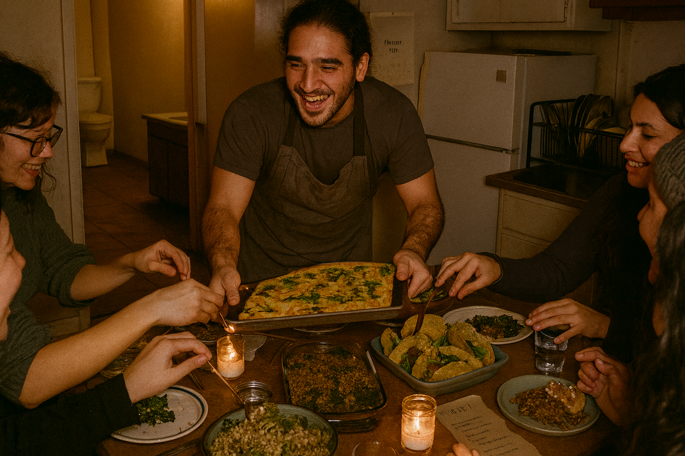
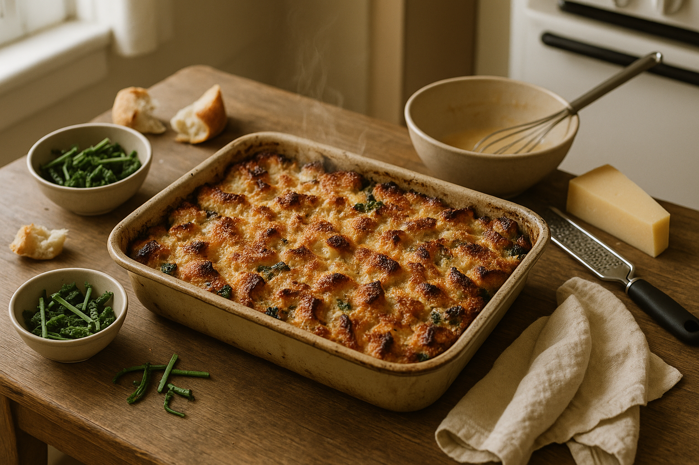
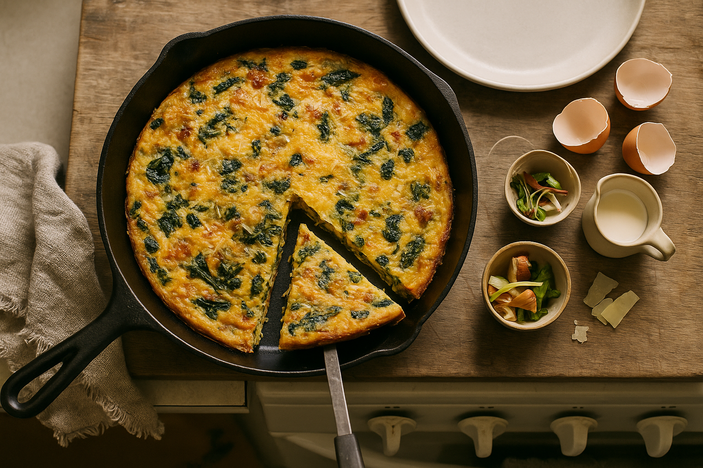
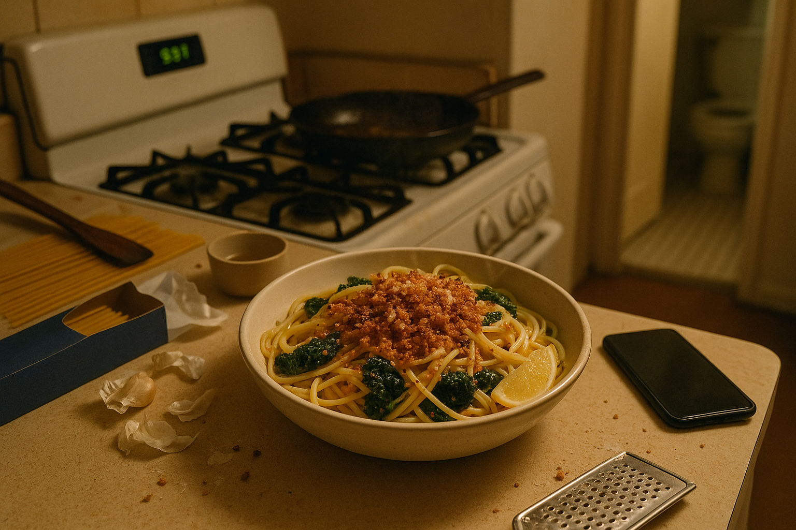
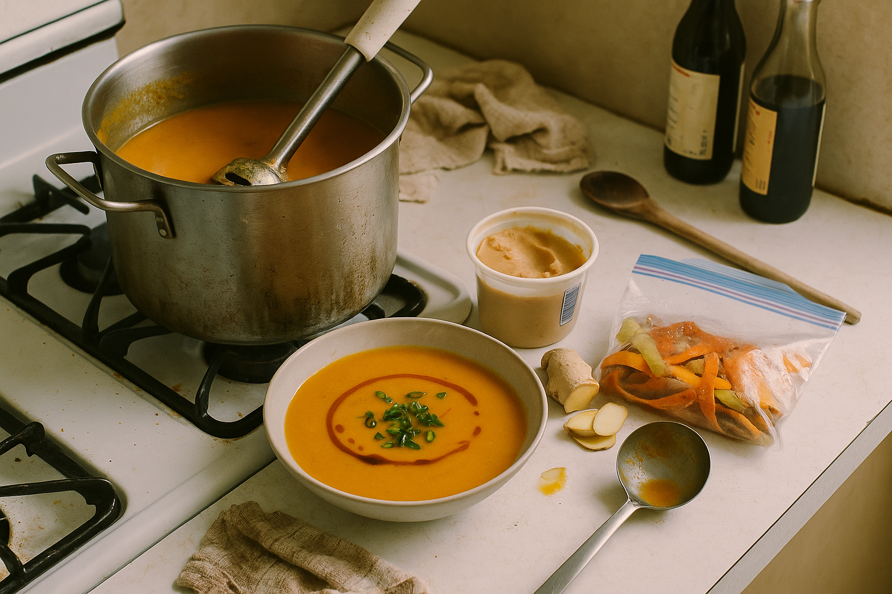
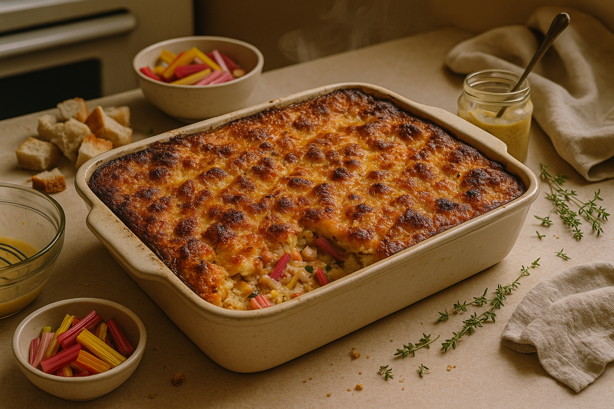
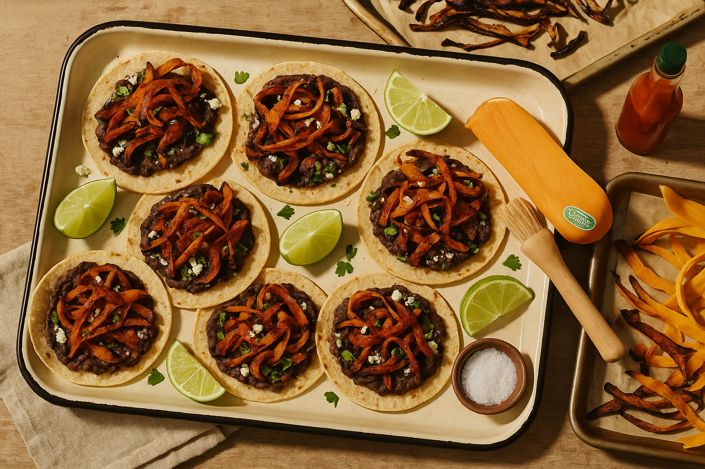
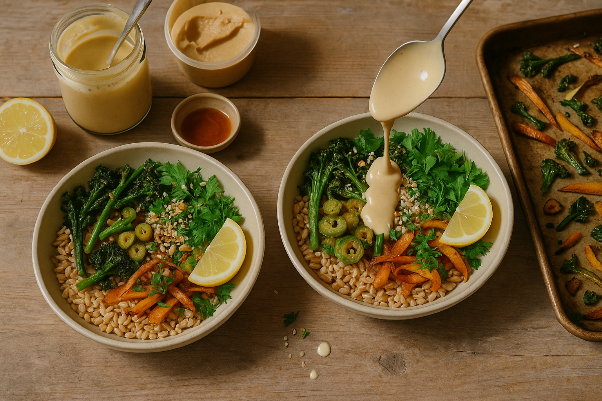
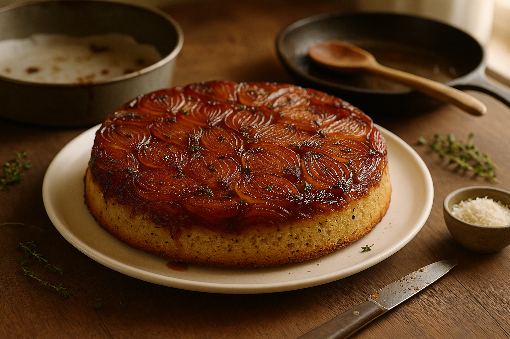

# Chapter 8: Mains

> *"This is dinner."*

## On Making It Count

The dishes in this chapter are not side projects. They're meals—the kind you eat for dinner on a Wednesday when you're tired and hungry and need something substantial. They're also the kind you'd serve to guests without apology, because they taste like intention, not desperation.

The line between "scrap cooking" and "just cooking" blurs here. These recipes use scraps as primary ingredients, not garnishes. Kale ribs become the pasta. Bread ends become the gratin. Vegetable trim becomes the frittata. Nothing is incidental. Everything matters.

A note on portions: These recipes serve 2–4 people depending on appetite. If you're cooking for one, halve them. If you're feeding a crowd, double them. They all scale predictably.

<!-- img-ref: images/chapter-01/002_author-photo.png -->
<!-- img-prompt: Documentary-style author photo, February 2023, evening, in a cramped San Francisco studio apartment. 35mm film look (Kodak Portra 400 aesthetic), natural room light mixed with warm tungsten lamps, slightly desaturated with gentle grain, shallow depth of field. Composition: eye-level from the corner of a fold-out table squeezed between the stove and a small window; the visible bathroom door is ajar in the background, a glimpse of the toilet in soft blur. Cheap laminate counters, rental-grade white stove with scuffs, a drying rack piled with just-washed plates. The author, same person as prior author-photo 002 (match face, body type, hair), hair tied back, in a worn gray linen apron over a black T-shirt, mid-laugh, placing a platter down. Four to five friends, imperfect and real, reaching for food; candid hand motions and soft motion blur. On the table: generous, unpretentious platters of scrap-based mains—bread-and-kale rib gratin in a battered 9x13 dish with golden edges, a big bowl of pasta with brown-butter bread crumbs and kale ribs, a frittata cut into wedges, a tray of roasted squash-skin tacos, and a ribs-and-grains bowl with herbs. Mismatched plates, thrifted flatware, jam jars as candleholders, a torn brown-paper menu with scribbles. A small wall calendar clearly shows February 2023. Mood: proof that cooking from scraps can be elegant without pretense—warm, convivial, humble abundance. Camera details: 35mm lens at f/2, ISO 800, natural light plus lamp glow around 3000–3500K, soft highlights on steam rising from dishes. No food styling gloss, real crumbs, water rings, a dish towel tossed on a chair. Keep it candid, lived-in, and honest, not aspirational. -->

---

## Recipe 1: Bread-and-Kale-Rib Gratin

### The Why

Gratin is a French technique for turning almost anything into comfort food: layer it in a dish, add cream and cheese, bake until golden and bubbling. This version uses stale bread and kale ribs—two things most people throw away—and transforms them into something rich, savory, and deeply satisfying. It's like a savory bread pudding, but better.

### The Recipe

**Serves:** 4 as a main, 6 as a side
**Active time:** 20 minutes
**Baking time:** 35–40 minutes
**Keeps:** 3 days refrigerated (reheats beautifully)

#### Ingredients

- 4 cups (240g) stale bread, torn into 1-inch pieces (any sturdy bread)
- 3 cups (300g) kale ribs, sliced into ½-inch pieces
- 2 tablespoons olive oil
- 1 large onion, thinly sliced
- 3 garlic cloves, minced
- 1 teaspoon fine sea salt
- ½ teaspoon black pepper
- ¼ teaspoon nutmeg (optional but traditional)
- 1½ cups (375ml) whole milk or half-and-half
- ½ cup (125ml) heavy cream
- 3 large eggs
- 1 cup (100g) grated Gruyère, Parmesan, or sharp cheddar
- ¼ cup (15g) bread crumbs for topping (optional)

#### Method

1. **Preheat oven:** 375°F (190°C). Butter a 9x13-inch baking dish or similar.

2. **Sauté aromatics:** In a large skillet, heat olive oil over medium heat. Add onion and cook for 8–10 minutes until soft and golden. Add garlic and cook 1 minute more. Add kale ribs, salt, pepper, and nutmeg. Cook, stirring, for 5–7 minutes until the ribs are tender. Remove from heat.

3. **Make custard:** In a bowl, whisk together milk, cream, and eggs until smooth. Stir in half the cheese.

4. **Assemble:** Spread half the bread pieces in the prepared baking dish. Top with half the kale-onion mixture. Repeat layers. Pour the custard evenly over everything, pressing down gently so the bread soaks it up. Sprinkle the remaining cheese on top, then the bread crumbs if using.

5. **Bake:** Bake for 35–40 minutes until the top is golden brown and the custard is set (it shouldn't jiggle when you shake the pan). If the top browns too quickly, cover with foil for the last 10 minutes.

6. **Rest:** Let cool for 10 minutes before serving. It needs this time to set—otherwise it'll be soupy.

#### Variations

- **Add protein:** Layer in cooked sausage, bacon, or shredded chicken.
- **Lighter version:** Use all milk (no cream) and reduce the cheese to ½ cup.
- **Herb it up:** Add fresh thyme or rosemary to the custard.

#### Notes

- **Bread texture matters:** Stale is essential. Fresh bread will turn to mush. If your bread is only slightly stale, toast it first.
- **Can I prep ahead?** Yes. Assemble the gratin (steps 1–4), cover, and refrigerate for up to 24 hours. Add 10 minutes to the baking time if going straight from the fridge to the oven.
- **Leftovers:** Slice and reheat in a 350°F oven until warmed through. Microwave works but the texture suffers.

<!-- img-prompt: Hero shot of a bread-and-kale-rib gratin just out of the oven in a small San Francisco studio kitchen. Editorial cookbook style, honest not glossy. Slightly desaturated warm palette, natural daylight from a window at left, soft shadows, light bounce from a white towel. Composition: three-quarter overhead at about 45 degrees. A battered 9x13 baking dish sits on a weathered wood table; the top is deeply golden with crispy cheese and bread edges, tiny craters of bubbling custard visible near the corners, wisps of steam rising. The gratin layers show flecks of vivid green kale ribs peeking between bread cubes. Around it: a small bowl of raw sliced kale ribs, a few torn stale bread ends, a wedge of Gruyère with a microplane, a whisk resting in a bowl streaked with leftover custard, and a folded, slightly stained linen towel. Rental-grade oven visible in soft background blur, with a cheap laminate countertop. Include subtle imperfections: stray bread crumb on the rim, a thin line of baked-on cheese at the edge. Mood: deeply comforting, Wednesday-night dinner energy—substantial and real. Camera details: 50mm equivalent, f/4 for clear detail with gentle falloff. Color temperature around 4800K. Keep textures realistic, not overly glossy: matte cheese crisp, custard sheen subdued. Show transformation by juxtaposing the raw scraps (kale ribs and bread ends) near the finished dish without clutter. No heavy props, no aspirational styling. The image should make you smell the nutty Gruyère and toasty bread, and want to scoop a corner immediately. -->

---

## Recipe 2: Scrap-Vegetable Frittata

### The Why

Frittata is the most forgiving dish in the egg canon. You can throw almost any cooked vegetable scrap into beaten eggs, bake it, and end up with something cohesive and delicious. It's breakfast, lunch, or dinner. It's hot, room temp, or cold from the fridge. It's perfect.

This is less a recipe and more a formula. Once you understand the ratio (eggs to scraps to dairy), you can make a frittata from whatever's in your Clean-Catch bin.

### The Recipe

**Serves:** 4
**Active time:** 10 minutes
**Cooking time:** 15–20 minutes
**Keeps:** 3 days refrigerated

#### Ingredients

**Base:**
- 8 large eggs
- ¼ cup (60ml) milk or cream
- ½ teaspoon fine sea salt
- ¼ teaspoon black pepper
- ¼ cup (25g) grated cheese (Parmesan, cheddar, feta—whatever)

**Scraps (about 2 cups total, cooked or raw depending on type):**
Choose a mix from these categories:
- **Greens:** Wilted kale, chard, spinach, or herb stems (blanched or sautéed)
- **Alliums:** Onion ends, leek tops, scallions (sautéed)
- **Vegetables:** Roasted squash trim, sautéed zucchini, tomato ends, potato scraps
- **Optional add-ins:** Cooked bacon, sausage, crumbled feta, olives

**For cooking:**
- 2 tablespoons olive oil or butter

#### Method

1. **Preheat oven:** 375°F (190°C).

2. **Prep scraps:** If your scraps are raw (onions, greens), sauté them first in the olive oil until tender. If they're already cooked (roasted vegetables, blanched greens), skip this step.

3. **Make egg base:** In a bowl, whisk together eggs, milk, salt, pepper, and half the cheese.

4. **Combine:** Add the scraps to the egg mixture. Stir to distribute evenly.

5. **Cook:** Heat an oven-safe 10-inch skillet (cast iron or non-stick) over medium heat. Add oil or butter. Pour in the egg-scrap mixture. Cook undisturbed for 2–3 minutes until the edges start to set.

6. **Finish in oven:** Sprinkle the remaining cheese on top. Transfer the skillet to the oven and bake for 12–15 minutes until the center is just set (it shouldn't jiggle). Don't overbake—it'll keep cooking from residual heat.

7. **Rest:** Let sit for 5 minutes in the pan. Slide onto a plate or cutting board, slice into wedges, and serve.

#### Variations

- **Herb-heavy:** Add a handful of chopped fresh herbs (parsley, basil, dill) to the egg mixture.
- **Spicy:** Add red chili flakes or diced jalapeño.
- **Mediterranean:** Use feta, olives, tomatoes, and oregano.

#### Notes

- **Ratios:** 8 eggs to 2 cups scraps is the magic ratio. More scraps = too dense. Fewer scraps = too eggy.
- **Oven-safe pan is essential:** If you don't have one, cook the frittata entirely on the stovetop: cover the pan and cook over low heat for 15–20 minutes until set.
- **Make ahead:** Frittata is excellent at room temperature or cold. Make it the night before and slice it for lunch.

<!-- img-prompt: Hero shot of a scrap-vegetable frittata presented in a well-seasoned 10-inch cast-iron skillet. Editorial, approachable, warm natural daylight from a nearby window, gentle shadows, slightly desaturated. Composition: overhead perspective, centered skillet on a weathered wood surface with a simple off-white plate to the side. The frittata top is burnished golden with visible flecks of greens (wilted kale or chard stems), softened onions, and pockets of melted cheese. A single wedge is cut and slightly lifted with a basic metal spatula, revealing a custardy, tender interior speckled with colorful vegetable bits. Around the skillet: small bowls of scraps to emphasize transformation—a handful of onion ends, herb stems, and roasted vegetable trim; cracked eggshells; a tiny pitcher with leftover milk; a few cheese shavings. Keep it modest: a frayed kitchen towel, rental-grade stove knobs barely visible in soft blur at the edge, laminate counter peeking in. Mood: forgiving, any-meal-of-the-day practicality. Camera details: 50mm equivalent, f/5.6 for crisp detail; white balance around 5000K. No glossy food styling—let real textures show: delicate browned bubbles, uneven edges, a bit of cheese that oozed over the side. Sprinkle a restrained amount of grated cheese on top for the oven-finish cue. The scene should feel like a Tuesday or Wednesday dinner that took care of itself, as if you slid the pan from oven to table without fuss. Appetite appeal comes from honest textures, steam, and the visible scrap-to-supper narrative. -->

---

## Recipe 3: Pasta with Brown-Butter Bread Crumbs and Kale Ribs

### The Story

December 2021. 9:37pm. I've been home from work for three hours and haven't eaten yet because I've been doom-scrolling. I'm too tired to go to the store. I have: kale ribs I saved yesterday, stale bread, half a box of pasta, butter, garlic.

I make this.

It takes 15 minutes. It costs maybe $2. It tastes like the kind of thing you'd order at a restaurant that puts "rustic" in its name and charges $22. That's the moment I realized scrap cooking isn't just about thrift—it's about speed and flavor and actually eating dinner instead of staring into the fridge wondering what's wrong with you.

### The Why

This is the platonic ideal of Drain Salad cooking: fast, cheap, delicious, and built entirely from scraps and pantry staples. The kale ribs become tender and sweet. The bread crumbs become crunchy and nutty. The garlic becomes fragrant. It's umami, crunch, and carbs. It's perfect.

### The Recipe

**Serves:** 2–3
**Active time:** 15 minutes
**Keeps:** Eat immediately (doesn't reheat well)

#### Ingredients

- 12 oz (340g) pasta (spaghetti, linguine, or any long pasta)
- 2 cups (200g) kale ribs, sliced thin
- 4 tablespoons (56g) unsalted butter
- 1 cup (60g) coarse bread crumbs (from stale bread)
- 4 garlic cloves, thinly sliced
- ½ teaspoon red chili flakes
- ½ teaspoon fine sea salt, plus more for pasta water
- ¼ cup (25g) grated Parmesan, plus more for serving
- Lemon wedge for serving
- Flaky salt and black pepper

#### Method

1. **Cook pasta:** Bring a large pot of salted water to a boil (it should taste like the sea). Add pasta and cook according to package directions until al dente. **Reserve 1 cup pasta water before draining.** Drain the rest.

2. **Blanch kale ribs:** While the pasta cooks, drop the kale ribs into the boiling pasta water for the last 2 minutes of cooking. Drain with the pasta.

3. **Brown the butter and crumbs:** In a large skillet, melt butter over medium heat. Swirl until it foams, then turns golden and smells nutty (3–4 minutes). Immediately add bread crumbs. Stir constantly for 3–4 minutes until the crumbs are deeply golden and crispy. Transfer crumbs to a bowl and set aside.

4. **Sauté garlic:** Return the empty skillet to medium heat (no need to wipe it out—the residual butter is flavor). Add garlic and chili flakes. Cook for 1 minute until fragrant but not browned.

5. **Combine:** Add the drained pasta and kale ribs to the skillet with the garlic. Toss. Add ¼ cup of the reserved pasta water and the Parmesan. Toss vigorously until the pasta is coated in a light, creamy sauce. Add more pasta water if it looks dry.

6. **Finish:** Remove from heat. Add half the bread crumbs and toss. Transfer to bowls. Top with the remaining bread crumbs, more Parmesan, a squeeze of lemon, flaky salt, and black pepper.

#### Variations

- **Add protein:** Toss in a can of drained white beans or top with a fried egg.
- **Herb it up:** Add minced parsley or basil just before serving.
- **Anchovy:** Add 2 minced anchovy fillets with the garlic for extra umami.

#### Notes

- **Pasta water is essential:** It's starchy and salty and helps the sauce cling to the pasta. Don't skip this.
- **Brown butter timing:** Watch it closely. It goes from perfect to burnt in seconds.
- **Why blanch the kale ribs?** Raw kale ribs are too fibrous. Blanching tenderizes them without turning them to mush.

<!-- img-prompt: Hero shot rooted in the moment: December 2021, 9:37 pm, cramped San Francisco studio apartment kitchen. Warm tungsten overhead mixed with dim window spill, slightly desaturated, gentle grain, honest not glam. Composition: close three-quarter angle on a deep bowl of long pasta swirled with tender kale ribs and glistening with a light sauce, generously showered with deeply golden, coarse brown-butter bread crumbs. Flecks of chili, shards of Parmesan, a lemon wedge squeezed nearby. Steam subtly visible. Around the bowl: the truth of the late-night cook—half a box of spaghetti lying open, a crumpled butter wrapper, garlic papery skins, a skillet with brown butter residue and a wooden spoon resting inside, a small cup of reserved pasta water. In soft blur behind, the cheap laminate counter, a scuffed rental-grade stove clock reading 9:37, and the open bathroom doorway hinting the toilet beyond. A smartphone lies face down beside the bowl, notifications glancing off-screen—doom-scroll interrupted by dinner. Camera details: 35mm lens at f/2.8 to isolate the pasta while keeping enough context, color temperature around 3000–3500K. Mood: fast, cheap, devastatingly good; relief and triumph in a small, imperfect space. Show breadcrumb texture clearly—crunch implied by irregular edges—while the kale ribs look tender from the quick blanch. No heavy props, no food styling sheen; a few crumbs on the table and a grater dusted with cheese keep it real. -->

---

## Recipe 4: Root-Vegetable Scrap Soup with Miso and Ginger

### The Why

This is the soup you make when you have a gallon bag of frozen vegetable trimmings and no plan. Carrot peels, onion ends, celery tops, potato skins, squash scraps—all of it goes into the pot with miso, ginger, and garlic. It simmers. It becomes soup. It's warm, savory, and genuinely nourishing.

This is not elegant. This is honest.

### The Recipe

**Serves:** 4–6
**Active time:** 15 minutes
**Cooking time:** 30 minutes
**Keeps:** 5 days refrigerated, 3 months frozen

#### Ingredients

- 2 tablespoons neutral oil or butter
- 1 large onion, roughly chopped (or onion ends and scraps)
- 4 garlic cloves, smashed
- 2-inch piece fresh ginger, sliced thin (no need to peel)
- 6 cups (about 900g) mixed root vegetable scraps (carrot peels, potato ends, squash trim, parsnip scraps, etc.)*
- 6 cups (1.5L) vegetable stock or water
- 2 tablespoons white or yellow miso paste
- 1 tablespoon soy sauce
- 1 teaspoon fine sea salt (adjust to taste)
- ¼ teaspoon black pepper
- Optional: 1 tablespoon rice vinegar, 1 teaspoon toasted sesame oil

*Rinse scraps thoroughly. Remove any dirt, blemishes, or very tough bits.

#### Method

1. **Sauté aromatics:** In a large pot, heat oil over medium heat. Add onion, garlic, and ginger. Cook for 5 minutes until fragrant and softened.

2. **Add scraps:** Add the vegetable scraps and stir to coat. Cook for 3–4 minutes to let them start releasing flavor.

3. **Add liquid:** Pour in stock or water. Bring to a boil, then reduce to a simmer. Cook, partially covered, for 20–25 minutes until all the scraps are very tender.

4. **Blend:** Use an immersion blender to puree the soup until smooth. Alternatively, transfer to a blender in batches (careful—hot liquid expands). Blend until silky.

5. **Finish:** Return soup to the pot (if you used a blender). Whisk in miso paste, soy sauce, salt, and pepper. Taste. It should be savory, slightly sweet, and balanced. Adjust: more miso for depth, more salt if flat, a splash of rice vinegar for brightness.

6. **Serve:** Ladle into bowls. Drizzle with sesame oil if using. Top with toasted sesame seeds, scallion greens, or crispy fried shallots if you're feeling fancy.

#### Variations

- **Creamy:** Add ½ cup coconut milk or cream at the end.
- **Spicy:** Add red chili flakes or a spoonful of chili crisp.
- **Herb it up:** Stir in fresh cilantro or parsley just before serving.

#### Notes

- **What scraps work?** Root vegetables are best: carrots, potatoes, squash, parsnips, turnips, sweet potatoes. Avoid brassicas (kale, cabbage, broccoli)—they'll make the soup bitter.
- **Miso is key:** It adds a savory, fermented depth that turns this from "vegetable water" into "soup."
- **Can I use raw scraps?** Yes. No need to cook them first—they'll cook in the soup.

<!-- img-prompt: Hero shot of root-vegetable scrap soup that reads warm, nourishing, and honest. Natural daylight from a window at left, soft and diffuse, slightly desaturated warm palette. Composition: overhead to three-quarter angle on a large, slightly dented soup pot on a rental-grade stove, lid off, with an immersion blender resting on the rim, droplets clinging to the shaft. In front: a wide, shallow bowl filled with silky orange-gold soup, faint steam rising, finished with a drizzle of toasted sesame oil and a sprinkle of scallion greens. Beside the bowl: a small tub of white or yellow miso with a spoon mark, a piece of fresh ginger with slices fanned out, a splashy ladle with orange streaks, and a zip-top freezer bag half-full of mixed root scraps (carrot peels, potato skins, squash trim), beads of condensation on the bag. Keep the background humble: cheap laminate counter, a frayed dish towel, a stained wooden spoon. Camera details: 50mm equivalent, f/4 for sharp texture without looking clinical; white balance around 4800–5000K. Mood: This is not elegant; it is sincere and nourishing. Textures matter: light surface sheen on the soup, matte mise-en-place. Avoid brassica cues in the scraps to prevent bitterness association. Include minimal soy sauce and rice vinegar bottles off to the side for context, labels generic. No perfect styling—let a small drip on the bowl rim and a few soup splashes on the stove tell the story of blending hot soup in a small kitchen. -->

---

## Recipe 5: Savory Bread Pudding with Chard Stems and Cheese

### The Why

Sweet bread pudding is a dessert. Savory bread pudding is dinner. It's custardy, cheesy, and rich—like a cross between a quiche and a gratin. This version uses chard stems (the rainbow-colored ribs that most people discard), stale bread, and whatever cheese you have. It's comfort food with a vegetable disguised inside.

### The Recipe

**Serves:** 6
**Active time:** 20 minutes
**Baking time:** 40–45 minutes
**Keeps:** 3 days refrigerated

#### Ingredients

- 6 cups (360g) stale bread, cut into 1-inch cubes
- 2 cups (200g) chard stems, sliced into ½-inch pieces (rainbow chard is prettiest, but any chard works)
- 2 tablespoons olive oil
- 1 medium onion, diced
- 2 garlic cloves, minced
- 1 teaspoon fine sea salt
- ½ teaspoon black pepper
- 2 cups (500ml) whole milk
- 4 large eggs
- 1½ cups (150g) grated cheese (Gruyère, cheddar, fontina—something melty)
- ¼ cup (25g) grated Parmesan
- 1 teaspoon Dijon mustard
- ½ teaspoon fresh thyme leaves (or ¼ teaspoon dried)

#### Method

1. **Preheat oven:** 350°F (175°C). Butter a 9x13-inch baking dish.

2. **Sauté chard stems:** In a skillet, heat olive oil over medium heat. Add onion and cook for 5 minutes until soft. Add chard stems, garlic, salt, and pepper. Cook for 7–10 minutes until the stems are tender (they should still have some bite—they're naturally crisp). Remove from heat.

3. **Make custard:** In a large bowl, whisk together milk, eggs, half the grated cheese, Parmesan, mustard, and thyme.

4. **Assemble:** Add bread cubes and the chard-onion mixture to the custard. Stir gently to combine. Let sit for 10 minutes so the bread absorbs the liquid.

5. **Bake:** Pour into the prepared baking dish. Sprinkle the remaining cheese on top. Bake for 40–45 minutes until the top is golden brown and the custard is set (a knife inserted in the center should come out mostly clean).

6. **Rest:** Let cool for 10 minutes before slicing. Serve warm.

#### Variations

- **Add protein:** Stir in cooked sausage, bacon, or diced ham.
- **Lighter version:** Use 2% milk and reduce cheese to 1 cup total.
- **Herb it up:** Add fresh parsley, dill, or chives to the custard.

#### Notes

- **Chard stems are naturally crunchy:** Even after cooking, they'll have texture—this is good. Don't overcook them to mush.
- **Stale bread is essential:** Fresh bread will turn gummy. If your bread is only slightly stale, toast it first.
- **Can I use other greens?** Yes. Kale ribs, collard stems, or broccoli stems all work.

<!-- img-prompt: Hero shot of savory bread pudding with chard stems and cheese, baked in a 9x13 dish. Natural window light, warm neutral palette, honest textures, editorial not glossy. Composition: three-quarter overhead at about 45 degrees. The top is deeply golden with scattered browned cheese, edges slightly puffed and crisp. A corner has been scooped, revealing custardy interiors studded with bright rainbow chard stems—pink, gold, and white slivers—plus softened onions and melted cheese strands. Surrounding elements to underline scrap-to-supper: a small pile of stale bread cubes with uneven crusts, a bowl of sliced chard stems in vivid colors, a whisk and mixing bowl with a thin custard film, a jar of Dijon with a spoon, sprigs of thyme. Background: rental-grade oven door in soft blur, cheap laminate counter, a tea towel slung casually. Camera details: 50mm lens at f/4.5, white balance around 4900K, shallow steam wisps visible. Mood: custardy, rich, weeknight-comfort that doubles as company food. Show real imperfections: a bit of cheese stuck to the dish rim, toasted crumbs on the table, a slightly uneven layer. No dramatic props, no overly stylized garnishes—let the colorful chard stems provide the visual pop. The scene suggests it just rested 10 minutes and is ready to serve, inviting a fork to dive in. Keep colors warm but slightly desaturated to avoid food-porn gloss. -->

---

## Recipe 6: Roasted Squash-Skin Tacos with Black Beans

### The Why

When you roast a butternut squash, you peel it first and throw away the skin. This is wasteful. The skin, roasted until crispy and caramelized, tastes like sweet, smoky vegetable chips. Tucked into a tortilla with black beans, lime, and cilantro, it's a taco that doesn't apologize for being made from scraps.

### The Recipe

**Serves:** 4 (2 tacos each)
**Active time:** 20 minutes
**Roasting time:** 25–30 minutes
**Keeps:** Components keep 3 days refrigerated; assemble fresh

#### Ingredients

**For the squash skins:**
- Peels from 1 large butternut squash (about 2 cups)*
- 2 tablespoons olive oil
- ½ teaspoon smoked paprika
- ½ teaspoon cumin
- ½ teaspoon fine sea salt
- ¼ teaspoon cayenne (optional)

*Only use if the squash was organic or thoroughly scrubbed. Conventional squash may have wax coatings.

**For the tacos:**
- 8 small corn or flour tortillas
- 1 can (15 oz / 425g) black beans, drained and warmed
- ½ cup (120g) crumbled queso fresco or feta
- ¼ cup (10g) fresh cilantro, chopped
- Lime wedges
- Hot sauce

#### Method

1. **Preheat oven:** 425°F (220°C). Line a baking sheet with parchment.

2. **Prep squash skins:** Cut the peels into strips about 2–3 inches long and ½ inch wide. Toss with olive oil, smoked paprika, cumin, salt, and cayenne. Spread in a single layer on the baking sheet.

3. **Roast:** Roast for 25–30 minutes, flipping halfway through, until the skins are deeply browned, crispy at the edges, and caramelized. Some pieces will char—this is good.

4. **Warm tortillas:** Wrap tortillas in foil and warm in the oven for the last 5 minutes of roasting. Or char them directly over a gas flame for 20 seconds per side.

5. **Assemble tacos:** Smear each tortilla with a spoonful of black beans. Top with roasted squash skins, crumbled cheese, cilantro, and a squeeze of lime. Add hot sauce if desired.

#### Variations

- **Add crunch:** Top with pickled onions or shredded cabbage.
- **Creamy:** Add a dollop of sour cream or Greek yogurt.
- **Spicy:** Use chipotle powder instead of smoked paprika.

#### Notes

- **Organic squash only:** Non-organic squash may have wax or pesticide residue on the skin. Don't risk it.
- **The skins will shrink:** They lose moisture as they roast. This is normal—they'll become concentrated and sweet.
- **What about the squash flesh?** Roast it. Eat it. This book is about using the whole vegetable.

<!-- img-prompt: Hero shot of roasted squash-skin tacos that celebrates scraps without apology. Natural midday light, warm tones, slight desaturation, editorial realism. Composition: overhead view of an enamel tray holding eight small corn tortillas, lightly charred, each smeared with warm black beans and piled with crispy, caramelized butternut squash peels. The peels are curled, deeply browned at the edges with a few charred tips, dusted in smoked paprika and cumin. Garnishes: crumbled queso fresco, chopped cilantro, and lime wedges with visible juice beads. In the background, a parchment-lined sheet pan shows remaining roasted squash skins, some darker from the roast; a vegetable brush and a squash peel pile emphasize the prep. A small sticker or tag reading organic subtly placed near the squash for safety context; avoid branding. Include a simple bottle of hot sauce and a pinch bowl of salt. Camera details: 35mm equivalent, f/5.6 for crisp detail across the scene; white balance about 5200K. Mood: playful, surprising, thrifty and bold. Textures should be honest—no gloss, just real crisp edges and tender beans. The tortillas look warmed, not styled—some blistered spots, slight folds. The tray sits on a weathered wood surface with a linen napkin. No elaborate props; let the peels be the star. Show the skins’ shrink and caramelization to communicate flavor and the transformation from trash to taco. -->

---

## Recipe 7: Ribs-and-Grains Bowl with Miso-Tahini Dressing

### The Why

This is a formula, not a rigid recipe. The idea: cooked grains + roasted or sautéed scraps + a creamy, tangy dressing + something crunchy on top = a bowl that feels like a meal. It's endlessly adaptable and uses whatever scraps you've accumulated.

### The Recipe

**Serves:** 2
**Active time:** 20 minutes
**Keeps:** Components keep 3 days refrigerated; assemble fresh

#### Ingredients

**For the bowl:**
- 2 cups cooked grains (farro, rice, quinoa, barley—whatever you have or want)
- 2 cups mixed vegetable scraps, roasted or sautéed (kale ribs, broccoli stems, carrot peels, squash trim)*
- 2 tablespoons olive oil
- Salt and pepper

*Cut scraps into similar sizes so they cook evenly.

**For the miso-tahini dressing:**
- 2 tablespoons tahini
- 1 tablespoon white or yellow miso paste
- 1 tablespoon lemon juice
- 1 tablespoon water (more as needed to thin)
- 1 teaspoon maple syrup or honey
- 1 small garlic clove, grated
- Pinch of salt

**For topping:**
- ¼ cup (30g) toasted nuts or seeds (sunflower, sesame, almonds)
- 2 tablespoons minced fresh herbs (parsley, cilantro, dill)
- Lemon wedge

#### Method

1. **Roast or sauté scraps:** Toss vegetable scraps with olive oil, salt, and pepper. Either roast at 425°F (220°C) for 20 minutes until tender and caramelized, or sauté in a hot pan until browned.

2. **Make dressing:** In a small bowl, whisk together tahini, miso, lemon juice, water, maple syrup, garlic, and salt. The dressing should be pourable but thick—if it's too thick, add more water 1 teaspoon at a time.

3. **Assemble bowls:** Divide grains between two bowls. Top with roasted scraps. Drizzle generously with dressing. Top with nuts, herbs, and a lemon wedge.

4. **Eat:** Mix everything together before eating. The dressing should coat the grains and scraps.

#### Variations

- **Add protein:** Top with a fried egg, grilled tofu, or shredded chicken.
- **Pickled things:** Add quick-pickled fines (from Chapter 6) for crunch and tang.
- **Different dressing:** Use crumb-vinaigrette or lemon-herb dressing instead.

#### Notes

- **Grain cooking:** If you're starting from scratch, cook grains in vegetable stock instead of water for extra flavor.
- **Scraps can be raw:** If your scraps are tender (cucumber, tomatoes), skip the roasting and use them raw.
- **Meal prep:** Cook grains and roast scraps in bulk on Sunday. Assemble bowls all week.

<!-- img-prompt: Hero shot of a ribs-and-grains bowl with miso-tahini dressing, designed as an adaptable formula. Natural daylight, warm neutral palette, honest textures. Composition: clean overhead shot of two bowls side by side on a weathered wood table. Each bowl contains a base of cooked grains (one with chewy farro, one with brown rice) topped with roasted scraps: kale ribs, broccoli stems cut into coins, roasted carrot peels, and squash trim, all caramelized at the edges. A creamy miso-tahini dressing is being drizzled over one bowl from a spoon mid-frame, catching the light—thick but pourable ribbons. Toppings: a scatter of toasted sesame seeds and chopped nuts, fresh herbs (parsley and dill), and a lemon wedge resting on the rim. Surrounding the bowls, small mise-en-place to tell the story: a jar of tahini with a spoon mark, a small miso tub, a cut lemon, a pinch bowl of maple syrup, and a tray with extra roasted scraps. Camera details: 50mm equivalent, f/5.6 for clarity; white balance around 5000K. Mood: nutritious, satisfying, endlessly customizable—Tuesday evening meal prep meets real dinner. Keep styling restrained: a few stray grains, dressing drips on the tabletop, a well-used sheet pan with browned bits in soft blur. No heavy props. The colors should be warm and inviting without hyper-saturation; let the roasted edges and herb greens provide contrast. -->

---

## Recipe 8: Upside-Down Savory Cake with Caramelized Onion Ends

### The Why

This is a savory riff on pineapple upside-down cake. Onion ends (the parts you'd normally discard) are caramelized in butter and sugar until jammy and sweet, then topped with a simple savory cake batter. When you flip it out of the pan, the onions are on top, glossy and beautiful. It's weird, impressive, and tastes like a love letter to alliums.

### The Recipe

**Serves:** 6–8 as a side or appetizer
**Active time:** 25 minutes
**Baking time:** 30 minutes
**Keeps:** 2 days at room temperature (covered)

#### Ingredients

**For the caramelized onion layer:**
- 3 tablespoons (42g) unsalted butter
- 2 tablespoons brown sugar
- 3 large onions' worth of root ends and outer layers, thinly sliced (about 2 cups)
- 1 teaspoon fresh thyme leaves (or ½ teaspoon dried)
- ¼ teaspoon salt

**For the cake:**
- 1 cup (125g) all-purpose flour
- 1½ teaspoons baking powder
- ½ teaspoon fine sea salt
- ¼ teaspoon black pepper
- 2 large eggs
- ½ cup (125ml) milk
- ¼ cup (60ml) olive oil
- ½ cup (50g) grated Parmesan

#### Method

1. **Preheat oven:** 350°F (175°C). Line the bottom of a 9-inch round cake pan with parchment.

2. **Caramelize onions:** In a skillet, melt butter over medium heat. Add brown sugar and stir until dissolved. Add onions, thyme, and salt. Cook, stirring occasionally, for 15–20 minutes until the onions are deeply caramelized and jammy. They should be golden-brown and very soft.

3. **Arrange onions:** Spread the caramelized onions evenly in the bottom of the prepared cake pan. Press down gently. Let cool slightly.

4. **Make cake batter:** In a bowl, whisk together flour, baking powder, salt, and pepper. In another bowl, whisk together eggs, milk, olive oil, and Parmesan. Add wet ingredients to dry ingredients and stir until just combined (don't overmix).

5. **Bake:** Pour batter over the onions in the pan. Spread evenly. Bake for 30 minutes until the cake is golden and a toothpick inserted in the center comes out clean.

6. **Invert:** Let cool in the pan for 10 minutes. Run a knife around the edges. Place a serving plate over the pan and flip. Tap gently. The cake should release. Peel off the parchment.

7. **Serve:** Slice into wedges. Serve warm or at room temperature.

#### Variations

- **Add cheese:** Crumble goat cheese or blue cheese over the onions before adding the batter.
- **Herb it up:** Add fresh rosemary or sage to the onion layer.
- **Spicy:** Add a pinch of red chili flakes to the batter.

#### Notes

- **Onion ends only:** This is a great use for the tough root base and outer layers you'd normally toss. Don't use whole onions—save those for something else.
- **Patience with caramelizing:** Don't rush this step. Proper caramelization takes 15–20 minutes. If you rush it, the onions won't be sweet.
- **Serve warm:** This is best slightly warm or at room temperature. Cold, it's less impressive.

<!-- img-prompt: Hero shot of an upside-down savory cake with caramelized onion ends. Natural window light from the right, warm and slightly desaturated, editorial realism. Composition: three-quarter angle at table height. A 9-inch round cake sits on a simple off-white plate, freshly inverted: the glossy, jammy onion layer faces up, a mosaic of thin, deeply caramelized onion ends flecked with thyme. The onions are amber to mahogany, glistening lightly from butter and brown sugar. The cake crumb beneath peeks at the edges—golden, tender, and speckled with black pepper and Parmesan. In the background, the parchment-lined cake pan rests with a few sticky onion bits clinging, and a skillet with a thin sheen of brown sugar-butter residue holds a wooden spoon. A sprig of thyme, a small bowl of grated Parmesan, and a simple knife with onion smears complete the story. Camera details: 50mm lens, f/3.5 for shallow depth of field that keeps the cake sharp with gentle falloff; white balance around 4800K. Mood: elegant but weird in the best way—impressive yet made from scraps. Imperfections welcome: uneven onion edges, a little syrup drip down the side, crumbs on the plate. No glossy food-porn lighting; keep it soft and honest. The scene should suggest patience in caramelization—15 to 20 minutes of slow cooking—now rewarded in a visually striking, savory cake ready to slice warm or at room temperature. -->

---

## On Feeding Yourself

These eight mains are substantial, filling, and real. They're not tricks or novelties. They're dinners—the kind that leave you satisfied and maybe a little proud.

The goal isn't to live entirely on scraps. The goal is to realize that the scraps you've been throwing away could have been feeding you all along. That's not deprivation. That's abundance you didn't know you had.

Cook these. Feed yourself. Feed others. Let them ask, "What is this?" and then tell them: "Dinner."

---

**Photography note:** *Each recipe should have a hero shot of the finished dish, plated simply but generously. Include process shots for techniques that might be unfamiliar (caramelizing onions for the upside-down cake, assembling the gratin layers, blending soup). The aesthetic should be warm, homey, and appetizing—real food that you'd actually eat on a Tuesday night. Show the scraps in their raw form alongside the finished dish so readers can see the transformation.*
