# Chapter 9: Ferments & Condiments

> *"Time is an ingredient."*

## On Deliberately Rotting Your Garbage (And Why That's Actually a Good Idea)

I'm about to teach you how to ferment kitchen scraps.

Let me say that again, slowly: We're going to take the parts of vegetables that most people throw away—kale ribs, cabbage cores, carrot peels—put them in jars with salt water, leave them on the counter for a week, and then eat them.

This sounds insane. I know it sounds insane. But fermentation is one of the oldest and most reliable preservation techniques humans have. It's how we kept food before refrigeration. It's how sauerkraut, kimchi, pickles, yogurt, cheese, bread, beer, and wine exist. It's controlled rot—which sounds worse than it is—but what it really is, is harnessing beneficial bacteria (*Lactobacillus*, mostly) to transform scraps into something more complex, more flavorful, and longer-lasting than they were fresh.

Done correctly, fermentation is very safe. The salt and acidity create an environment where harmful bacteria can't survive. Follow the ratios, keep things submerged, trust your senses. If it smells tangy and funky—good. If it smells putrid and wrong—compost it.

But I'll be honest: my first attempts were disasters.

**June 19, 2021.** I'm three days into my first lacto-fermentation. I've packed a quart jar with kale ribs and brine, following a recipe I found online. The instructions said "keep scraps submerged" but I didn't understand how much that mattered. A few kale ribs floated to the surface. I figured it was fine.

Day 5, I open the jar. The smell hits me first—not tangy, but faintly off. Then I see it: a thin white film on the surface. Then, in one corner, a small patch of fuzzy green mold.

I stand there holding the jar, trying to convince myself I can just skim off the mold and eat the rest. This is the part where someone with common sense would throw it out. Instead, I spend fifteen minutes on fermentation forums, reading debates about whether kahm yeast (harmless) looks different from mold (not harmless). Eventually I accept that this is mold, that I've ruined it, and that I've wasted a week and a perfectly good jar of kale ribs.

<!-- img-ref: images/chapter-01/002_author-photo.png -->
<!-- img-prompt: Author photo in a cramped San Francisco studio kitchen, documentary film aesthetic, 35mm film look, slightly desaturated with warm tones and natural light from a single north-facing window. Date-specific: late June 2021, Day 5 of the first ferment attempt. The subject is the same person as author photo 002: mid-30s, short dark brown hair, light olive skin, lean build, faint stubble, wearing a wrinkled gray t-shirt and a beat-up black apron. Composition: medium close-up at counter height, shallow depth of field (f/2.0). Foreground in crisp focus: a quart mason jar in the author’s hands, filled with kale ribs and brine. Show a thin white film (kahm yeast) across the surface and a small, unmistakable fuzzy green mold patch clinging to the brine line in one corner. Several kale ribs are floating above the brine (no weight used), illustrating the mistake. A strip of masking tape on the jar reads: “Kale ribs – 2% – 6/19/21.” The author’s face is in soft focus behind the jar, eyes narrowed, ambivalent and a touch defeated, breathing in a not-tangy, faintly off smell. Background details: cheap laminate counter, rental-grade coil electric stove, dented saucepan, stained cutting board, a chipped mug, and—crucially—the bathroom door ajar so the toilet is visible down the same line of sight as the stove. Lighting: mixed cool window light with a weak warm overhead bulb, realistic shadows, no glam styling. Mood: honest, unglamorous, learning-through-failure. Include subtle film grain, slight vignette, and a handheld, candid feel. -->
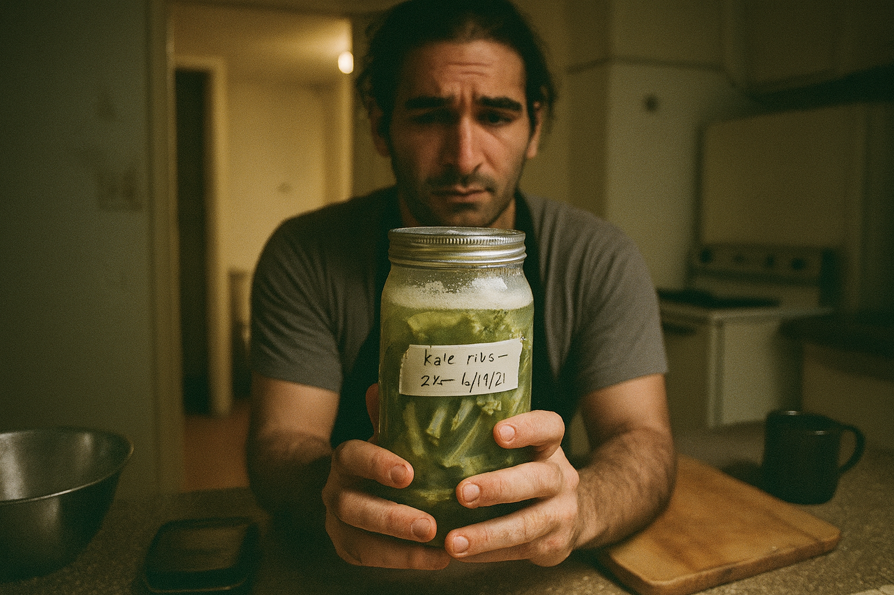

I threw the whole thing out, scrubbed the jar with bleach, and didn't try fermenting again for two months.

When I finally did try again—this time using a fermentation weight to keep everything submerged—it worked. The scraps came out tangy, crunchy, and so good I ate half the jar standing at the counter.

Fermentation is not intuitive. It requires trust in bacteria you can't see, patience you may not have, and the willingness to throw out a batch when it goes wrong. But once you understand the technique, it's incredibly forgiving. And it transforms scraps into something that lasts for months and makes everything it touches taste better.

This chapter is a practical primer on fermenting and preserving scraps. The recipes are low-risk and beginner-friendly. You don't need special equipment. Just jars, salt, time, and the willingness to let things get a little funky.

<!-- img-prompt: December 2021, 6:47 pm on a Wednesday in a tiny San Francisco studio kitchen. A real dinner scene: an honest, not-Instagram plate of steaming spaghetti slicked with olive oil, glossy but not staged. On top, spooned generously, are chopped lacto-fermented vegetable scraps—kale ribs, cabbage core shards, peppercorns—tangy and bright, their olive-green hue contrasting the pale pasta. Composition: three-quarter tabletop angle, slightly above eye level, 35mm film look, shallow depth of field focusing on the forkful lifted halfway from the bowl. The open jar of fermented scraps (masking tape label: “Lacto scraps – 2% – 12/05/21”) sits beside the bowl, brine meniscus and fermentation weight visible. Background: cheap laminate countertop, rental-grade coil stove with a pot still steaming, a thrifted colander in the sink, and in soft blur the bathroom door cracked open, a glimpse of the toilet—an honest reminder of the cramped studio layout. Lighting: warm tungsten from an overhead bulb mixes with cool evening window light, creating realistic color temperature contrast and soft shadows; no bounce cards or glamour. Surfaces: weathered wood board as a trivet, a slightly chipped white ceramic bowl, a dented stainless spoon. Include small details: stray salt grains, a drizzle of olive oil pooling, and condensation on the jar. Mood: relief and quiet pride—the kind of dinner that turns the day around without spending money. Color palette: warm neutrals with muted greens and golden pasta tones. Keep styling minimal, editorial yet unpretentious. -->
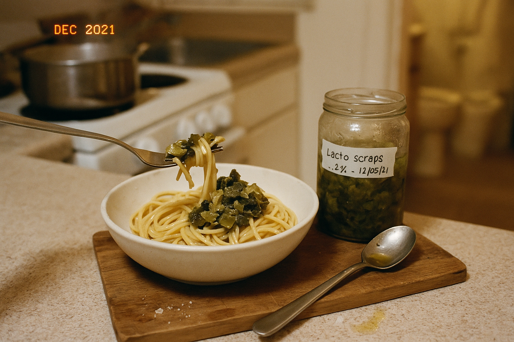

---

## On Fermentation vs. Pickling

Let's clarify: **pickling** uses vinegar to preserve. **Fermentation** uses salt and time to encourage beneficial bacteria (mostly *Lactobacillus*) to create lactic acid, which preserves the food naturally. Pickles are fast (hours). Ferments are slow (days to weeks).

Quick-pickled scraps (Chapter 6) are ready in hours. Lacto-fermented scraps take 3–7 days, but they develop deeper, more complex flavors—tangy, slightly fizzy, funky in the best way.

Both have their place. Pickling is instant gratification. Fermenting is patience rewarded.

---

## Recipe 1: Lacto-Fermented Vegetable Scraps (The Master Formula)

### The Why

This is the foundational fermentation technique. It works for almost any vegetable scrap: kale ribs, cabbage cores, radish tops, carrot peels, cucumber ends, onion layers. The salt brine creates an environment where *Lactobacillus* bacteria thrive and harmful bacteria die. The result: tangy, crunchy, probiotic-rich scraps that last for months.

### The Recipe

<!-- img-prompt: Process sequence: Lacto-fermentation timeline, clearly showing Day 1 → Day 3 → Day 7 progression. Three identical quart mason jars arranged left to right on a weathered wood surface against a neutral off-white wall. Each jar contains the same mix of vegetable scraps (kale ribs, carrot peels, cabbage core pieces) with peppercorns and a bay leaf. All jars have a visible fermentation weight keeping scraps fully submerged, with 1 inch headspace. Labels are hand-written on masking tape: “Day 1 – 12/01/21 – 2% brine,” “Day 3 – 12/03/21 – active,” “Day 7 – 12/07/21 – ready.” Lighting: natural window light from the left, soft and even, no harsh reflections; documentary cookbook style. Show the differences: Day 1 brine is clear, scraps bright and crisp-looking; a few tiny bubbles clinging but mostly still. Day 3 brine is noticeably cloudy with many small CO2 bubbles rising and collecting under the weight; color slightly more olive, buoyant pieces settling. Day 7 brine is opaque but calm, bubbles mostly gone; scraps look slightly darker, uniformly submerged, edges softened yet intact. Keep lids loose on top (or coffee filters with rubber bands), with a white plate under each to suggest possible overflow. Add subtle annotations (small, tasteful text overlay beneath each jar) listing: salt concentration (2%), ideal temp (65–75°F / 18–24°C), instruction “keep everything submerged.” Aesthetic: warm neutrals, minimal styling, instructional clarity, professional but approachable. Slight film grain for authenticity, no glossy highlights. -->
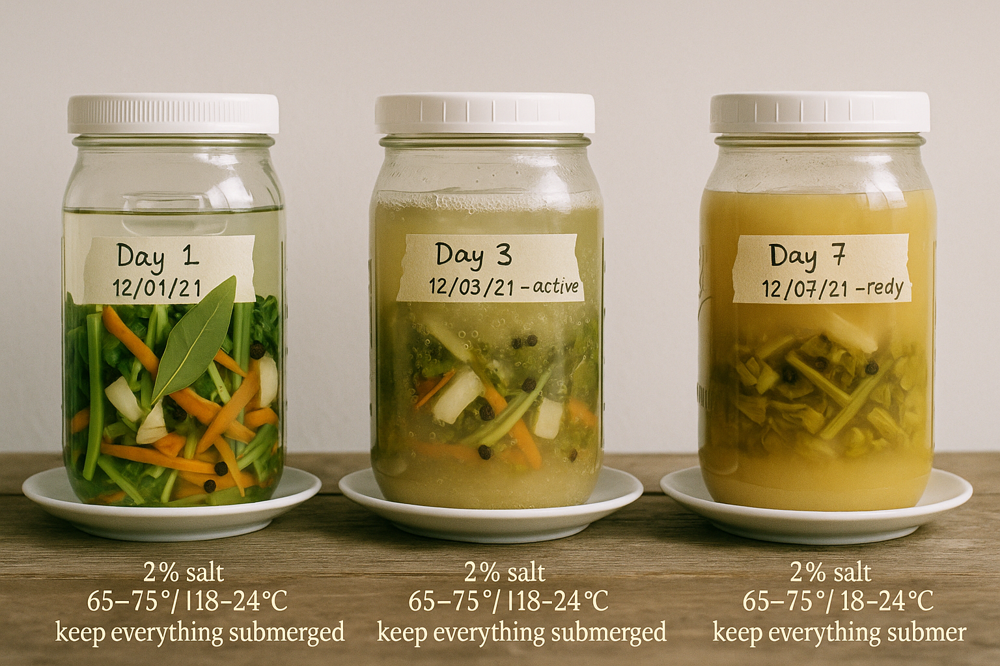

**Yield:** 1 quart jar
**Active time:** 15 minutes
**Fermentation time:** 3–7 days (then refrigerate)
**Keeps:** 3+ months refrigerated

#### Ingredients

**For the scraps:**
- 3 cups (about 450g) mixed vegetable scraps, chopped into bite-sized pieces*
- Optional aromatics: 2 garlic cloves (smashed), 1 teaspoon peppercorns, 1 teaspoon coriander seeds, 1 bay leaf, fresh dill, or chili flakes

*Good candidates: cabbage core, kale ribs, carrot peels, radish tops, cucumber ends, cauliflower trim, turnip scraps. Avoid: soft vegetables (tomatoes, zucchini—they turn mushy), allium skins (too papery).

**For the brine:**
- 2 cups (500ml) filtered water (chlorinated tap water can inhibit fermentation—if your tap water is heavily chlorinated, use filtered or boiled-then-cooled water)
- 1 tablespoon (15g) fine sea salt (about 2% brine by weight)

#### Method

1. **Prep scraps:** Wash scraps thoroughly. Cut into uniform, bite-sized pieces. Pack into a clean quart jar along with any aromatics.

2. **Make brine:** In a measuring cup, dissolve salt in water. Stir until fully dissolved.

3. **Pour brine:** Pour brine over the scraps until they're completely submerged. Leave 1 inch of headspace at the top of the jar.

4. **Weight down:** Place a smaller jar, a clean stone, or a fermentation weight on top of the scraps to keep them submerged. Scraps exposed to air = mold.

5. **Cover loosely:** Cover the jar with a lid loosely screwed on (not tight—fermentation produces CO2 gas that needs to escape). Alternatively, use a coffee filter secured with a rubber band.

6. **Ferment at room temp:** Place the jar on a plate (it may bubble over) in a cool, dark spot (65–75°F / 18–24°C is ideal). Let ferment for 3–7 days.

<!-- img-ref: images/chapter-09/056_lacto-fermentation-timeline.png -->
<!-- img-prompt: Ultra close-up macro of an active lacto-ferment in a clear quart jar to show bubbling fermentation. Fill the frame with the jar wall and brine line: a tangle of kale ribs, carrot peels, and cabbage bits pressed under a glass weight. Capture streams of tiny CO2 bubbles clinging to the vegetable surfaces and racing upward, some bursting at the brine surface, leaving a delicate foam ring against the glass. The brine is slightly cloudy, with a faint olive tint; peppercorns and a bay leaf peek through. Composition: tight macro at a slight angle, focus razor-sharp on the bubbles and the brine meniscus; background falls into soft blur. Lighting: natural side light from a nearby window, highlighting bubble edges and brine texture; no artificial glare. A loose metal lid sits askew on top (or a coffee filter with rubber band) to imply gas escape; 1 inch headspace visible. Place the jar on a white plate with a few escaped droplets to suggest overflow. Subtle details: faint condensation on the inside of the glass, a masking tape label partially legible (“2% brine”). Mood: alive, fizzy, quietly scientific—controlled chaos in a jar. Color palette: warm neutrals with muted greens and golds. Aesthetic: professional food photography but unpretentious; documentary realism; slight film grain; avoid glossy, staged styling. Emphasize the sensory feel of fermentation: effervescence, tangy smell implied, time captured mid-transformation. -->
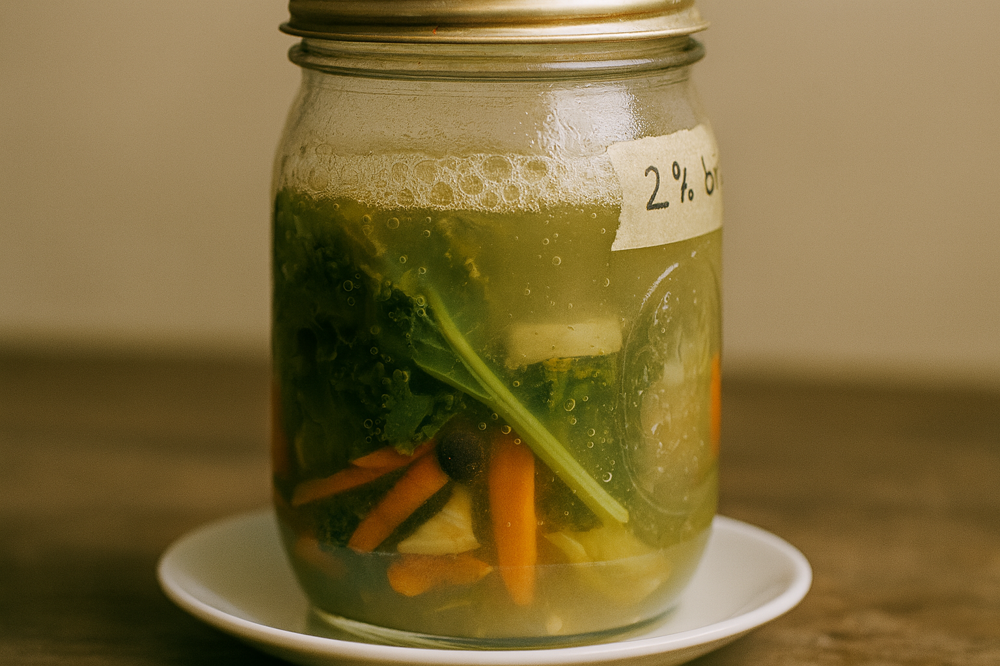

7. **Taste daily:** Start tasting after day 3. The scraps should be tangy, slightly sour, and crunchy. When they taste good to you, they're done.

8. **Refrigerate:** Once fermented to your liking, seal the jar tightly and refrigerate. This slows fermentation dramatically. The scraps will keep for months.

#### Troubleshooting

- **White film on top:** This is kahm yeast—harmless but undesirable. Skim it off and make sure scraps stay submerged.
- **Mold (green, black, fuzzy):** Discard the batch. This means something wasn't submerged or the brine was too weak.
- **Smells putrid:** It should smell tangy and slightly funky (like sauerkraut), not rotten. If it smells truly bad, discard it.
- **Too salty:** Rinse the fermented scraps before eating.

#### Variations

- **Spicy:** Add sliced jalapeño or red chili flakes.
- **Dill-forward:** Add a big handful of fresh dill.
- **Ginger-garlic:** Add sliced ginger and garlic cloves.

<!-- img-ref: images/chapter-09/056_lacto-fermentation-timeline.png -->
<!-- img-prompt: Hero shot of finished lacto-fermented vegetable scraps, editorial yet honest. A single quart jar sits on a weathered wooden board in soft natural daylight. The jar is tightly sealed, the vegetables fully settled and submerged in slightly cloudy brine: kale ribs, cabbage core wedges, carrot peel ribbons, peppercorns, and a bay leaf. The colors are muted olive and gold, appetizing but real. On the front, a strip of masking tape neatly labeled by hand: “Lacto scraps – 2% brine – 12/04/21.” Beside the jar, a small ceramic dish holds a modest serving of the fermented scraps, glistening, crunchy-looking, brine droplets catching the light. Composition: three-quarter angle at jar height, shallow depth of field focusing on the textures inside the jar and the glint of brine on the dish. Background: neutral off-white wall, a hint of the rental-grade coil stove edge in soft blur to ground the scene in a small apartment kitchen. Props are minimal: a clean fork, a few stray salt crystals, and a folded linen to add warmth. Lighting: window light from the left, gentle shadows, slightly desaturated, warm tone; 35mm film feel, subtle grain. Mood: patient and proud—time transformed scraps into something durable and delicious. Avoid glossy food-styling tricks; show real condensation, realistic imperfections, no artificial garnish. Emphasize longevity and approachability; it looks like something you could make with jars, salt, and time. -->
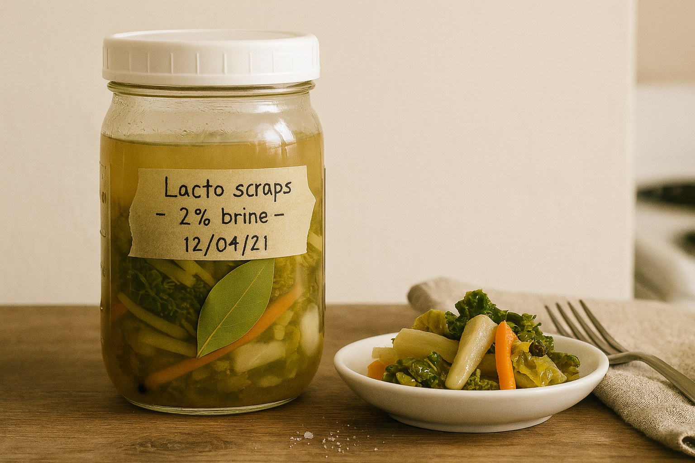

<!-- img-ref: images/chapter-09/058_fermented-vegetables-hero.png -->
<!-- img-prompt: Infographic, two-column comparison: “Raw vs. Fermented (7 Days)” in a warm, educational cookbook aesthetic. Background: off-white paper texture with a warm neutral palette (soft tans, muted greens, charcoal text). Typography: clean, inviting humanist sans-serif for headings and labels; clear hierarchy; no corporate gloss. Left column labeled “Raw Scraps (Day 0)” with a neatly arranged top-down photo of mixed vegetable scraps (kale ribs, carrot peels, cabbage core chunks) on a white plate. Callouts with thin hairline leader lines and small icons: “Color: bright green/orange,” “Texture: crisp,” “Aroma: fresh/green,” “pH: ~6.5,” “Shelf life: days.” Right column labeled “Fermented (Day 7)” with a photo of the same scraps submerged in a jar, brine cloudy, pieces slightly darker, CO2 bubbles faint. Callouts: “Color: olive/gold,” “Texture: tender-crunch,” “Aroma: tangy,” “pH: ~3.5–4.0,” “Shelf life: months (refrigerated).” A center strip lists the process essentials with small icons: salt shaker icon “2% salt by weight,” water drop “keep scraps submerged,” thermometer “65–75°F (18–24°C),” clock “3–7 days,” loose lid icon “allow gas to escape.” Include a small note box at bottom: “Skim harmless white kahm yeast; discard if mold is green/black/fuzzy or smells putrid.” Maintain ample negative space, legible captions, and harmonious color contrast. Use soft, editorial photos integrated into the layout with subtle shadows; no overly bright saturation, no clip-art. Tone: friendly field guide—beautiful but functional, immediately useful to a beginner. -->
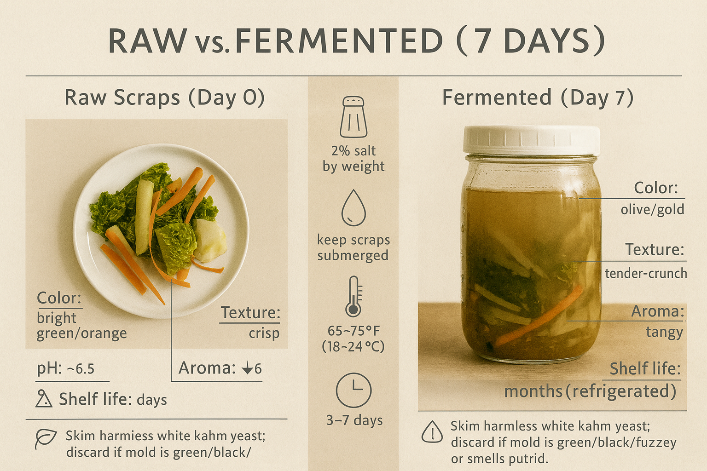

---

## Recipe 2: Scrap Sauerkraut (Cabbage Cores and Outer Leaves)

### The Why

Sauerkraut is fermented cabbage. Traditional recipes call for whole heads of cabbage, but the technique works just as well with the parts you'd normally throw away: the tough core, the outer leaves, the bits you trimmed off. It's tangy, crunchy, probiotic-rich, and lasts for months.

### The Recipe

**Yield:** 1 quart jar
**Active time:** 15 minutes
**Fermentation time:** 5–10 days
**Keeps:** 6+ months refrigerated

#### Ingredients

- 4 cups (400g) shredded cabbage scraps (cores, outer leaves, etc.)
- 1 tablespoon (12g) fine sea salt (about 2.5% of the cabbage's weight)
- Optional: 1 teaspoon caraway seeds, juniper berries, or black peppercorns

#### Method

1. **Shred cabbage:** Shred scraps as thin as possible (use a knife, mandoline, or food processor). Cores should be sliced very thin—they're tougher than leaves.

2. **Salt and massage:** Place shredded cabbage in a large bowl. Sprinkle with salt. Using clean hands, massage the cabbage vigorously for 5–10 minutes. It will release liquid and shrink dramatically. You want enough liquid to cover the cabbage when you pack it into a jar.

3. **Pack into jar:** Transfer cabbage and all its liquid into a clean quart jar. Pack it down tightly with your fist or a wooden spoon. The cabbage should be submerged in its own brine. If there's not enough liquid, make a quick brine (1 cup water + 1½ teaspoons salt) and add just enough to cover.

4. **Weight down:** Place a weight on top to keep cabbage submerged.

5. **Cover loosely:** Cover with a lid loosely screwed on or a coffee filter secured with a rubber band.

6. **Ferment at room temp:** Place jar on a plate. Ferment for 5–10 days at room temperature (65–75°F / 18–24°C). Taste after day 5. It should be tangy and crunchy. The longer it ferments, the tangier it gets.

7. **Refrigerate:** When it tastes good, seal tightly and refrigerate. It will keep for 6+ months and continue developing flavor.

#### Notes

- **Salt is key:** Don't reduce the salt—it's what creates the right environment for fermentation.
- **Cabbage must be submerged:** Any exposed cabbage will mold. Keep it under the brine.
- **Bubbling is normal:** You may see bubbles rising—this is CO2 from fermentation. Good sign.

<!-- img-prompt: Hero image of scrap sauerkraut made from cabbage cores and outer leaves. A tall glass jar, packed tight with thinly shredded pale-green and golden cabbage strands, glistening in their own brine. Caraway seeds and a few juniper berries are visible, suspended. The jar sits on a weathered wooden board with a small pile of sauerkraut forked out onto a chipped white saucer, showcasing crunchy, well-defined shreds and a few beads of brine. Label on masking tape: “Scrap Kraut (cores/leaves) – 2.5% salt – 01/02/22.” Composition: three-quarter angle, camera at jar height, shallow depth of field keeps focus on textures of the kraut and seeds; background softly blurs to an off-white wall and the edge of a rental-grade stove. Lighting: natural window light from the left, gentle warmth, no glossy highlights; slight desaturation and subtle grain for an editorial, honest feel. Props minimal: a clean fork, a linen corner, salt crystals. Show that the cabbage is submerged below the brine line; the top surface is glossy and calm. Mood: grounded, practical abundance—proof that “waste” becomes a long-lasting staple. Color palette: muted greens, straw-golds, warm neutrals. No slick styling, no pristine studio; it should feel like a real, small apartment kitchen moment—approachable and appetizing without pretense. -->
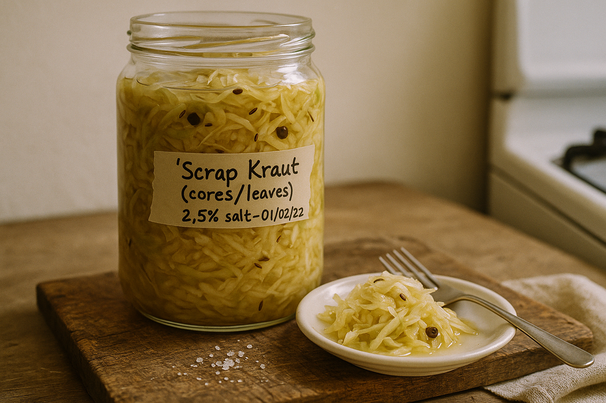

---

## Recipe 3: Fermented Hot Sauce (Chili Scraps, Garlic, Salt)

### The Why

If you cook with fresh chilies, you're left with stems, seeds, and tops. Most people throw them away. But fermented with salt and garlic, they become hot sauce—tangy, complex, and as spicy as you want. This is how Tabasco and Sriracha are made, just on a smaller, scrappier scale.

### The Recipe

**Yield:** About 1 cup
**Active time:** 10 minutes
**Fermentation time:** 7–14 days
**Keeps:** 6+ months refrigerated

#### Ingredients

- 2 cups (200g) chili scraps (stems removed, seeds okay) or whole chilies, roughly chopped*
- 4 garlic cloves, smashed
- 2 teaspoons (10g) fine sea salt
- ½ cup (125ml) filtered water
- Optional after fermentation: 2 tablespoons vinegar, 1 teaspoon honey

*Use any chilies: jalapeño, serrano, Fresno, Thai, habanero (careful—hot). Mix varieties for complexity.

#### Method

1. **Combine:** In a clean pint jar, combine chopped chilies, garlic, and salt. Pour in water. Stir to dissolve salt.

2. **Weight and cover:** Place a weight on top to keep chilies submerged. Cover loosely with a lid or coffee filter.

3. **Ferment:** Let sit at room temperature for 7–14 days. Shake or stir daily to redistribute. It will smell pungent and tangy.

4. **Blend:** After fermentation, pour everything (chilies, garlic, brine) into a blender. Blend until smooth. Taste. It should be spicy, tangy, and funky. If it's too thick, add water or vinegar to thin. If it's too salty, add honey to balance.

5. **Strain (optional):** For a smoother sauce, strain through a fine-mesh sieve. For a chunkier sauce, leave as-is.

6. **Bottle:** Pour into a clean bottle or jar. Refrigerate. It will keep for 6+ months.

#### Variations

- **Smoky:** Use roasted chilies or add ½ teaspoon smoked paprika.
- **Sweet:** Add 1 tablespoon honey or maple syrup after blending.
- **Fruity:** Add a splash of pineapple juice or mango after blending.

#### Notes

- **Wear gloves:** Chili oils burn. Don't touch your eyes.
- **Start mild:** If you're new to fermented hot sauce, start with jalapeños. You can always add hotter chilies next time.
- **It will separate:** Fermented hot sauce separates in the bottle—this is normal. Shake before using.

<!-- img-prompt: Hero shot: fermented hot sauce from chili scraps. Foreground: a small clear glass bottle of deep red-orange sauce, slightly translucent, with flecks of seeds and skin, a little separation visible near the top. Masking tape label reads “Chili Scrap Sauce – 01/18/22.” Next to it, a short wide-mouth jar shows the pre-blended ferment: chopped chilies (mixed jalapeño and Fresno), garlic cloves, and brine, with a fermentation weight holding solids under the surface; a few bubbles cling to the glass. Scattered nearby are chili tops, a tangle of seeds, and a sliced jalapeño, hinting at the “scraps” origin. Composition: three-quarter tabletop angle, camera low to the bottle’s midline; bottle cap off and a droplet of sauce on a spoon to suggest viscous texture. Lighting: natural daylight from the right, soft and warm, with realistic shadows; slight film grain. Background: neutral wall and a hint of the apartment stove, unfussy. Color palette: warm reds, muted greens, and warm neutrals; no excessive saturation. Mood: punchy, alive, unfussy. Include a subtle reminder detail: a pair of disposable gloves off to the side, lightly crumpled. Keep styling minimal, honest, not Instagram-glossy—this is practical heat with complexity, born from saved stems and seeds turned into a long-lasting condiment. -->
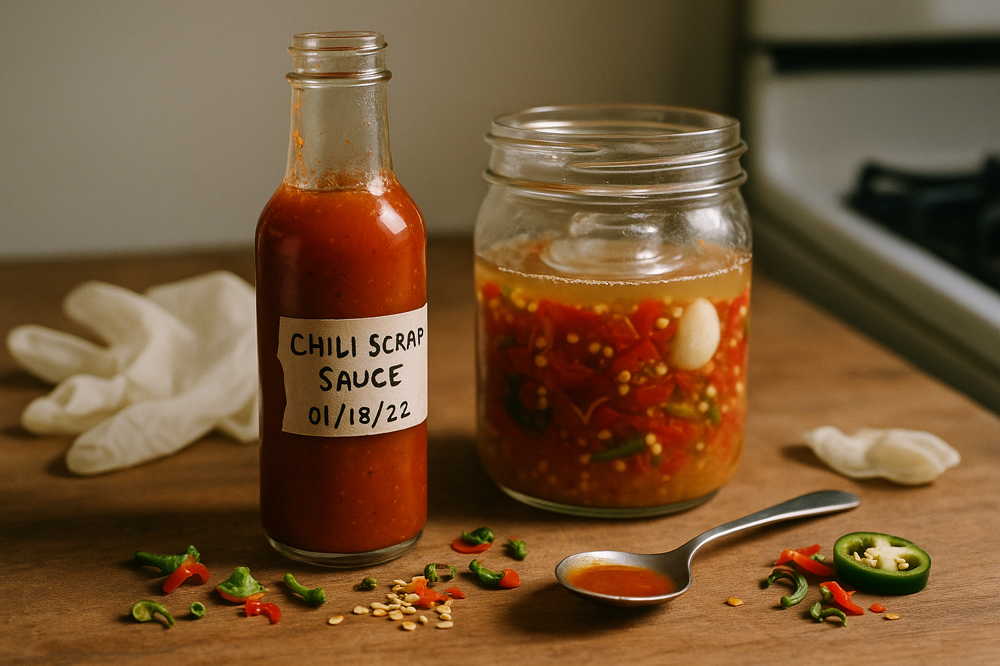

---

## Recipe 4: Herb-Stem Chimichurri (Preserved in Oil and Vinegar)

### The Why

Chimichurri is an Argentinian sauce made from parsley, garlic, vinegar, and oil. Traditional recipes use parsley leaves, but the stems work just as well—they're more intensely flavored and hold up better in the acidic brine. This version is half condiment, half preservation technique: the acid and oil keep the herbs fresh for weeks.

### The Recipe

**Yield:** About 1 cup
**Active time:** 10 minutes
**Ready immediately, improves with time**
**Keeps:** 2–3 weeks refrigerated

#### Ingredients

- 2 cups (packed) herb stems (parsley, cilantro, or a mix), minced very fine
- 4 garlic cloves, minced
- ½ teaspoon red chili flakes
- ½ teaspoon fine sea salt
- ¼ teaspoon black pepper
- ¼ cup (60ml) red wine vinegar
- ½ cup (125ml) olive oil

#### Method

1. **Mince herbs:** Mince stems as finely as possible—almost to a paste. A food processor works, but pulsing by hand gives better texture.

2. **Combine:** In a bowl, combine minced stems, garlic, chili flakes, salt, pepper, and vinegar. Stir. Let sit for 5 minutes (the acid will mellow the garlic).

3. **Add oil:** Stir in olive oil. Taste. It should be bright, garlicky, herbaceous, and spicy. Adjust: more vinegar for tang, more oil to mellow, more salt to sharpen.

4. **Store:** Transfer to a jar and refrigerate. Stir before using—it will separate.

#### Uses

- Drizzle over grilled or roasted vegetables
- Spoon over fried eggs
- Toss with roasted potato scraps
- Use as a marinade for chicken or fish
- Stir into grain bowls or pasta

#### Variations

- **Spicy:** Add minced jalapeño or double the chili flakes.
- **Citrus:** Replace vinegar with lemon juice.
- **Oregano-forward:** Add 1 teaspoon dried oregano.

#### Notes

- **Minced fine is key:** If the stems are too large, they'll be fibrous. Mince them almost to dust.
- **It gets better:** Chimichurri improves after 24 hours as the flavors meld.
- **Oil will solidify:** If refrigerated, the olive oil will solidify—this is normal. Let it sit at room temperature for 15 minutes before using.

<!-- img-prompt: Hero image of herb-stem chimichurri—bright, garlicky, preserved in oil and vinegar. A small squat jar sits open on a weathered wooden surface, filled to the brim with finely minced parsley and cilantro stems, tiny garlic specks, red chili flakes, and visible pockets of olive oil shimmering between emerald flecks. The mixture looks moist and spoonable, not puréed—clearly chopped by hand. A masking tape label on the jar reads: “Chimi (stems) – 02/03/22.” Composition: close, three-quarter angle, focus on the glossy chopped texture; a spoon rests beside the jar with a heaped scoop, some oil pooling around it. Background: soft blur of a neutral wall and the edge of a cheap laminate counter; editorial cookbook style, no clutter. Lighting: natural daylight from the left, warm but not harsh; slight desaturation and subtle grain for realism. Color palette: vivid greens tempered by warm neutrals and golden oil, no oversaturation. Include a tiny pinch of red chili flakes on the surface, a faint dusting of black pepper, and a few stray herb stem trimmings to communicate origin. Mood: practical exuberance—bright flavor made from what’s usually discarded. Keep it unpretentious: honest textures, oil separation visible, no fancy props. The sauce looks ready to drizzle on eggs or vegetables; it feels like something that will keep a couple of weeks in the fridge, improving with time. -->
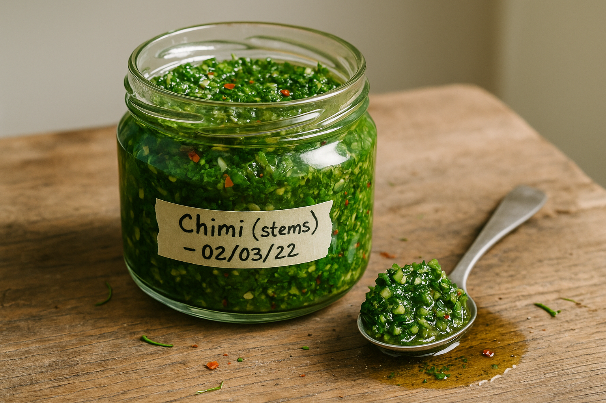

---

## Recipe 5: Citrus-Peel Marmalade (From Spent Rinds)

### The Why

After you juice lemons, limes, or oranges, you're left with the hollowed-out rinds. Most people compost them. But boiled with sugar, they become marmalade—bittersweet, jammy, and excellent on toast, stirred into yogurt, or used as a glaze for roasted vegetables.

### The Recipe

**Yield:** About 2 cups
**Active time:** 30 minutes
**Cooking time:** 1 hour
**Keeps:** 1 month refrigerated

#### Ingredients

- 4 cups (packed) spent citrus rinds (lemon, orange, grapefruit, or a mix), sliced thin*
- 2 cups (500ml) water
- 1½ cups (300g) granulated sugar
- Juice of 1 lemon (for pectin and acidity)
- Pinch of salt

*Only use organic citrus. Conventional citrus peels often have wax or pesticide residue.

#### Method

1. **Prep rinds:** Slice rinds (pith and all) into very thin strips—as thin as you can manage.

2. **Simmer:** In a large pot, combine rinds and water. Bring to a boil, then reduce to a simmer. Cook for 30 minutes until the pith is very soft.

3. **Add sugar:** Add sugar, lemon juice, and salt. Stir until sugar dissolves. Increase heat and bring to a rolling boil. Boil for 20–30 minutes, stirring occasionally, until the mixture thickens and reaches 220°F (104°C) on a candy thermometer. If you don't have a thermometer, test by dropping a spoonful onto a cold plate—it should wrinkle when you push it with your finger.

4. **Cool and jar:** Remove from heat. Let cool for 10 minutes, then transfer to clean jars. Let cool completely before sealing. Refrigerate.

#### Variations

- **Spiced:** Add a cinnamon stick, star anise, or cardamom pods while simmering.
- **Savory:** Reduce sugar to 1 cup and add 1 teaspoon fresh thyme or rosemary. Use as a glaze for roasted vegetables or pork.
- **Ginger:** Add 2 tablespoons minced fresh ginger.

#### Uses

- Spread on toast
- Stir into yogurt or oatmeal
- Glaze for roasted carrots, squash, or chicken
- Mix with olive oil and vinegar for a bright vinaigrette

#### Notes

- **Organic citrus only:** Non-organic peels can have pesticide or wax residue.
- **The pith is bitter:** That's the point. It mellows with cooking and adds complexity.
- **Temperature matters:** If your marmalade doesn't thicken, you didn't cook it long enough. Return it to the pot and boil for another 10 minutes.

<!-- img-prompt: Hero shot of citrus-peel marmalade made from spent rinds. Foreground: a clear, squat jar with translucent, amber-gold marmalade packed with thin, tender ribbons of peel—some lemon, some orange—suspended in a glossy gel. The peel varies from pale yellow to deep orange; a few tiny air bubbles catch the light. Masking tape label: “Spent-Rind Marmalade – 03/10/22.” Composition: three-quarter angle at jar height. Beside the jar, a small slice of toast with a generous swipe of marmalade, edges slightly uneven, a bit of syrup pooling. In the background: a cutting board with halved, hollowed lemon and orange shells (clearly juiced), a chef’s knife, and a candy thermometer resting on a pot, all softly blurred. Lighting: natural daylight from the right, warm and inviting, with real shadows and slight highlights on the gel’s surface; editorial, not glossy. Color palette: warm ambers, muted yellows, and natural neutrals; slightly desaturated for honesty. Include a pinch of salt granules nearby and a small lemon wedge for brightness. Mood: frugal alchemy—bitterness transformed into a rich, jammy preserve. Avoid pristine styling; embrace real drips, a crumb or two on the board, and the sense that this was made on a rental stove in a tiny kitchen with patience and sugar. -->
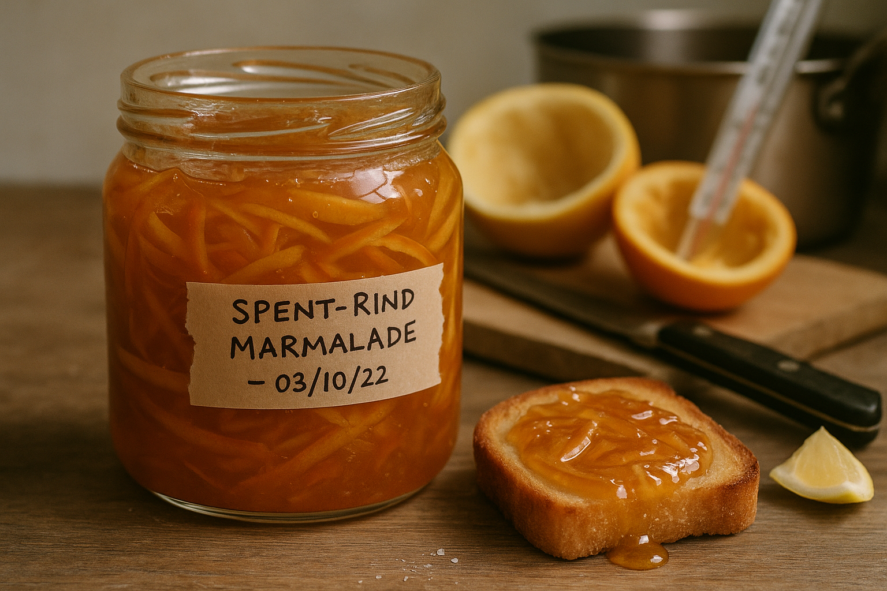

---

## Recipe 6: Scrap-Vegetable Relish (Mustard-Vinegar Style)

### The Why

Relish is finely chopped vegetables preserved in vinegar, mustard, and spices. It's tangy, crunchy, and keeps for weeks. This version uses vegetable scraps—cucumber ends, carrot nubs, onion pieces, cabbage cores—and transforms them into a condiment that elevates sandwiches, burgers, grain bowls, and eggs.

### The Recipe

**Yield:** About 2 cups
**Active time:** 15 minutes
**Ready immediately, improves with time**
**Keeps:** 3 weeks refrigerated

#### Ingredients

- 2 cups (300g) mixed vegetable scraps, diced very small (¼-inch pieces)*
- ¼ cup (30g) finely diced red onion or onion scraps
- ¼ cup (60ml) apple cider vinegar
- 2 tablespoons Dijon mustard
- 1 tablespoon honey or sugar
- 1 teaspoon fine sea salt
- ½ teaspoon celery seeds or mustard seeds
- ¼ teaspoon turmeric (for color)

*Good candidates: cucumber ends, carrot nubs, radish tops, cabbage core, cauliflower trim, green beans.

#### Method

1. **Dice scraps:** Dice all scraps as small and uniform as possible. You want them to be relish-sized, not chunky.

2. **Combine:** In a bowl, whisk together vinegar, mustard, honey, salt, celery seeds, and turmeric. Add diced scraps and onion. Stir thoroughly.

3. **Rest:** Let sit at room temperature for at least 30 minutes. The scraps will soften slightly and absorb the brine.

4. **Taste and adjust:** It should be tangy, sweet, and well-seasoned. Add more vinegar for brightness, more honey for sweetness, more salt if flat.

5. **Jar and refrigerate:** Transfer to a clean jar and refrigerate. It's good immediately, but better after 24 hours.

#### Uses

- Top hot dogs, burgers, or sandwiches
- Stir into tuna or egg salad
- Spoon over grain bowls
- Serve alongside cheese and crackers

#### Variations

- **Spicy:** Add minced jalapeño or red chili flakes.
- **Dill-forward:** Add fresh dill and use white vinegar instead of cider vinegar.
- **Sweet:** Increase honey to 2 tablespoons.

<!-- img-prompt: Hero image of mustard-vinegar scrap-vegetable relish. A small, clear jar filled with finely diced, colorful vegetable scraps—cucumber ends, carrot nubs, bits of cabbage core—cut to neat 1/4-inch pieces. The brine is bright and slightly viscous, tinted golden by turmeric; mustard or celery seeds dot the mixture. A masking tape label reads: “Scrap Relish – 04/14/22.” Composition: three-quarter tabletop angle, shallow depth of field focused on the jar’s textures; a spoonful of relish rests on a small plate in front, glistening and structured, not mushy. The background is simple: weathered wood surface, neutral wall, perhaps the edge of a renter’s stove in soft blur. Lighting: soft natural daylight from the left, warm and realistic; slight desaturation with a hint of film grain for an editorial, honest look. Color palette: muted greens, oranges, and golds with warm neutrals. Include subtle cues of the recipe: a small bowl with a dab of Dijon, a drip of apple cider vinegar, and a pinch of turmeric on the board—minimal, not staged. Mood: approachable, tangy, and practical—immediately useful on a sandwich or stirred into salad. Keep styling unpretentious, with tiny imperfections like a stray seed on the rim; no slick, glossy food porn. It should feel like something you mixed in a bowl, tasted, labeled, and stashed to make everything better for the next few weeks. -->
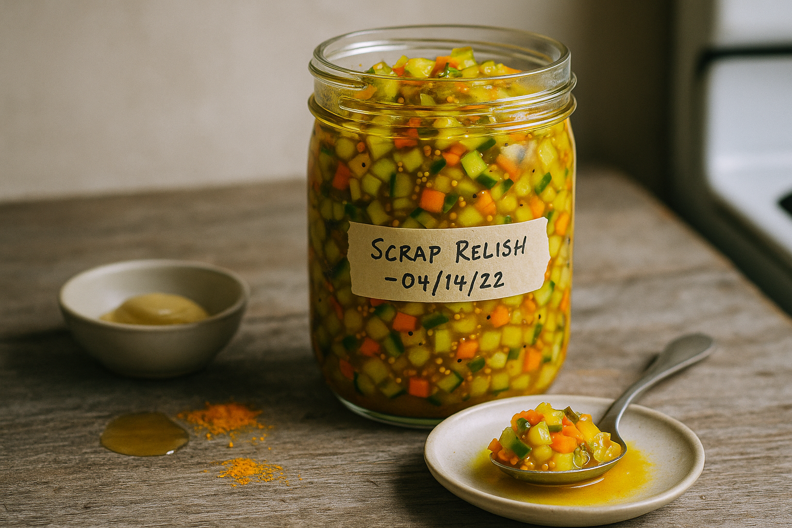

---

## Recipe 7: Brown-Butter Breadcrumb Pesto (Preserved)

### The Why

This is a hybrid: bread-crumb condiment meets pesto meets preserved spread. It uses stale bread, herb stems, garlic, and brown butter to create a thick, spreadable paste that lasts for weeks and makes everything it touches taste better.

### The Recipe

**Yield:** About 1 cup
**Active time:** 15 minutes
**Keeps:** 2 weeks refrigerated

#### Ingredients

- 1 cup (60g) coarse bread crumbs from stale bread
- 4 tablespoons (56g) unsalted butter
- 1 cup (packed) herb stems (parsley, basil, cilantro), minced fine
- 3 garlic cloves, minced
- ¼ cup (25g) grated Parmesan
- ¼ cup (60ml) olive oil
- 2 tablespoons lemon juice
- ½ teaspoon fine sea salt
- ¼ teaspoon black pepper

#### Method

1. **Brown butter and crumbs:** In a skillet, melt butter over medium heat. Swirl until it browns and smells nutty. Add bread crumbs. Stir constantly for 3–4 minutes until deeply golden. Remove from heat.

2. **Combine:** In a bowl, combine the toasted crumbs (with all the browned butter), minced herb stems, garlic, Parmesan, olive oil, lemon juice, salt, and pepper. Stir until it forms a thick, spreadable paste. If it's too thick, add more olive oil.

3. **Taste and adjust:** It should be nutty, herby, garlicky, and rich. Adjust seasoning as needed.

4. **Store:** Transfer to a jar. Cover the surface with a thin layer of olive oil (this prevents oxidation). Refrigerate.

#### Uses

- Spread on toast or sandwiches
- Toss with pasta
- Spoon over roasted vegetables
- Stir into soups for richness
- Use as a topping for baked fish

<!-- img-prompt: Hero shot of brown-butter breadcrumb pesto made from stale bread and herb stems. Foreground: a small jar filled with a thick, spoonable paste—speckled with deep golden breadcrumb flecks, vivid green minced stems, and grated Parmesan integrated into a glossy, olive-oil sheen. The surface has a gentle pooling of oil, signaling preservation. Label on masking tape: “Breadcrumb Pesto – 05/22/22.” Composition: three-quarter angle, camera at jar height, shallow depth of field focusing on the texture. A spoon lies beside the jar with a generous smear of the pesto on the board, showing coarse crumb structure and tiny garlic bits. Background: weathered wood surface; a heel of stale bread, a microplane with a few cheese shavings, and a small skillet with browned butter residue (golden-brown speckles) in soft blur. Lighting: natural daylight from the left, warm and soft; slight desaturation and subtle grain for realism. Color palette: warm browns, muted greens, and natural neutrals. Mood: nutty, rich, and resourceful—decadence from scraps. Avoid pristine styling; allow a few crumbs and oil droplets. Emphasize tactile appeal: the nutty browned-butter aroma implied, the spreadable density, the sense that this will keep a couple weeks under oil in the fridge, ready to smear on toast or toss with pasta. -->
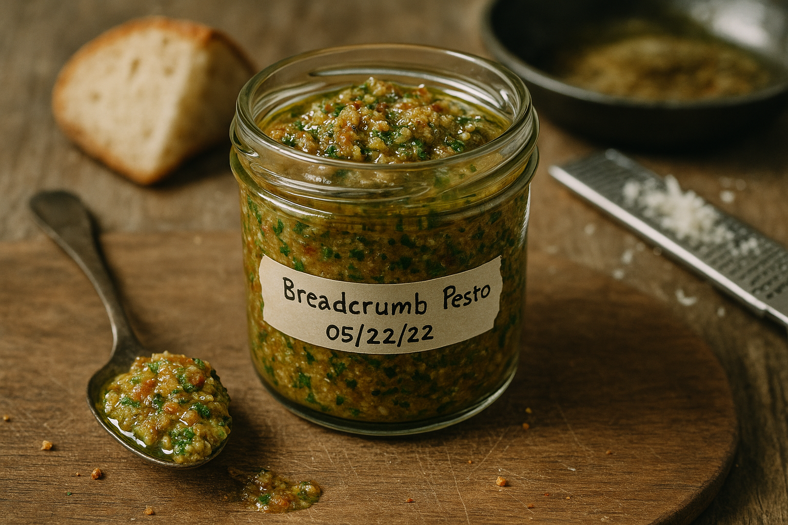

---

## On Time and Flavor (And Becoming That Person)

Ferments and condiments are not fast food. They require patience—days, sometimes weeks. But what you get in return is complexity, depth, and longevity. A jar of lacto-fermented scraps lasts for months. A bottle of fermented hot sauce lasts for half a year. These are investments.

Fair warning: once you start fermenting, you'll become insufferable about it. You'll check your jars daily. You'll bring fermented hot sauce to dinner parties. You'll describe things as "funky in a good way" and expect people to understand what that means. Your fridge will develop a dedicated fermentation shelf. Your friends will start to worry.

This is normal. You're not joining a cult—you're just discovering that controlled bacterial transformation is both deeply weird and genuinely useful. You're building a pantry of flavor that pays dividends every time you open the fridge and find something tangy, funky, and ready to make dinner better.

And unlike your fresh scraps, which wilt and die within days, these ferments last. They wait for you. They get better with time. They're patient, which is more than I can say for most things in the kitchen.

<!-- img-prompt: Documentary shot of a home fermentation/condiment shelf inside a cramped San Francisco studio. A narrow wire shelf or the inside door of a small rental fridge shows multiple neatly arranged jars and bottles, all labeled with masking tape and dates. Visible: “Lacto scraps – 2% – 12/04/21,” “Chili Scrap Sauce – 01/18/22,” “Scrap Kraut – 01/02/22,” “Chimi (stems) – 02/03/22,” “Spent-Rind Marmalade – 03/10/22,” “Scrap Relish – 04/14/22,” and “Breadcrumb Pesto – 05/22/22.” Each jar looks honest: some separation in the hot sauce, oil cap on the pesto and chimichurri, cloudy brine in ferments, tidy but real condensation on glass. Composition: straight-on, waist-height perspective, slight wide angle to capture the shelf but keep distortion natural. Lighting: natural daylight spilling from the kitchen window, soft and warm; no flash. Background hints: cheap laminate countertop, a glimpse of the rental-grade stove, and a stack of thrifted plates; keep it tidy but lived-in. Color palette: warm neutrals with muted greens, golds, and reds; slightly desaturated, subtle film grain. Mood: organized, proud, and practical—an unglamorous pantry of flavor built from scraps over time. Include small details like a pencil and a roll of masking tape nearby, reinforcing the habit of labeling and the sense of a working home fermentation lab-meets-farmhouse pantry. -->
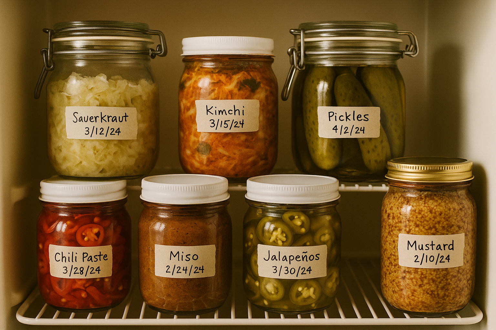

---

**Photography note:** *This chapter needs process-driven imagery. Include: (1) jars of fermenting vegetables at different stages (day 1, day 5, finished); (2) bubbling ferments with visible brine levels; (3) finished condiments in clean jars with labels; (4) side-by-side comparisons of raw scraps vs. fermented results; (5) a "condiment shelf" shot showing multiple jars organized and labeled. The aesthetic should be rustic, scientific, and aspirational—like a home fermentation lab meets a farmhouse pantry.*
