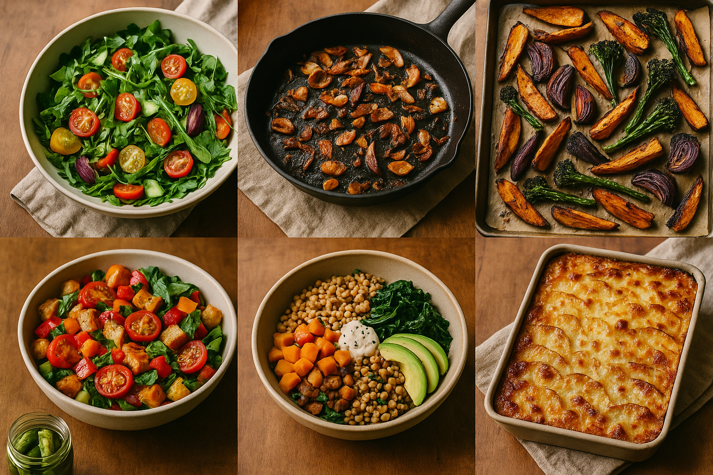
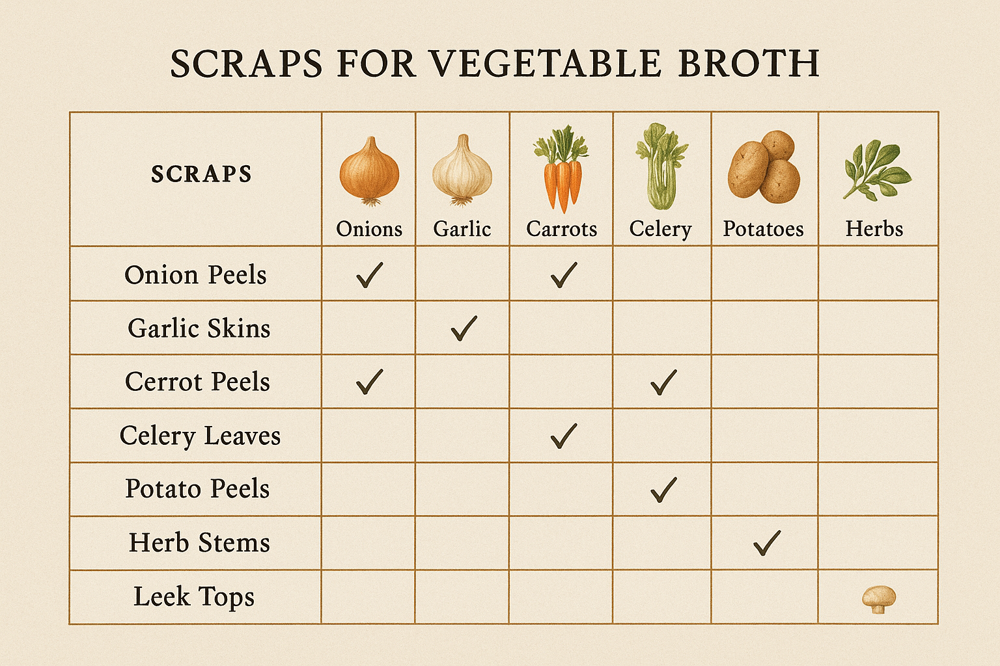
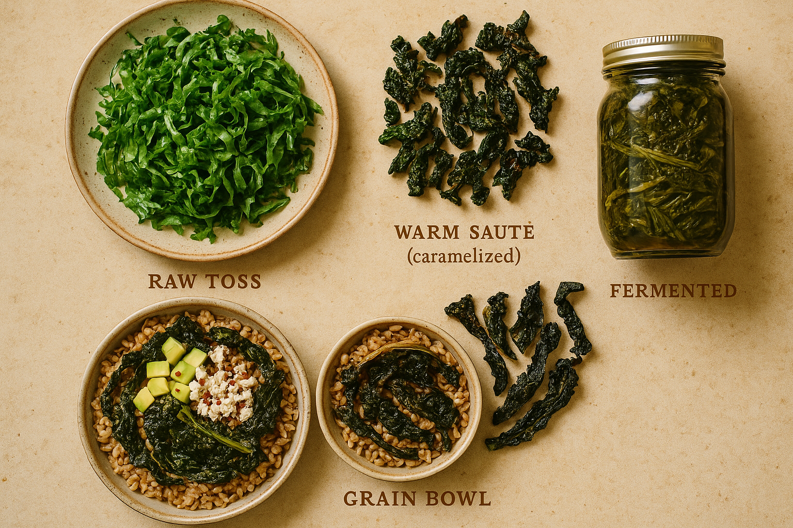
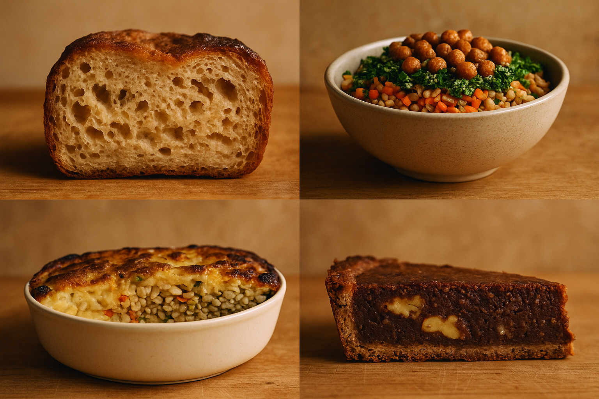
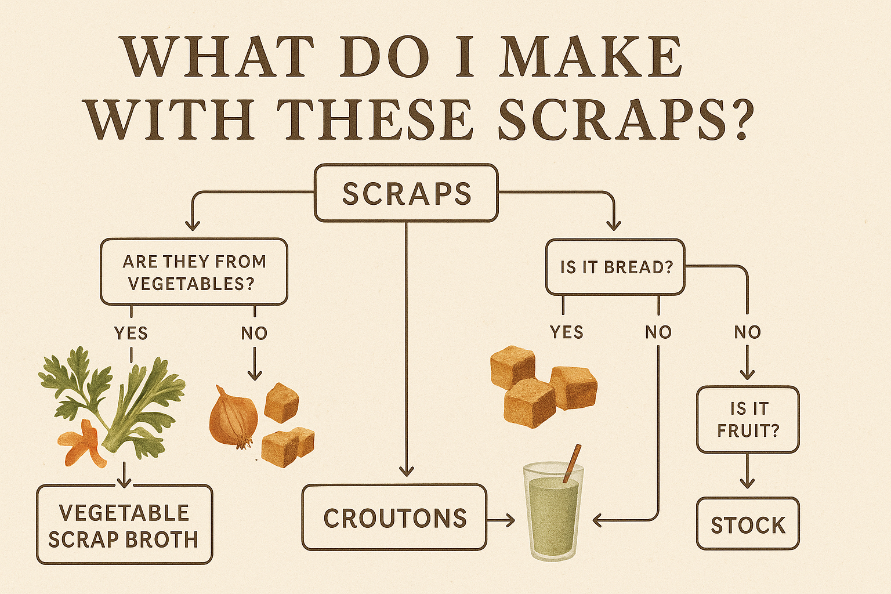

# Chapter 10: Taxonomy of Varieties

> *"Names clarify thinking."*

## On Categorization (Or: Why I'm Taxonomizing Garbage Like It's a Biological Phylum)

I realize we've reached the point where I'm creating a formal taxonomic system for dishes made from kitchen scraps. This is either the work of someone who's thought deeply about the culinary possibilities of waste reduction, or someone who's completely lost their mind. Let the reader decide.

But here's the thing: Drain Salads are not monolithic. A bowl of wilted greens tossed with crumb-vinaigrette is a very different thing from a gratin of stale bread and kale ribs, which is itself different from a jar of fermented vegetable scraps. They're all Drain Salads—they all transform scraps into food—but they occupy different culinary spaces, have different technical requirements, and work in different contexts.

Without names for these categories, you're just flailing. With names, you can say "I'm making a Raw Toss, so I need to slice these scraps thin and dress them aggressively" or "This is a Bread-Bound dish, so the bread needs to be actually stale, not just day-old." Naming clarifies thinking.

This chapter is a field guide. It categorizes Drain Salads into eight varieties based on their structure, technique, and use case. Think of these as species within the genus *Salatidae Drenularis* (I made that up, but it sounds legitimate). Each has its own characteristics, strengths, and ideal contexts. Once you understand the taxonomy, you can improvise with confidence—because you'll know what kind of dish you're trying to make.

This is not about rules. It's about vocabulary. When you know the name for what you're making, you can make it better.

---

## The Eight Varieties

<!-- img-prompt: Create a clean, educational infographic that compares the eight varieties of Drain Salads side by side in a 4x2 grid. Title at top: “The Eight Varieties of Drain Salads” with the subtitle “Names clarify thinking” and a small note: “Field guide assembled in a cramped San Francisco studio, winter 2021, 6:47pm Wednesday.” Use a warm, desaturated palette (parchment off‑white background with subtle recycled-paper texture; muted olive, rust, ochre, charcoal accents). Typography: friendly, readable humanist sans serif (small caps for Latin names), clear hierarchy for headings and bullets. Each tile contains: 1) a small overhead photographic plate or jar showing the variety in an honest, unglamorous way with natural window light, slight film grain, soft shadows; 2) the name pairing in this format: Latin (English) — Salata Cruda (Raw Toss), Saltato (Warm Sauté), Arrosto (Roasted Char), Panzanella (Bread‑Bound), Cereale (Grain‑Based Bowl), Fermentato (Fermented Funk), Brodo (Soup/Broth), Gratinato (Baked/Gratin); 3) a concise bullet stack: Speed, Texture, Flavor, Shelf life; 4) a one‑line “Key technique.” Show realistic mini-dishes: thin-shaved kale ribs glistening with lemon (Raw Toss), browned stem pieces with garlic and chili (Warm Sauté), charred kale ribs on a sheet pan corner (Roasted Char), chunky tomato‑and‑bread bite (Bread‑Bound), chewy grains topped with scraps and crumbs (Grain Bowl), a small brine jar with submerged scraps and bubbles (Fermented), a clear cup of golden broth (Soup), a browned-topped gratin wedge (Baked). Keep everything honest—scuffed surfaces, mismatched plates, no food‑porn gloss. Maintain consistent lighting like late-afternoon San Francisco window light. Add tiny icon cues (pan, oven, jar) by each tile. Spacing airy, grid lines subtle, annotations crisp. The overall mood: pragmatic, reassuring, a taxonomy built from broke necessity turned technique. -->

### 1. The Raw Toss (Salata Cruda)

**Definition:** Raw or minimally cooked scraps tossed with a bright dressing and served immediately.

**Characteristics:**
- **Speed:** 10–15 minutes from prep to plate
- **Texture:** Crisp, crunchy, fresh-feeling
- **Flavor profile:** Bright, acidic, light
- **Shelf life:** Eat immediately (wilts within hours)

**Key technique:** The scraps must be very fresh and finely sliced or shaved. Thick cuts of raw scraps are fibrous and unpleasant. Thin cuts (mandoline, sharp knife) make them tender.

**Examples:**
- Shaved kale-rib salad with lemon vinaigrette
- Thinly sliced radish-top salad with sesame dressing
- Herb-stem tabbouleh (bulgur + minced parsley stems)

**When to use:** When you need something fast, fresh, and light. Summer cooking. Side dishes.

**Common mistakes:**
- Cutting scraps too thick (results in fibrous, tough bites)
- Under-dressing (raw scraps need aggressive seasoning)
- Letting it sit too long (it wilts and weeps)

---

### 2. The Warm Sauté (Saltato)

**Definition:** Scraps cooked quickly in a hot pan with fat, garlic, and aromatics until tender and caramelized.

**Characteristics:**
- **Speed:** 10–20 minutes
- **Texture:** Tender with crispy edges
- **Flavor profile:** Savory, slightly sweet from caramelization
- **Shelf life:** 2–3 days refrigerated

**Key technique:** High heat, don't crowd the pan, let things brown. If you stir constantly, you're steaming, not sautéing. Let scraps sit undisturbed for 2–3 minutes to develop color.

**Examples:**
- Sautéed kale ribs with garlic and chili flakes
- Caramelized onion ends with miso
- Chard stems with brown butter and lemon

**When to use:** When you want something warm, savory, and comforting. Fall/winter cooking. Side dishes that go with protein.

**Common mistakes:**
- Overcrowding the pan (steam instead of browning)
- Too-low heat (scraps turn limp instead of caramelized)
- Not seasoning enough (scraps have muted flavors—salt aggressively)

---

### 3. The Roasted Char (Arrosto)

**Definition:** Scraps roasted in a hot oven until caramelized, crispy at the edges, and concentrated in flavor.

**Characteristics:**
- **Speed:** 25–40 minutes (mostly hands-off)
- **Texture:** Tender inside, crispy edges, some charred bits
- **Flavor profile:** Deep, sweet, umami-rich
- **Shelf life:** 3–4 days refrigerated

**Key technique:** High heat (425–450°F / 220–230°C), single layer on the pan, don't crowd. Toss scraps with oil, salt, and aromatics. Let them roast undisturbed for at least 15 minutes before flipping.

**Examples:**
- Roasted squash-skin strips
- Charred kale ribs
- Caramelized carrot peel chips

**When to use:** When you have time, when you want deep flavor, when you're already using the oven for something else.

**Common mistakes:**
- Too-low temp (scraps steam instead of roast)
- Overcrowding the pan (no air circulation = no crisp)
- Not enough oil (scraps dry out and burn instead of caramelize)

---

### 4. The Bread-Bound (Panzanella)

**Definition:** Stale bread as the primary structure, soaked in dressing or liquid, combined with scraps.

**Characteristics:**
- **Speed:** 15–30 minutes (plus resting time)
- **Texture:** Bread is soft and custardy inside, crispy edges
- **Flavor profile:** Rich, savory, cohesive
- **Shelf life:** Eat same day (bread gets soggy); components keep 3 days separately

**Key technique:** The bread must be stale—fresh bread turns to mush. Soak it in dressing or liquid (tomato juice, vinegar, broth) until tender but still holding its shape. Let it rest for 15–30 minutes before serving so flavors meld.

**Examples:**
- Classic panzanella (tomato + bread + pickle brine)
- Bread-and-kale-rib gratin
- Savory bread pudding with chard stems

**When to use:** When you have a lot of stale bread. When you want something filling and substantial. When you need to stretch scraps into a full meal.

**Common mistakes:**
- Using fresh bread (turns gummy)
- Over-soaking (bread disintegrates)
- Not resting long enough (flavors don't meld)

---

### 5. The Grain-Based Bowl (Cereale)

**Definition:** Cooked grains (rice, farro, quinoa, etc.) as the base, topped with scraps, dressing, and crunch.

**Characteristics:**
- **Speed:** 20–40 minutes (depending on grain cook time)
- **Texture:** Chewy grains, varied toppings
- **Flavor profile:** Balanced, customizable
- **Shelf life:** Components keep 5 days separately; assemble fresh

**Key technique:** Cook grains in stock (not water) for flavor. Dress them while still warm so they absorb the dressing. Layer textures: soft grains, tender scraps, crunchy topping.

**Examples:**
- Farro bowl with roasted carrot peels and miso-tahini dressing
- Rice bowl with sautéed kale ribs and brown-butter crumbs
- Quinoa bowl with herb-stem chimichurri

**When to use:** Meal prep. When you need something filling and portable. Lunch. Dinner when you're tired.

**Common mistakes:**
- Under-seasoning the grains (they're bland without salt and fat)
- No textural contrast (all soft = boring)
- Assembling too far ahead (gets soggy)

---

### 6. The Fermented Funk (Fermentato)

**Definition:** Scraps preserved through lacto-fermentation or pickling, eaten as a condiment or side.

**Characteristics:**
- **Speed:** Days to weeks (fermentation time)
- **Texture:** Crunchy, tangy
- **Flavor profile:** Sour, funky, complex
- **Shelf life:** Months (refrigerated)

**Key technique:** Submerge scraps in salt brine (2% by weight). Keep at room temp for 3–7 days. Taste daily. When tangy and crunchy, refrigerate.

**Examples:**
- Lacto-fermented kale ribs
- Sauerkraut from cabbage cores
- Fermented hot sauce from chili scraps

**When to use:** When you have more scraps than you can eat immediately. When you want to build a pantry of condiments. When you want probiotic-rich food.

**Common mistakes:**
- Not keeping scraps submerged (mold)
- Too little salt (spoilage instead of fermentation)
- Giving up too early (it takes 3–7 days to taste good)

---

### 7. The Soup/Broth (Brodo)

**Definition:** Scraps simmered in liquid until their flavors are extracted, then strained or blended.

**Characteristics:**
- **Speed:** 30 minutes to 2 hours (mostly hands-off)
- **Texture:** Liquid (clear or pureed)
- **Flavor profile:** Savory, umami-rich, warming
- **Shelf life:** 5 days refrigerated, 3 months frozen

**Key technique:** Sauté aromatics first (onion, garlic, ginger) to build depth. Add scraps and liquid. Simmer (don't boil) for at least 30 minutes. Strain for clear broth, or blend for soup.

**Examples:**
- Parmesan-rind broth
- Root-vegetable scrap soup with miso
- Herb-stem broth

**When to use:** When you have a bag of frozen scraps. When you need a base for other dishes. When you're sick and need something warm and nourishing.

**Common mistakes:**
- Boiling (makes broth cloudy and bitter)
- Not sautéing aromatics first (flat flavor)
- Not seasoning enough (scraps need help)

---

### 8. The Baked/Gratin (Gratinato)

**Definition:** Scraps layered in a dish with custard, cream, or béchamel, then baked until set and golden.

**Characteristics:**
- **Speed:** 45–60 minutes (includes baking)
- **Texture:** Creamy inside, crispy top
- **Flavor profile:** Rich, savory, comforting
- **Shelf life:** 3–4 days refrigerated

**Key technique:** Layer scraps with liquid (cream, milk, broth). Make sure the liquid fully covers the scraps. Bake at 375°F (190°C) until the top is golden and the liquid is absorbed. Let rest 10 minutes before serving so it sets.

**Examples:**
- Bread-and-kale-rib gratin
- Savory bread pudding with chard stems
- Potato-skin gratin with garlic and cheese

**When to use:** When you want comfort food. When you have time. When you need something that can sit in the oven while you do other things.

**Common mistakes:**
- Too little liquid (dry, tough)
- Not letting it rest (too soupy, doesn't slice cleanly)
- Under-seasoning (scraps + dairy need a lot of salt)

---

## Cross-Reference: Scrap to Variety

Not sure what variety to make with your scraps? Use this guide:

| **Scrap Type** | **Best Varieties** |
|---|---|
| Kale ribs | Raw Toss, Warm Sauté, Roasted Char, Grain Bowl, Fermented Funk |
| Stale bread | Bread-Bound, Baked/Gratin |
| Herb stems | Raw Toss (minced), Soup/Broth, Fermented Funk (chimichurri) |
| Carrot peels | Roasted Char, Soup/Broth |
| Onion ends | Warm Sauté, Roasted Char, Baked/Gratin |
| Cabbage cores | Fermented Funk, Warm Sauté, Raw Toss (shaved thin) |
| Tomato ends | Bread-Bound, Soup/Broth |
| Chard stems | Warm Sauté, Baked/Gratin |
| Potato skins | Roasted Char, Warm Sauté |
| Citrus rinds | Fermented Funk (marmalade), Raw Toss (sliced thin) |

<!-- img-prompt: Design a warm, functional reference infographic: a matrix that maps scrap types (rows) to the eight Drain Salad varieties (columns). Title: “Cross‑Reference: Scrap to Variety.” Subtitle note: “Compiled in a San Francisco studio kitchen, winter light, 2021.” Layout: landscape grid with a parchment off‑white background and subtle paper tooth; columns labeled with the varieties using small‑caps Latin + English beneath: Salata Cruda (Raw Toss), Saltato (Warm Sauté), Arrosto (Roasted Char), Panzanella (Bread‑Bound), Cereale (Grain‑Based Bowl), Fermentato (Fermented Funk), Brodo (Soup/Broth), Gratinato (Baked/Gratin). Rows: Kale ribs; Stale bread; Herb stems; Carrot peels; Onion ends; Cabbage cores; Tomato ends; Chard stems; Potato skins; Citrus rinds. Use clean humanist sans serif, clear column/row headers, and muted olive/rust dots or checkmarks to indicate “Best varieties.” Include a small legend describing dot intensity: solid dot = ideal, open dot = good option. Provide tiny line-drawn icons beside each scrap row (a ribbed leaf spine for kale ribs, a torn bread cube, a sprig for herb stems, a ribbon peel for carrots, a bulb slice for onion ends, a cabbage wedge, a tomato butt, a chard stem, a curled potato skin, a citrus rind strip). Keep colors restrained: charcoal text, muted olive highlights, rust accents. Ensure strong visual clarity with generous spacing and thin grid lines. Add a slim side note column with pragmatic tips in tiny text, e.g., “Slice thin for Raw Toss,” “High heat for Sauté/Char,” “2% salt brine for Fermented.” Overall mood: approachable field guide, not clinical; designed for quick fridge‑door reference in a tiny apartment during the 6:47pm decision window. -->

---

## Mixing Varieties: Hybrid Dishes

Some dishes blend categories. That's fine—taxonomy is descriptive, not prescriptive. Examples:

- **Grain bowl with roasted scraps and fermented pickles:** Cereale + Arrosto + Fermentato
- **Panzanella with sautéed kale ribs:** Panzanella + Saltato
- **Gratin with fermented vegetables:** Gratinato + Fermentato

The taxonomy helps you think clearly about what you're building, but you're not locked into one category per dish.

---

## On Naming and Understanding

When I first started making Drain Salads, I didn't have these names. I just threw scraps in a pan and hoped. Sometimes it worked. Often it didn't. The failures taught me that not all scraps want the same treatment.

Kale ribs, blanched and tossed raw with dressing, are delicious. Kale ribs, raw and unblanched, are fibrous and bitter. The scrap is the same. The technique is different. The category is different.

Once I understood the categories—once I could say "I'm making a Warm Sauté" or "I'm building a Grain Bowl"—the cooking became easier. I stopped second-guessing. I knew what I was doing, even when I was improvising.

The taxonomy in this chapter is a map. It won't tell you exactly where to go, but it'll help you understand where you are.

<!-- img-prompt: Produce an honest, overhead documentary-style food photo showing the same scrap—kale ribs—prepared five ways, arranged left to right on a worn wooden board or cheap laminate counter in a cramped San Francisco studio kitchen. Light: soft natural daylight from a single window, slightly desaturated, warm tones, shallow depth of field with gentle falloff. Include small handwritten paper labels under each plate/jar: “Raw Toss,” “Warm Sauté,” “Roasted Char,” “Fermented,” “Grain Bowl.” Keep everything unpretentious: mismatched plates, a nicked knife, a few stray crumbs; the doorway to the bathroom softly visible at the far edge, out of focus, to ground the reality. Show distinct textures: 1) Raw Toss: thin-shaved, pale-green rib slivers glossed with lemon vinaigrette and salt flakes. 2) Warm Sauté: glossy, browned rib pieces with garlic flecks and red chili flake, a wisp of steam. 3) Roasted Char: darker, caramelized ribs with crisp, charred edges resting on a parchment-lined pan corner. 4) Fermented: a small clear jar of kale ribs submerged in brine, peppercorns and a bay leaf visible, tiny CO2 bubbles clinging; masking-tape date label “Dec 2021.” 5) Grain Bowl: a small bowl of chewy cooked grain (farro or rice) topped with warmed kale ribs, a spoonful of miso‑tahini, and crunchy browned breadcrumb sprinkles. Mood: resourceful, steady, the moment where naming the technique reduces chaos. Composition: centered linear arrangement with enough negative space for the labels; 35mm film look with subtle grain. This is broke cooking rendered clearly—no glam, just clarity and technique. -->

<!-- img-prompt: Create a comparative, textbook-like plate of eight cross-sections that reveal the internal structure and texture of each Drain Salad variety. Arrange in two rows of four on a warm off‑white background with a subtle paper texture. Use clean humanist sans serif labels under each: Salata Cruda (Raw Toss), Saltato (Warm Sauté), Arrosto (Roasted Char), Panzanella (Bread‑Bound), Cereale (Grain‑Based Bowl), Fermentato (Fermented Funk), Brodo (Soup/Broth), Gratinato (Baked/Gratin). Lighting: soft natural daylight, slightly desaturated, warm hues; crisp, instructional clarity. Show each as a literal cutaway: 1) Raw Toss: a shallow side slice of thin ribbons of dressed kale ribs—gloss on the surface, visible salt and lemon zest. 2) Warm Sauté: skillet edge cross-section—browned bits, garlic pieces, oil sheen. 3) Roasted Char: sheet-pan edge slice—caramelized scraps with charred tips, dry-crisp edges. 4) Bread‑Bound: a neat wedge revealing soaked bread cubes integrated with scraps; custardy interior, crisp top. 5) Grain Bowl: bowl cutaway—dense base of grains, a layer of scraps, a drizzle of dressing, and a sprinkle of crumbs on top. 6) Fermented: glass jar cross-section—scraps submerged under brine, a weight keeping them down, tiny bubbles, brine line marked. 7) Brodo: clear glass mug cross-section—golden broth, a few aromatic specks, clean surface. 8) Gratinato: slice of potato‑skin gratin—layered textures, melting cheese pockets, browned crust. Add fine, unobtrusive callout lines with two-word notes (e.g., “crispy edge,” “custard set,” “brine line”). Overall mood: scientific yet warm—like a field guide sketched at the tiny apartment counter, proving that structure and naming reveal how scraps become food. -->

<!-- img-prompt: Design an approachable decision-tree infographic titled: “What variety should I make with these scraps?” Subtitle: “A 6:47pm Wednesday field guide from a San Francisco studio kitchen.” Use a warm neutral palette (parchment background, muted olive and rust for branches, charcoal type), with a subtle recycled-paper texture. Typography: clear humanist sans serif, with small‑caps for the eight variety endpoints labeled by Latin + English names. Start at a central question node with a bowl icon; branch with large, readable questions: “How much time?” (10–15 min, 20–40 min, 45–60 min, Days), “How fresh are your scraps?” (very fresh, tough/fibrous, lots/overflow), “What heat is available?” (stovetop, oven, none), “Do you have stale bread?” (yes/no), “Do you want something to keep for weeks?” (yes/no), “Do you have cooked grains?” (yes/no). Lead to clearly labeled endpoints with small illustrative mini-icons or thumbnails: Salata Cruda (Raw Toss), Saltato (Warm Sauté), Arrosto (Roasted Char), Panzanella (Bread‑Bound), Cereale (Grain‑Based Bowl), Fermentato (Fermented Funk), Brodo (Soup/Broth), Gratinato (Baked/Gratin). Keep branches clean, with generous spacing and consistent line weights, avoiding clutter. Add tiny practical notes near key forks: “Slice thin,” “High heat,” “Use 2% brine,” “Stale bread only,” “Simmer, don’t boil,” “Dress grains warm.” Include a small footer: “Built from broke months, Nov 2021–Mar 2022—constraint breeds creativity.” Mood: calm, decisive, instructional—something you’d tape to a cheap laminate cabinet, helping you navigate scraps toward dinner without drama. No brand logos; prioritize legibility and warmth. -->

---

**Photography note:** *This chapter should be highly visual and comparative. Include: (1) side-by-side photos of the same scrap (e.g., kale ribs) prepared using different varieties (Raw Toss, Warm Sauté, Roasted Char, Fermented); (2) a visual matrix showing scrap types matched to best varieties; (3) cross-sections or overhead shots of each variety type to show texture and structure differences; (4) a "decision tree" infographic: "What do I make with these scraps?" The aesthetic should be educational and reference-guide-like—think field guide or textbook, but beautiful.*
