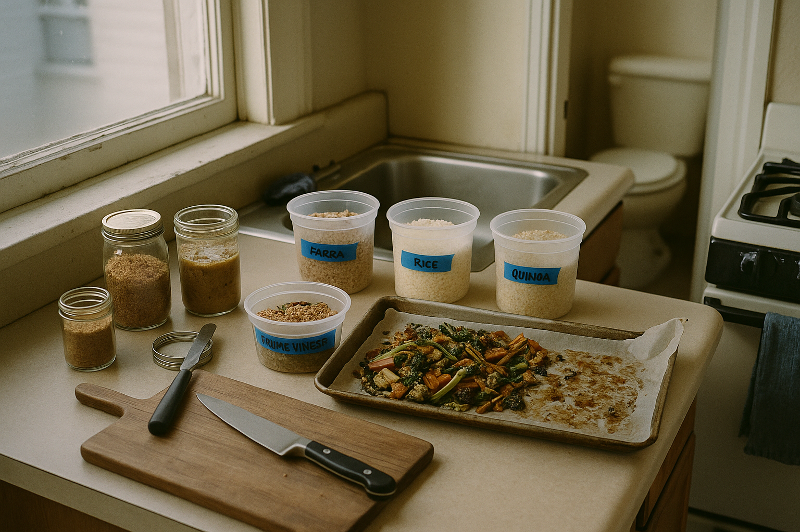
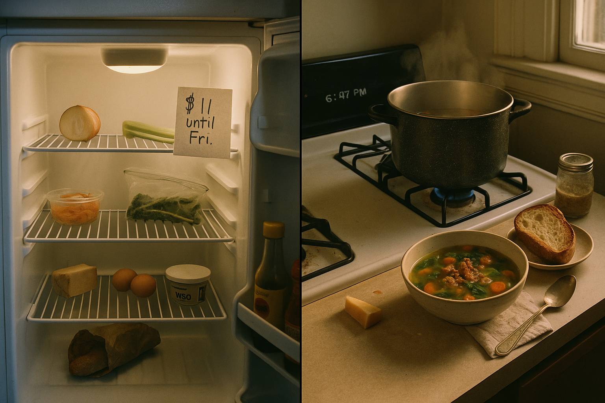
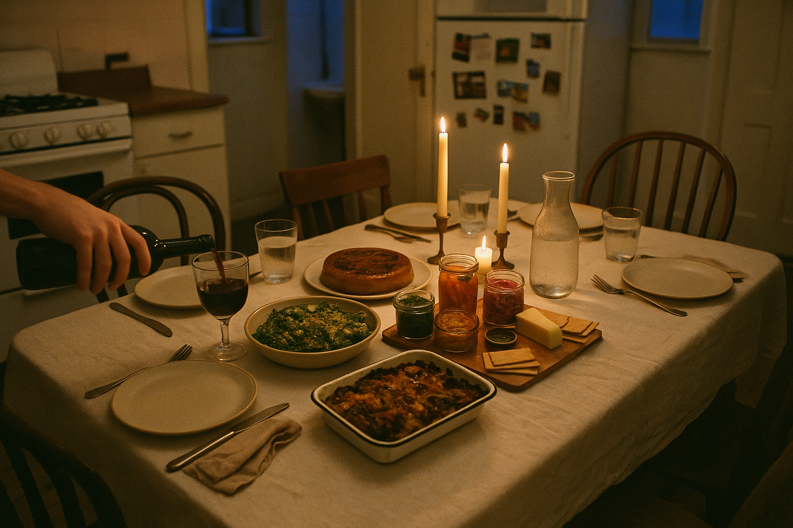
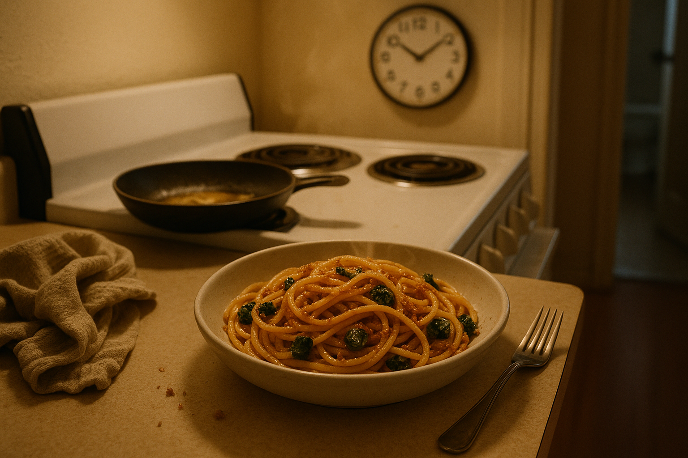
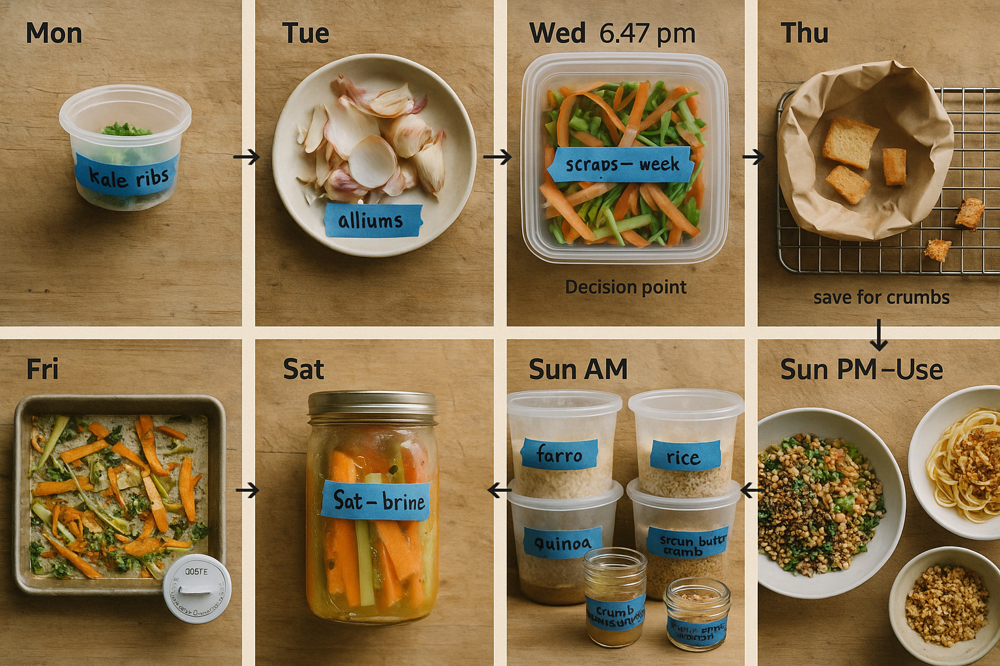

# Chapter 11: Use Cases

> *"Context is everything."*

## On Application

This book has given you theory, technique, and recipes. Now comes the practical question: *when* do you actually use this?

Drain Salad cooking isn't an all-or-nothing proposition. You're not converting to a new religion. You're adding a tool to your repertoire—a way of seeing your kitchen that makes you more resourceful, more efficient, and arguably a better cook.

This chapter maps Drain Salad techniques onto real-life situations. Some are daily (weeknight dinners, meal prep). Some are occasional (dinner parties, travel). Some are circumstantial (broke, busy, cleaning out the fridge). All of them benefit from understanding how to cook from scraps.

---

## Use Case 1: The Sunday Meal-Prep Session

**Situation:** You have 2–3 hours on Sunday afternoon. You want to set yourself up for easy weeknight dinners.

**Drain Salad strategy:**

1. **Cook grains in bulk:** Make 4–6 cups of farro, rice, or quinoa. Store in the fridge in portioned containers. These will be the base for grain bowls all week.

2. **Roast a big batch of scraps:** Toss all your vegetable scraps (carrot peels, kale ribs, squash trim, broccoli stems) with olive oil, salt, and pepper. Roast at 425°F (220°C) for 25–30 minutes. Store in the fridge.

3. **Make two foundations:** Brown-butter bread crumbs and crumb-vinaigrette (Chapter 6). These last all week and make everything better.

4. **Optional: Start a ferment:** If you have a lot of scraps, start a batch of lacto-fermented vegetables. By Wednesday, you'll have tangy pickles to top grain bowls.

<!-- img-prompt: Create a documentary-style cookbook photo of a Sunday meal-prep spread in a cramped San Francisco studio apartment kitchen, winter 2022, around Sunday 2:30 pm. Composition: three-quarter overhead angle that shows a cheap beige laminate countertop below a west-facing window; soft, natural daylight. In the soft-focus background, glimpse the narrow bathroom doorway with a standard white apartment toilet just visible—real life, not staged. Keep the rental-grade stove (scuffed black grates), a dinged stainless sink, and a frayed blue dish towel in frame to ground it in reality. On the counter: a clean, honest lineup of clear deli containers labeled with blue painter’s tape and Sharpie: “farro,” “rice,” “quinoa,” each fluffy and slightly steamy; “roasted scraps” featuring carrot peels, kale ribs shaved thin, broccoli stems, and squash trim with caramelized, blistered edges from a 425°F roast. Include the actual sheet pan lined with wrinkled parchment, glistening with olive oil, salt, and pepper. Add two foundations: a small glass jar of brown-butter bread crumbs (toasty, sandy texture with flecks of darker caramelization, a gentle butter sheen) and a squat jar of crumb-vinaigrette (tawny, lightly separated with visible garlic and pepper specks), a mini whisk alongside. Optional ferment: a slender Mason jar with shredded mixed veg under cloudy brine, tiny air bubbles clinging. A weathered wood cutting board with a chef’s knife and a few stray crumbs keeps it honest. Mood: calm, methodical, quietly confident—front-loading labor so weeknights are assemble-only. Color palette: warm neutrals, caramel browns, olive greens, off-whites, and stainless steel grays. Aesthetic: slightly desaturated, 35mm film look, subtle grain, shallow depth of field focused on the containers and sheet pan; realistic textures, no glossy food styling, no perfection—just appetizing, unpretentious readiness for the week. -->

**Monday–Friday:** Assemble bowls in 5 minutes: grains + roasted scraps + dressing + crunch (bread crumbs). Add a fried egg if you want protein. Dinner is done.

**Why this works:** You're front-loading the labor. Weeknights, you're just assembling components, not cooking from scratch.

---

## Use Case 2: The "I'm Broke Until Friday" Week

**Situation:** It's Tuesday. Payday isn't until Friday. You have $11 in your checking account and a fridge full of scraps.

**Drain Salad strategy:**

1. **Take inventory:** What scraps do you have? Wilted greens? Stale bread? Onion ends? Parmesan rinds? List everything.

2. **Make stock or soup:** Combine all your scraps in a pot with water, salt, and a spoonful of miso. Simmer for 30 minutes. You now have 6 cups of soup that cost $0.

3. **Make bread-based dishes:** If you have stale bread, make panzanella or bread pudding. Bread + scraps + eggs/cheese = a meal that feels substantial.

4. **Stretch with grains:** If you have dry rice, pasta, or beans in the pantry, cook them and use scraps as the "topping." A small amount of scraps + a lot of grain = full stomach.

<!-- img-prompt: Create a split-image diptych that tells a clear before/after story in the same cramped San Francisco studio, Tuesday 6:47 pm, November 2021—the “I’m broke until Friday” week. Left panel (Before): straight-on view into an open rental fridge with a flickery warm bulb and wire shelves. It’s nearly empty: a half onion wrapped in plastic, celery ends, carrot peels in a deli cup, kale ribs in a zip bag, a hard Parmesan rind, a tub of miso, a couple of eggs, soy sauce, mustard, hot sauce, and a heel of stale bread in a paper bag. Tape a wrinkled note on the fridge door edge: “$11 until Fri.” The interior looks honest and a bit forlorn; cool highlights from the fridge light, slightly desaturated 35mm film look with subtle grain. Right panel (After): same space minutes later, but the camera steps back to include the cheap laminate counter and scuffed stove. Warm natural light from a nearby window mixes with the fridge glow. A dented stockpot on a burner with steam rising—scrap soup made from those bits (visible onion ends, carrot peel curls, kale rib coins, miso-tinted broth). In the foreground, a chipped ceramic bowl filled with the soup, garnished with a few brown-butter crumbs for crunch; a slice of the once-stale bread now toasted. The Parmesan rind sits on the counter, ready to go back to the pot. A small jar of crumb-vinaigrette suggests tomorrow’s grain bowl. The mood shifts from scarcity to resourcefulness: not pity, but capability. Keep it unglamorous—some drips on the stovetop, a spoon resting on a stained dish towel. Color palette: cool-fridge whites on the left; warmer caramel browns and greens on the right. Aesthetic: honest editorial documentary, slightly desaturated, natural textures, no food-porn sheen. -->

**Why this works:** Scraps are free. You've already paid for them when you bought the original vegetables. Using them is pure profit.

**Personal note:** This was me, November 2021 to March 2022. Four months of this. Every meal was scraps + pantry staples. I didn't starve. I didn't eat badly. I learned more about cooking in those four months than I did in two years of school.

---

## Use Case 3: The Dinner Party

**Situation:** You're hosting 6–8 people. You want to impress them without spending $200 on groceries.

**Drain Salad strategy:**

1. **Lead with a showstopper:** Make Sludge Caesar (Chapter 7) or the upside-down savory cake with caramelized onion ends (Chapter 8). These are made from scraps but look and taste like you meant it.

2. **Serve ferments as a "cheese plate":** Arrange lacto-fermented vegetables, herb-stem chimichurri, and citrus-peel marmalade on a board with crackers and cheese. Call it "house preserves." People will think you're fancy.

3. **Make a gratin as the main:** Bread-and-kale-rib gratin (Chapter 8) or savory bread pudding. It's rich, feeds a crowd, and can sit in the oven while you socialize.

4. **Don't mention scraps:** Seriously. Call it "ember salad" or "rustic gratin" or "preserved vegetables." The food is good enough to stand on its own. You don't need to justify it.

**Why this works:** Drain Salad techniques—roasting, fermenting, emulsifying—produce restaurant-quality results. You're not serving scraps. You're serving food that happens to be made from scraps.

**Personal story:** March 2022. Six friends. $3.47 dish. Someone asked for the recipe. That's when I knew this was real.

<!-- img-prompt: Photograph an elegant-but-honest dinner party table for 6–8 in the same San Francisco studio apartment, February 2023, 7:30 pm. This is proof that scrap cooking can be beautiful without a $200 grocery run. Composition: three-quarter overhead angle capturing a small, slightly scuffed dining table (think folding table with a thin linen cloth), mismatched chairs, and the compact kitchenette in soft background—rental-grade stove, a magnet-cluttered fridge, and a glimpse of the bathroom door slightly ajar in soft blur. Lighting: warm candlelight mixed with blue-hour window light; natural, slightly desaturated 35mm film look with gentle grain. On the table: a low, wide bowl of Sludge Caesar—leafy greens slicked in a deeply emulsified, anchovy-forward dressing with a halo of brown-butter crumbs; an upside-down savory cake crowned with lacquered, caramelized onion ends on a simple plate; a well-worn enamel baking dish holding a bread-and–kale-rib gratin, bubbling and browned; and a modest board of “house preserves”: jars of lacto-fermented vegetables (carrots, cabbage, thin beans), a small crock of herb-stem chimichurri, and citrus-peel marmalade, plus a small wedge of cheese and plain crackers. Keep the plating confident but unfussy; this food stands on its own. Include a hand mid-pour filling a thrift-store wine glass, a rumpled cloth napkin, and condensation on a water carafe. Mood: welcoming, generous, unpretentious. Color palette: warm neutrals, roasted browns, olive greens, vibrant pickled oranges and pinks for contrast. No glossy hero styling—real textures, a few crumbs on the table, and candle wax drips. It should feel like friends are about to sit down and be surprised that “scraps” can taste like this. -->

---

## Use Case 4: The "Fridge Cleanout Before Travel" Night

**Situation:** You're leaving town tomorrow morning. Your fridge has odds and ends that will spoil while you're gone.

**Drain Salad strategy:**

1. **Make a big frittata:** Sauté all your vegetable scraps (greens, alliums, whatever), mix with beaten eggs, bake. Eat half for dinner, pack half for the plane/road trip.

2. **Quick-pickle anything that's borderline:** Cucumber ends, carrot nubs, radish tops—slice thin, cover with brine (vinegar + water + salt + sugar), refrigerate. They'll last 2–3 weeks.

3. **Freeze scraps you can't use:** Stale bread, cheese rinds, herb stems—all go in the freezer in labeled bags. You'll thank yourself when you get home.

**Why this works:** You're not wasting food or money. You're converting perishables into either meals or preserved items.

---

## Use Case 5: The Weeknight "I Have 20 Minutes" Dinner

**Situation:** It's 7:30pm. You're tired. You need to eat something that isn't takeout.

**Drain Salad strategy:**

1. **Pasta with brown-butter crumbs and scraps (Chapter 8):** Boil pasta. Brown butter, add bread crumbs. Toss. Add wilted kale ribs or roasted vegetable trim if you have it. Total time: 15 minutes.

2. **Grain bowl with whatever:** Leftover rice or farro + sautéed scraps + any dressing + any crunch. Total time: 10 minutes if grains are pre-cooked.

3. **Fried eggs over anything:** Sauté scraps in a pan. Crack eggs on top. Cover and cook until whites set. Eat with toast. Total time: 10 minutes.

<!-- img-prompt: Capture a quick weeknight dinner, 7:30 pm, in the same small San Francisco studio kitchen—tired but determined to avoid takeout. Composition: intimate, counter-height 45-degree angle framing a shallow bowl of pasta with brown-butter crumbs and wilted kale ribs on a cheap beige laminate counter beside the rental-grade stove. The pasta is coated, not drowned: spaghetti or bucatini with a glossy brown-butter sheen, speckled with toasty, sandy crumbs and flecks of deep green kale rib coins just tender. Steam is visible in the warm light. To the left, a small skillet sits on the back burner, its butter browned and nutty with a few golden milk solids and lingering crumbs. Include a thrifted fork, a rumpled dish towel, and a few stray crumbs on the counter—nothing staged. In soft focus, the bathroom doorway is barely visible—an honest reminder of the cramped studio reality. On a wall or fridge in the background, a simple clock reads exactly 7:30. Lighting: warm, domestic tungsten (cheap dome fixture) with a bit of window spill—slightly desaturated 35mm film look, subtle grain, realistic textures, no harsh specular highlights. Mood: relief and competence—dinner in 15 minutes from what’s on hand. Color palette: warm browns and golds from the brown butter and crumbs, muted greens from the kale ribs, neutral off-white ceramics and beige counters. Emphasize the texture contrast: silky pasta, crunchy crumbs, tender greens. Keep it appetizing but unpretentious—this is food you actually eat standing at the counter when you’re beat. -->

**Why this works:** These aren't "projects." They're fast, simple, and use what you already have.

---

## Use Case 6: The "I'm Cooking for One" Reality

**Situation:** You live alone. Recipes serve 4–6. You end up with too many scraps or too much food.

**Drain Salad strategy:**

1. **Embrace small batches:** Most Drain Salad recipes scale down easily. Make 1 serving of pasta with crumbs. Make a 2-egg frittata in a small pan.

2. **Freeze in portions:** If you make a batch of soup or gratin, portion it into single servings and freeze. Future you will appreciate this.

3. **Use scraps for condiments:** One person doesn't generate enough scraps for a daily salad, but you can accumulate them over a week and make ferments or relishes that last months.

**Why this works:** Cooking for one is about systems, not recipes. Build a system where scraps accumulate into something useful over time.

---

## Use Case 7: Feeding Kids (or Skeptical Adults)

**Situation:** You have people in your household who are suspicious of "scraps."

**Drain Salad strategy:**

1. **Don't call it Drain Salad:** Call it pasta, grain bowl, frittata—whatever it is. The name matters.

2. **Focus on familiar formats:** Kids (and skeptical adults) are more likely to eat something that looks normal. Gratin, pasta, tacos—these are recognizable. Lead with those.

3. **Bury the scraps:** Mix kale ribs into pasta with lots of Parmesan. Hide carrot peels in soup. Blend roasted scraps into tomato sauce. They'll never know.

4. **Make it crunchy:** Kids especially love crunch. Bread crumbs, crispy potato skins, fried vegetable peelings—these are universally appealing.

**Why this works:** You're not asking people to change their preferences. You're just quietly using scraps in formats they already like.

---

## Use Case 8: The Post-Holiday Fridge Chaos

**Situation:** It's December 27th. Your fridge has: half a roasted turkey, wilted herbs, stale dinner rolls, three kinds of cheese, and vegetable scraps from making stuffing.

**Drain Salad strategy:**

1. **Make stock from bones:** Turkey carcass + vegetable scraps + water. Simmer for 2 hours. You now have turkey stock for soup, risotto, or freezing.

2. **Turn stale rolls into bread crumbs or panzanella:** Toast them or soak them in dressing.

3. **Make herb-stem chimichurri:** All those parsley, sage, and thyme stems from garnishes? Chimichurri. It'll last 2 weeks and make leftovers taste less sad.

4. **Frittata or grain bowl with everything:** Turkey + scraps + grains + dressing = a meal that doesn't feel like leftovers.

**Why this works:** Post-holiday food waste is depressing and expensive. Drain Salad techniques turn chaos into meals.

---

## Use Case 9: Learning to Cook

**Situation:** You're new to cooking. You want to improve but don't know where to start.

**Drain Salad strategy:**

Start here. Seriously.

Drain Salad cooking teaches you:
- **Knife skills:** Mincing herb stems, shaving kale ribs, dicing scraps fine.
- **Seasoning:** Scraps have muted flavors, so you learn to salt, acid, and fat aggressively.
- **Timing:** Blanching kale ribs, browning butter, caramelizing onions—these are fundamental techniques.
- **Improvisation:** You can't follow a recipe exactly because you don't know what scraps you'll have. You learn to adapt.

**Why this works:** Drain Salad cooking is low-stakes. If you mess up, you're only wasting scraps, not $30 worth of ingredients. It's practice with training wheels.

---

## Use Case 10: The "I Actually Love Cooking and Want a Challenge" Scenario

**Situation:** You're a competent cook. You want to push yourself.

**Drain Salad strategy:**

1. **Set a constraint:** For one week, make every meal exclusively from scraps and pantry staples. No fresh ingredients allowed except what you already have.

2. **Experiment with fermentation:** Start multiple ferments with different spice profiles. Compare results. Learn what you like.

3. **Invent a signature dish:** Take a scrap you normally throw away (broccoli stems, squash skins, whatever) and develop a dish around it. Refine it until it's restaurant-quality.

4. **Document everything:** Take photos, write notes, track what works and what doesn't. Build your own personal Drain Salad cookbook.

**Why this works:** Constraints breed creativity. When you can't rely on "just buy better ingredients," you have to rely on technique. That makes you a better cook.

---

## On Living With Drain Salad Cooking

This isn't a diet or a challenge or a month-long experiment. It's a way of seeing your kitchen that, once learned, you can't unsee.

You'll still buy groceries. You'll still cook "normal" food. But you'll also catch yourself saving kale ribs instead of composting them. You'll make bread crumbs from the heels nobody wants. You'll turn onion ends into a side dish without thinking about it.

It becomes habit. Not because you're trying to be virtuous or frugal, but because the food tastes good and the system works.

That's when you know it's stuck.

<!-- img-prompt: Design a process timeline image, overhead top-down, that shows scraps accumulating over a week and then being used—clear, instructive, warm and real. Layout: an 8-panel grid (two rows of four) on a weathered wood tabletop. Minimal, warm-neutral infographic labeling with a clean, unobtrusive sans-serif (think Source Sans/Inter), small black text. Slightly desaturated 35mm film look, natural window light. Panel 1 (Mon): a small deli container labeled with blue painter’s tape and Sharpie, “kale ribs,” freshly shaved. Panel 2 (Tue): onion ends and garlic skins gathered on a plate, tape-labeled “alliums.” Panel 3 (Wed, 6:47 pm): a larger container marked “scraps—week” containing carrot peels, broccoli stems, herb stems; a note “Decision point” small and subtle. Panel 4 (Thu): a paper bag with bread heels drying on a rack; a few croutons starting; label “save for crumbs.” Panel 5 (Fri): a sheet pan of mixed veg trim lightly oiled and seasoned, ready for a 425°F roast; a timer nearby. Panel 6 (Sat): a Mason jar of lacto-ferment—thin veg sticks under cloudy brine with trapped bubbles; tape: “Sat—brine.” Panel 7 (Sun AM): three clear containers of cooked grains—farro, rice, quinoa—labeled, steam still faint; a small jar “crumb-vinaigrette,” and another: “brown-butter crumbs.” Panel 8 (Sun PM—Use): two finished plates, one grain bowl (grains + roasted scraps + vinaigrette + crumbs) and one pasta with brown-butter crumbs; simple, appetizing, unstyled. Use subtle arrow markers between panels to imply flow; no heavy boxes or glossy graphic effects. Keep crumbs, drips, and tape edges imperfect to preserve honesty. Educational but warm: a field-guide feel rather than a sterile chart. -->

---

**Photography note:** *This chapter should feel documentary and real. Include: (1) a meal-prep spread showing containers of grains, roasted scraps, and dressings; (2) a "broke week" fridge with only scraps and pantry staples (before) and a finished meal (after); (3) a dinner party table with Drain Salad dishes plated elegantly; (4) a timeline showing scraps accumulating over a week and then being used. The aesthetic should be relatable and aspirational—real kitchens, real situations, real solutions.*
