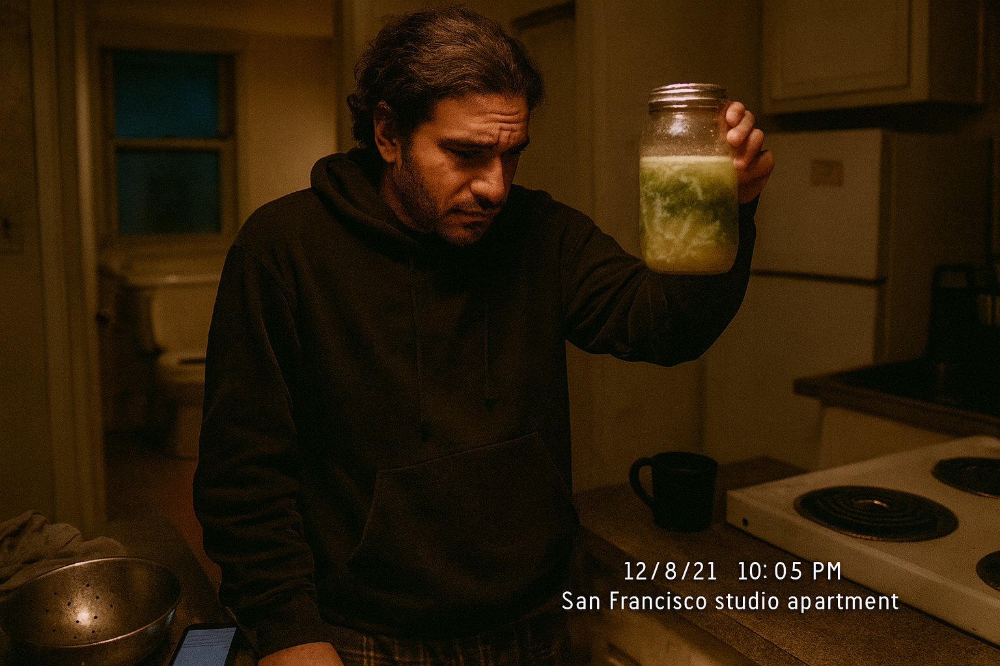
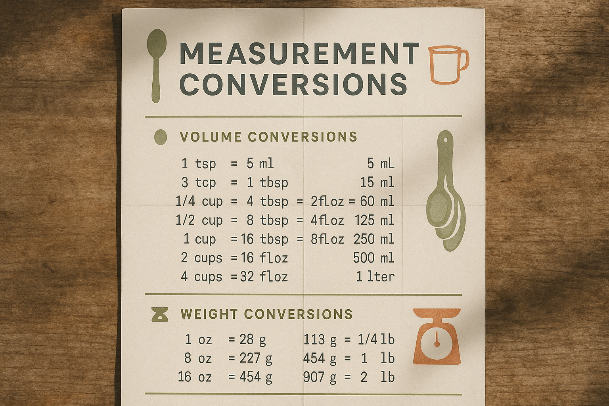
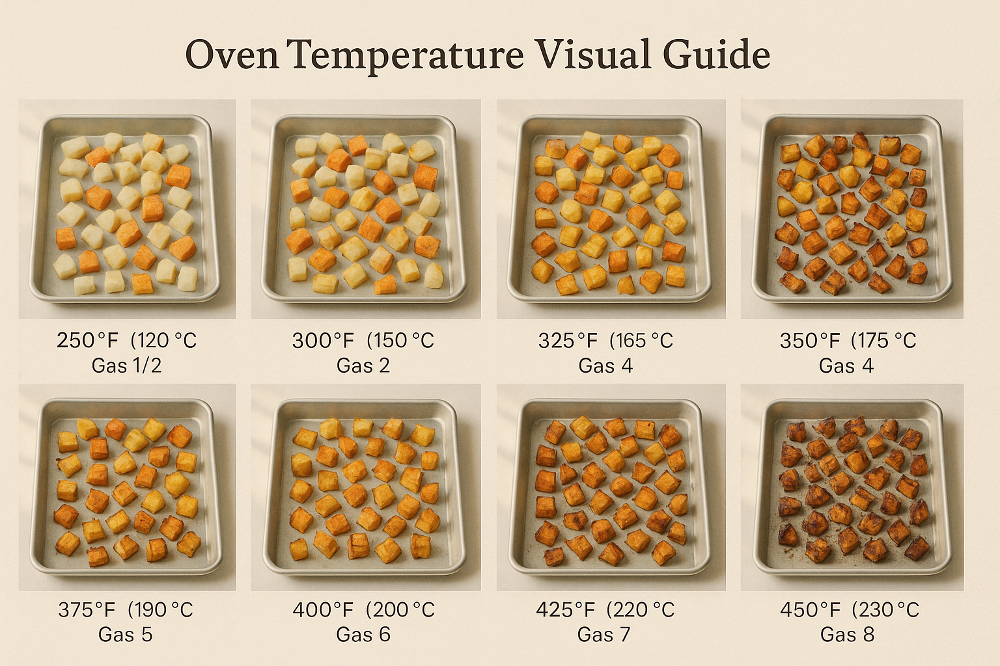
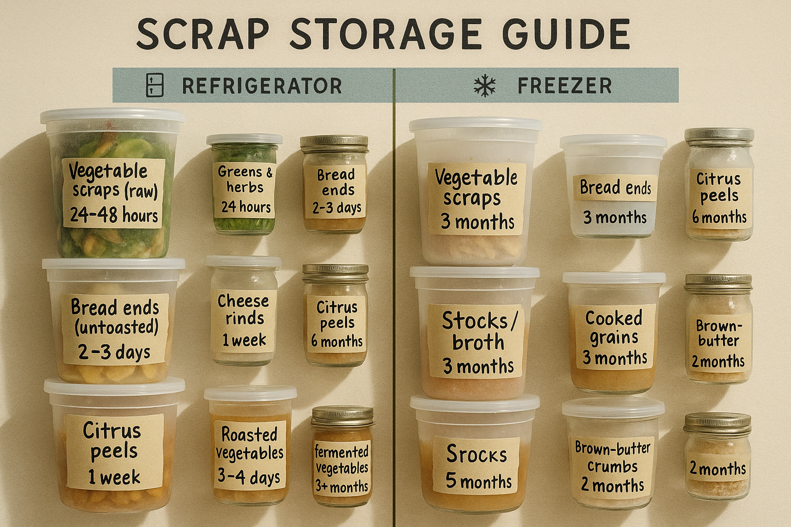
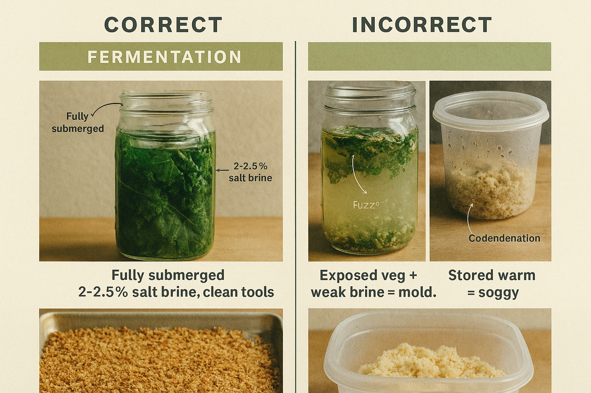

# Chapter 12: Appendices

> *"Reference is not reading, but it's always there when you need it."*

## On Tools, Not Rules (Or: The Chapter You'll Actually Use Most)

I know. You skipped to the recipe chapters. You skimmed the techniques. You probably haven't read the fermentation safety guidelines as carefully as you should. That's fine. I did the same thing with every cookbook I've ever owned.

But this chapter—this boring, back-of-the-book, reference-material chapter—is the one you'll actually use. Not when you're excited and inspired and making your first Drain Salad. But three months from now, when your ferment smells weird, or your kale ribs are too fibrous, or you can't remember if you can freeze cheese rinds.

This is the chapter for when things go wrong. And things will go wrong. Not because you're bad at this, but because cooking is a series of controlled disasters that you learn to navigate. The first time your bread crumbs won't crisp, or your scraps taste bitter, you'll come here. Bookmark this chapter. You'll be back.

**December 8, 2021.** I'm making my third attempt at lacto-fermented kale ribs. The first batch molded (my fault—didn't keep them submerged). The second batch tasted good but turned mushy after a week (too-warm fermentation environment). This time, I'm determined to get it right.

Day 5, I open the jar. There's a thin white film on the surface. My first thought: mold. My second thought: Is it mold, or is it that harmless yeast thing I read about?

I spend twenty minutes searching "white film on ferment" and cross-referencing three different fermentation books. Eventually I figure out it's kahm yeast—harmless, just unattractive. I skim it off, make sure everything's submerged, and keep going.

<!-- img-ref: images/chapter-01/002_author-photo.png -->
<!-- img-prompt: Author photo, documentary 35mm film look. Date/time/location stamped in the scene: December 8, 2021, ~10:05 PM, San Francisco studio apartment. Show the cramped kitchenette with cheap faux-granite laminate counters, an electric coil stove with stained drip pans, and, in the background, the open bathroom door with the toilet clearly visible from the stove. Slightly desaturated, warm tungsten tones from an under-cabinet bulb mixed with cool streetlight leaking through a small window. Shallow depth of field (35mm lens, f/2), natural grain, candid not posed. The same person as the earlier author portrait (image 002): same face and hair length, same build; wearing a threadbare dark hoodie and pajama pants. Frame the author left-of-center, mid-torso crop, head slightly bowed, brow furrowed, holding a quart mason jar up to eye level. Inside the jar: sliced kale ribs in a pale, slightly cloudy brine; on the surface, a thin, matte white film of kahm yeast—smooth, not fuzzy—catching the light. A faint ring line shows active fermentation. Tiny CO2 bubbles cling to the glass. On the counter, a glowing smartphone face-up near the sink with an indistinct search page (don’t render legible brand names), evoking “white film on ferment” panic-googling. Include a dented colander, a damp dish towel, and a cluttered dish rack. Composition: the jar and the author’s anxious expression are the focus; the toilet and narrow bathroom doorway sit soft and out-of-focus in the right third. Mood: the moment of panic before understanding, tense but intimate, honest not glamorous. No flash, no styling tricks—just real life, the smell of vinegar and cabbage implied by condensation on the jar. -->

The ferment turns out fine. But I shouldn't have had to dig through three books. That's why this chapter has a troubleshooting guide. So you don't have to panic-Google at 10pm when your ferment looks wrong.

---

## Appendix A: Troubleshooting Guide

### Problem: My Drain Salad is too bitter

**Likely causes:**
- Raw brassicas (kale, cabbage, broccoli) without blanching or massaging
- Too many herb stems without enough fat or salt
- Burnt garlic or over-charred vegetables

**Solutions:**
- Blanch bitter greens for 2–3 minutes before using
- Add fat (olive oil, brown butter, tahini) to coat and mellow bitterness
- Add sweetness (honey, maple syrup, caramelized onions) to balance
- Increase salt and acid—both counteract bitterness

---

### Problem: My Drain Salad is too wet/soggy

**Likely causes:**
- Scraps weren't dried after washing or blanching
- Dressing added too far in advance
- Bread wasn't stale enough (in bread-based dishes)

**Solutions:**
- Pat scraps completely dry with towels before using
- Dress salads immediately before serving, not hours ahead
- Toast bread until bone-dry before soaking in dressing
- Add more bread crumbs or grains to absorb excess liquid

---

### Problem: My Drain Salad tastes flat/bland

**Likely causes:**
- Under-salting (most common mistake)
- Not enough acid
- Scraps are past their prime and flavor has degraded

**Solutions:**
- Salt in layers: season scraps while cooking, season dressing, taste and adjust at the end
- Add acid aggressively: lemon juice, vinegar, pickle brine
- Use a finishing salt (flaky salt) just before serving for a burst of flavor
- Add umami: miso, soy sauce, Parmesan, nutritional yeast

---

### Problem: My ferment has mold

**Appearance:** Green, black, or fuzzy growth on the surface

**Causes:**
- Vegetables weren't fully submerged in brine
- Brine was too weak (not enough salt)
- Container or tools weren't clean

**What to do:** Discard the entire batch. Don't try to salvage it.

**Prevention:**
- Keep vegetables fully submerged (use a weight)
- Use 2–2.5% salt by weight for brine
- Use clean jars and tools
- Check daily and skim off any white film (kahm yeast) immediately

---

### Problem: My ferment smells rotten

**What it should smell like:** Tangy, sour, slightly funky (like sauerkraut)

**What it should NOT smell like:** Putrid, truly rotten, like garbage

**If it smells bad:** Discard it. Trust your nose. Fermentation gone wrong is unsafe.

---

### Problem: My bread crumbs won't crisp

**Likely causes:**
- Bread wasn't stale enough (contained too much moisture)
- Heat was too low
- Crumbs were stored while still warm (condensation = sogginess)

**Solutions:**
- Start with very stale bread—rock-hard is ideal
- Toast at higher heat (medium-high) and stir constantly
- Let crumbs cool completely before storing
- Store in an airtight container with a silica packet

---

### Problem: My kale ribs are too fibrous

**Likely causes:**
- Used raw without blanching or massaging
- Cut too thick

**Solutions:**
- Blanch ribs in boiling water for 2–3 minutes to tenderize
- Or massage raw ribs with salt for 5 minutes to break down fibers
- Slice ribs thin (¼-½ inch max) on a diagonal

---

### Problem: My Clean-Catch scraps smell off after one day

**Likely causes:**
- Scraps weren't fresh to begin with
- Container wasn't clean
- Scraps sat at room temp too long before refrigerating

**Solutions:**
- Only save scraps from fresh, high-quality ingredients
- Wash containers with hot, soapy water and dry completely
- Refrigerate scraps within 30 minutes of prepping
- Use scraps within 24–48 hours, or freeze them

---

## Appendix B: Measurement Conversions

<!-- img-prompt: Design an instructional, cookbook-style infographic poster titled “Measurement Conversions” with a warm, lived-in field guide aesthetic. Layout: vertical single-page, modular grid with generous margins. Background: warm cream paper (#F5F1E8) with subtle paper texture, a faint fold crease, and soft, natural daylight shadows as if lying on a weathered wood table. Color palette: ink-gray text (#333333), muted olive accents (#6B7B4D), and a rust highlight (#B45F3B). Typography: clear, friendly sans-serif for headings; monospaced numerals for tables; generous line spacing for legibility. Include minimalist hand-drawn silhouettes of measuring spoons and cups along the margins—imperfect, slightly watercolor-textured, not cutesy. Sections: 1) Volume Conversions, 2) Weight Conversions. In “Volume Conversions,” present a clean table and/or neatly aligned callouts showing these exact pairings: 1 tsp = 5 ml; 3 tsp = 1 tbsp = 15 ml; 1/4 cup = 4 tbsp = 2 fl oz = 60 ml; 1/2 cup = 8 tbsp = 4 fl oz = 125 ml; 1 cup = 16 tbsp = 8 fl oz = 250 ml; 2 cups = 16 fl oz = 500 ml; 4 cups = 32 fl oz = 1 liter. In “Weight Conversions,” include: 1 oz = 28 g; 4 oz = 113 g = 1/4 lb; 8 oz = 227 g = 1/2 lb; 16 oz = 454 g = 1 lb; 32 oz = 907 g = 2 lb; 1000 g = 2.2 lb = 1 kg. Add simple icons (spoon, cup, scale) near section titles. Keep the design warm and approachable, not sterile. Avoid glossy effects, heavy gradients, or overly decorative elements. Ensure numbers are crisp and easy to read at a glance, like a reference guide you’d tape to a cabinet door. -->

### Volume Conversions

| **Teaspoons** | **Tablespoons** | **Cups** | **Fluid Ounces** | **Milliliters** |
|---|---|---|---|---|
| 1 tsp | ⅓ tbsp | — | — | 5 ml |
| 3 tsp | 1 tbsp | — | ½ fl oz | 15 ml |
| — | 4 tbsp | ¼ cup | 2 fl oz | 60 ml |
| — | 8 tbsp | ½ cup | 4 fl oz | 125 ml |
| — | 16 tbsp | 1 cup | 8 fl oz | 250 ml |
| — | — | 2 cups | 16 fl oz | 500 ml |
| — | — | 4 cups | 32 fl oz | 1 liter |

### Weight Conversions

| **Ounces** | **Grams** | **Pounds** | **Kilograms** |
|---|---|---|---|
| 1 oz | 28 g | — | — |
| 4 oz | 113 g | ¼ lb | — |
| 8 oz | 227 g | ½ lb | — |
| 16 oz | 454 g | 1 lb | — |
| 32 oz | 907 g | 2 lb | — |
| — | 1000 g | 2.2 lb | 1 kg |

### Temperature Conversions

<!-- img-prompt: Create a horizontal, educational infographic titled “Oven Temperature Visual Guide,” warm, editorial cookbook style. Background: soft, neutral paper tone with daylight shadows; minimal, warm palette. Layout: an 8-tile row (or a 2x4 grid) showing the same sheet pan of cubed root vegetables (carrots, potatoes, onions) roasted at different oven settings. Each tile has a small, clean label with Fahrenheit, Celsius, and Gas Mark. Temperatures to include exactly: 250°F (120°C, Gas 1/2), 300°F (150°C, Gas 2), 325°F (160°C, Gas 3), 350°F (175°C, Gas 4), 375°F (190°C, Gas 5), 400°F (200°C, Gas 6), 425°F (220°C, Gas 7), 450°F (230°C, Gas 8). Visual cues per tile after the same time in the oven: 250°F—pale, soft, barely colored; 300°F—gentle drying, minimal browning; 325°F—light caramelization on edges; 350°F—uniform golden; 375°F—deeper browning, some crisp edges; 400°F—bold browning, visible steam; 425°F—hero tile: deeply bronzed, blistered edges, crisped tips, glistening with rendered oil; 450°F—darker char in spots, edges nearing burnt. Include a thin slider-like bar or legend under the tiles mapping Fahrenheit to Celsius and Gas Mark icons, clean sans-serif type, monospaced numerals. Lighting within the food tiles: soft natural window light from the left, minimal reflections, realistic textures (not glossy food porn). No brand logos, no over-styling. The overall mood: practical field-guide clarity—so a home cook can glance and know what 425°F should look like on roasted vegetables. -->

| **Fahrenheit** | **Celsius** | **Gas Mark** |
|---|---|---|
| 250°F | 120°C | ½ |
| 300°F | 150°C | 2 |
| 325°F | 160°C | 3 |
| 350°F | 175°C | 4 |
| 375°F | 190°C | 5 |
| 400°F | 200°C | 6 |
| 425°F | 220°C | 7 |
| 450°F | 230°C | 8 |

---

## Appendix C: Scrap Storage Guide

<!-- img-prompt: Cookbook reference infographic titled “Scrap Storage Guide,” with a warm field-guide aesthetic. Two clear columns: left labeled “Refrigerator” (blue-gray accent), right labeled “Freezer” (muted teal accent). Background: soft cream paper with subtle grain; natural daylight shadows; clean, organized layout. Show real quart deli containers and small jars photographed top-down and front-on, neatly arranged on a grid. Handwritten masking tape labels (thick black marker, legible) on each container with exact times. Refrigerator column containers labeled: “Vegetable scraps (raw) — 24–48 hours,” “Greens & herbs — 24 hours,” “Bread ends (untoasted) — 2–3 days,” “Cheese rinds — 1 week,” “Citrus peels — 1 week,” “Cooked grains — 5 days,” “Roasted vegetables — 3–4 days,” “Fermented vegetables — 3+ months,” “Stocks/broth — 5 days.” Freezer column containers labeled: “Vegetable scraps (raw) — 3 months,” “Bread ends — 3 months,” “Cheese rinds — indefinitely,” “Citrus peels — 6 months,” “Stocks/broth — 3 months,” “Cooked grains — 3 months,” “Brown-butter crumbs — 2 months.” Add small, unobtrusive icons at the top of each column: a simple fridge outline and a snowflake. Visual cues: slight condensation on refrigerated containers, thin frost patina on freezer containers. Color palette: ink-gray text (#333333), muted olive dividers (#6B7B4D), and restrained accent colors. Keep it unpretentious and real—containers can have minor scratches and water spots, but the overall layout is crisp and instructional. No brand logos, no sterile medical vibes. Make the times easy to read at a glance, like a chart you’d tape inside a cabinet door. -->

### Refrigerator Storage Times

| **Scrap Type** | **Storage Time** |
|---|---|
| Vegetable scraps (raw) | 24–48 hours |
| Greens and herbs | 24 hours |
| Bread ends (untoasted) | 2–3 days |
| Cheese rinds | 1 week |
| Citrus peels | 1 week |
| Cooked grains | 5 days |
| Roasted vegetables | 3–4 days |
| Fermented vegetables | 3+ months |
| Stocks and broths | 5 days |

### Freezer Storage Times

| **Item** | **Storage Time** |
|---|---|
| Vegetable scraps (raw) | 3 months |
| Bread ends | 3 months |
| Cheese rinds | Indefinitely |
| Citrus peels | 6 months |
| Stocks and broths | 3 months |
| Cooked grains | 3 months |
| Brown-butter crumbs | 2 months |

---

## Appendix D: Scrap-to-Dish Quick Reference

**If you have:** Kale ribs
**Make:** Sludge Caesar, pasta with brown-butter crumbs, lacto-ferment, grain bowl, kale-rib gratin

**If you have:** Stale bread
**Make:** Brown-butter crumbs, panzanella, bread pudding, crumb-vinaigrette, gratin

**If you have:** Herb stems
**Make:** Chimichurri, pesto, tabbouleh, broth, ferment (if tender)

**If you have:** Carrot peels
**Make:** Roasted chips, soup, ferment, stock

**If you have:** Onion ends
**Make:** Charred onion with miso, caramelized (for upside-down cake), stock, ferment

**If you have:** Cabbage cores
**Make:** Sauerkraut, shaved raw salad, sauté, ferment

**If you have:** Potato skins
**Make:** Crispy skins with brown butter, roast, gratin

**If you have:** Tomato ends
**Make:** Panzanella, soup, relish, stock

**If you have:** Citrus rinds (spent)
**Make:** Marmalade, candied peel, citrus-peel salad, ferment

---

## Appendix E: Essential Equipment

### Minimum Equipment (< $50)

- 1 chef's knife (8-inch), kept sharp
- 1 cutting board (wood or plastic)
- 1 large skillet (cast iron or stainless)
- 1 large pot for soups/stocks
- 1 mixing bowl and 1 strainer
- Measuring cups and spoons
- 3–5 deli containers with lids (quart size)
- 1 jar for fermenting (quart size)

### Nice-to-Have ($50–$150)

- Mandoline for thin slicing
- Food processor or blender
- Immersion blender (for soups)
- Cast-iron skillet (for crisping and sautéing)
- 9x13-inch baking dish (for gratins)
- Oven-safe skillet (for frittatas)
- Digital kitchen scale (for fermentation ratios)

### If You're Serious ($150+)

- Dehydrator (for drying scraps into "dust")
- Vacuum sealer (for long-term scrap storage)
- Pressure cooker (for fast stocks and broths)
- Multiple fermentation jars with airlocks
- High-powered blender (for smooth soups and sauces)

---

## Appendix F: Recommended Reading

### On Fermentation
- *The Art of Fermentation* by Sandor Ellix Katz (comprehensive, bible-status)
- *Fermented Vegetables* by Kirsten K. Shockey and Christopher Shockey (practical, beginner-friendly)

### On Scrap Cooking and Zero-Waste
- *The Everlasting Meal* by Tamar Adler (poetic, philosophical)
- *Cooking Scrappy* by Joel Gamoran (TV chef approach, accessible)
- *Root to Stalk Cooking* by Tara Duggan (vegetable-focused)

### On Technique
- *Salt, Fat, Acid, Heat* by Samin Nosrat (foundational cooking principles)
- *The Food Lab* by J. Kenji López-Alt (science-based technique)

### On Bread
- *Flour Water Salt Yeast* by Ken Forkish (if you want to make your own stale bread)

---

## Appendix G: Online Resources

### For Fermentation
- **Fermentation podcast by Sandor Katz** - Deep dives into fermentation science and culture
- **r/fermentation (Reddit)** - Active community for troubleshooting and inspiration

### For Food Science
- **Serious Eats** (seriouseats.com) - Recipe development with science explanations
- **America's Test Kitchen** (americastestkitchen.com) - Technique-focused cooking

### For Zero-Waste Cooking
- **Max La Manna** (@maxlamanna on Instagram) - Zero-waste recipe videos
- **r/zerowaste (Reddit)** - Community for reducing food waste

---

## Appendix H: Frequently Asked Questions

### Q: Is it safe to eat [specific scrap]?

**A:** General rule: If the original vegetable is safe to eat, the scraps are safe to eat (with exceptions). Avoid:
- Allium skins (papery outer layers—too fibrous and bitter)
- Moldy items (mold penetrates deeper than you can see)
- Non-organic citrus peels (may have wax or pesticide residue)
- Anything that smells off

### Q: How long can I keep scraps before using them?

**A:** Raw scraps: 24–48 hours refrigerated. Longer than that, freeze them or make them into something (stock, ferment, etc.).

### Q: Can I compost scraps I don't use?

**A:** Yes. Not all scraps are edible or worth saving. Compost what you can't eat. The goal is less waste, not zero waste.

### Q: Do I have to use organic vegetables?

**A:** For most scraps, no. For peels/skins you're eating (citrus, squash, potato), organic is safer if you can afford it.

### Q: What if my family thinks this is weird?

**A:** Don't tell them it's made from scraps. Just serve good food. If it tastes good, they won't care.

### Q: Can I do this if I'm vegan/vegetarian/gluten-free?

**A:** Yes. Most recipes are adaptable:
- Vegan: Skip cheese/eggs, use nutritional yeast and tofu
- Vegetarian: Already mostly vegetarian
- Gluten-free: Use gluten-free bread/grains, or skip bread entirely

### Q: Is this book saying I should never throw anything away?

**A:** No. Use what you can. Compost the rest. Don't stress about perfection.

---

## Appendix I: Weights and Volumes for Common Ingredients

### Breads & Grains

| **Ingredient** | **1 Cup** | **Notes** |
|---|---|---|
| Bread crumbs (coarse) | 60g | Packed lightly |
| Bread crumbs (fine) | 85g | Packed |
| Cooked rice | 175g | Cooled |
| Cooked farro | 190g | Cooled |
| Cooked quinoa | 185g | Cooled |
| Bulgur (dry) | 140g | Before cooking |

### Vegetables (Scraps)

| **Ingredient** | **1 Cup** | **Notes** |
|---|---|---|
| Kale ribs, sliced | 100g | Packed |
| Herb stems, minced | 40g | Packed |
| Onion, diced | 150g | — |
| Carrot peels | 80g | Loosely packed |
| Cabbage, shredded | 70g | — |

### Liquids & Fats

| **Ingredient** | **1 Cup** | **Notes** |
|---|---|---|
| Olive oil | 220g | — |
| Butter | 227g | 2 sticks |
| Stock/broth | 250g | Same as water |
| Vinegar | 240g | — |

---

## Appendix J: A Note on Failure (Because You Will Fail, and That's Fine)

<!-- img-prompt: Instructional side-by-side comparison infographic, warm cookbook field-guide style. Two bold columns labeled “Correct” (muted green check) and “Incorrect” (rust red X), with two rows of photographic close-ups that match the book’s honesty. Row 1: Fermentation. Left (Correct): a clear quart jar of kale ribs fully submerged under brine, a glass weight pressing vegetables below the liquid line, no fuzz, possibly a faint, thin white film being skimmed—labeled “Fully submerged, 2–2.5% salt brine, clean tools.” Right (Incorrect): a jar with floating vegetable bits poking above the brine and visible fuzzy green/black mold on the surface—labeled “Exposed veg + weak brine = mold. Discard.” Row 2: Bread crumbs. Left (Correct): sheet pan of evenly toasted, golden-brown coarse bread crumbs, dry and sandy, steam lines gone; a note reading “Cool completely before storing.” Right (Incorrect): pale, clumped, greasy crumbs in a fogged plastic container with visible condensation droplets—labeled “Stored warm = soggy.” Background: soft cream paper with daylight shadows, not sterile; typography: clean sans-serif headings, monospaced numerals/notes; restrained color palette (ink gray text, muted olive rules, red/green accents). Include thin arrows or callouts pointing to key details (liquid line, mold fuzz, condensation). Camera look: natural window light from the left, f/5.6 for clarity, slightly desaturated, realistic textures. No glossy food styling—just honest, educational visuals that make the differences obvious at a glance. -->

You will make Drain Salads that don't work.

The scraps will be too bitter. The ferment will mold. The bread will turn to mush. The kale ribs will be fibrous and unpleasant. You'll over-salt something, or under-season it, or char it instead of caramelize it. You'll follow a recipe exactly and it will still come out wrong because your stove runs hot, or your bread wasn't stale enough, or you used the wrong kind of vinegar.

This is normal. This is not a moral failing. This is just cooking.

Every cook—professional or home, trained or self-taught, Michelin-starred or just trying to figure out dinner—fails constantly. The difference is that good cooks fail forward. They taste the failure, figure out what went wrong, and adjust next time. They don't take it personally. They just fix it.

I have thrown out more Drain Salads than I've published in this book. I've made ferments that smelled like death. I've made bread pudding that was simultaneously dry and soggy. I've made crumb-vinaigrettes that separated into a puddle of oil with sad breadcrumbs floating on top. Every single failure taught me something.

So when your Drain Salad doesn't work—and it will, eventually—don't give up. Go back to the troubleshooting guide in this appendix. Check the techniques in Chapter 5. Re-read the recipe. Taste critically and figure out what went wrong. Then try again.

Failure is just feedback. Expensive, occasionally disgusting feedback, but feedback nonetheless.

And if all else fails, order pizza and try again tomorrow. The scraps will still be there. They're patient.

---

**Photography note:** *This chapter should feel like a reference manual—clean, organized, and easy to navigate. Include: (1) a visual conversion chart with measuring cups and spoons; (2) a temperature guide with visual cues (e.g., what 425°F roasted vegetables look like); (3) storage containers labeled and organized by time/type; (4) side-by-side comparisons of correct vs. incorrect techniques (e.g., properly submerged ferment vs. moldy ferment). The aesthetic should be instructional, like a textbook or field guide.*
